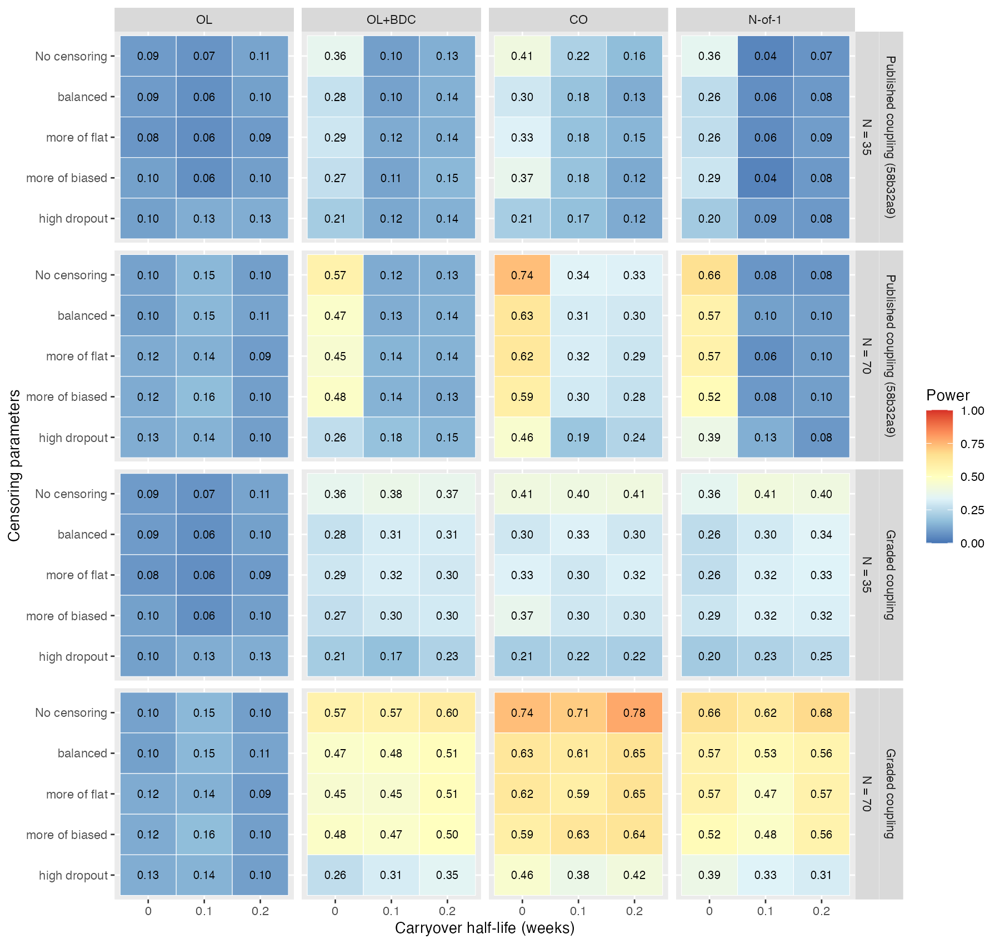

```{r setup, include = FALSE}
knitr::opts_chunk$set(echo = FALSE, warning = FALSE, message = FALSE)
```

# Abstract {-}

**Background.** The power of aggregated N-of-1 trials to validate a
predictive biomarker is estimated by simulation. Hendrickson et al.
(2020) introduced a framework for this, and were, to our knowledge,
the first in the N-of-1 literature to encode the biomarker-by-treatment
interaction as a correlation between the biomarker and the drug
response within a joint multivariate normal distribution. We examine
that encoding, correct its defects, and specify a refined
data-generating process for trials of prazosin-like drugs.

**Methods.** We derive the moments and power of a paired-difference
interaction statistic in closed form under the published process and
refined versions of it. We verify them by Monte Carlo simulation,
including runs of the published code. We compare covariance-based and
mean-based binding of the biomarker, and stress-test analysis models
against the features the refined process adds.

**Results.** As soon as any carryover is present, the published
coupling rule gives every off-drug visit the full on-drug biomarker
correlation. The interaction vanishes, and power falls to near the
test size at every positive half-life. Coupling that decays with the
stated carryover half-life restores a smooth decline, monotone in the
half-life for the paired-difference statistic, and raised power in
the published code from 0.13 to 0.64 at a half-life of 0.1 week.
Conditional on the biomarker, covariance-based binding is mean
moderation with a reduced residual variance, so mean-based binding
that fades with the drug effect loses power almost identically. Under
compound symmetry without carryover the joint distribution exists only
for correlations
below 0.256, so the published effect sizes of 0.3 and 0.6 relied on
silently repaired matrices. Separable AR(1) correlation raises the
bound to 0.44, or 0.48 at a serial correlation of 0.7. A biomarker that
is also prognostic makes analyses that share the biomarker effect with
baseline anticonservative.

**Conclusions.** The covariance-based encoding is coherent but needs
graded coupling, a correlation structure with room for realistic
effects, and validity checks that stop instead of repairing. We give
the closed-form results that identify the power loss, the code
changes for the published software, and a refined process for
simulation studies of aggregated N-of-1 designs.

**Keywords:** N-of-1 trials; predictive biomarker; simulation;
carryover; data-generating process; power; prazosin.

# Background

## Aggregated N-of-1 trials and predictive biomarkers

In an aggregated N-of-1 trial each participant moves between drug and
placebo, or between drug and no drug, several times, and the
individual series are analyzed together
[@nikles2011; @vohra2016cent; @punja2016]. Because every participant
contributes both an on-drug and an off-drug response, the design can
estimate how the drug effect varies between people, and so test
whether a baseline measurement predicts who benefits
[@senn2016mastering; @schork2015]. The motivating example is prazosin
for post-traumatic stress disorder (PTSD). Higher pretreatment
standing systolic blood pressure was associated with greater symptom
reduction on prazosin but not on placebo [@raskind2016bp], which makes
blood pressure a candidate predictive biomarker
[@raskind2003; @raskind2013; @raskind2018].

Closed-form power calculations exist only for simplified versions of
these designs [@wang2019; @senn2002], so power is estimated by
simulating trials from a
data-generating process (DGP) and analyzing each simulated trial
[@morris2019simulation]. The DGP decides what a simulation can show.
In particular, it decides how the biomarker interaction is represented,
how the drug effect builds and wanes, and how carryover from one period
reaches the next.

## The framework of Hendrickson et al.

Hendrickson et al. [@hendrickson2020] (hereafter RH) introduced the
simulation framework this paper builds on. Its contributions include:

- **A component decomposition of the symptom score.** The score is the
  baseline level minus three responses, each following a modified
  Gompertz curve:
  - a biological drug response (BR), driven by time since the current
    on-drug period began;
  - an expectancy response (PB), driven by time in the trial and scaled
    by the participant's expectancy of receiving drug;
  - a time-varying natural course (TV).
- **Design machinery.** It covers open-label, crossover, blinded
  discontinuation and a Hybrid design combining all three. It tracks
  time on drug, time since discontinuation and expectancy for each
  visit.
- **Open software** (the `pmsimstats` R package).

RH also encoded the predictive biomarker in a distinctive way.
Simulation studies of N-of-1 and crossover designs usually represent
treatment-effect heterogeneity in one of two ways. The first is random
participant-by-treatment variation
[@senn2016mastering; @araujo2016; @senn2019samplesize; @zucker1997].
The second, for an observed moderator, is a biomarker-by-treatment
term in the mean [@haller2018; @grenet2020; @kent2020path]. RH instead
placed the biomarker in the same multivariate normal distribution as
the response components.
They gave it a nonzero correlation $c_{bm}$ with the drug response at
on-drug visits and zero correlation elsewhere. A predictive biomarker
is then one whose association with the outcome differs between on-drug
and off-drug visits. To our knowledge this was the first time the
biomarker-by-treatment interaction was parameterized as a covariance
in the N-of-1 literature. The parameterization keeps the marginal
distribution of the drug response fixed and expresses the strength of
the interaction as a correlation.

The encoding is natural for a biomarker that tracks individual
variation in response rather than a fixed dose-response relation, and
it lets a single correlation calibrate the strength of the effect
against the variability of the drug response.

## Why a follow-up is needed

Reusing RH's process for a series of simulation studies exposed two
problems. Both trace to the implementation, not to the idea.

1. **The joint distribution often does not exist.** Under the
   compound-symmetry structure RH used, the correlation matrix is
   positive definite only for $c_{bm}$ below a ceiling, 0.256 in the
   Hybrid design without carryover. RH's nonzero effect sizes were 0.3
   and 0.6. The code repairs any non-positive-definite matrix silently.
   Counting one matrix per design path, effect size and half-life, 37%
   of the published grid's matrices at those effect sizes (20 of 54)
   were replaced by nearby valid matrices. At $c_{bm} = 0.3$ the repair
   changed no correlation by more than 0.007, so RH's results at that
   effect size are essentially those of the stated process. At
   $c_{bm} = 0.6$ it lowered the on-drug correlation to 0.54 to 0.57
   and moved other correlations by up to 0.10, so those results
   describe a different process from the one stated.
2. **Power collapses under any carryover.** RH reported that power to
   detect the interaction fell sharply once carryover was introduced.
   In the Hybrid design at $N = 70$ and $c_{bm} = 0.3$ it fell from
   0.74 to 0.12 at a half-life of 0.1 week, when only 0.1% of the drug
   effect remains a week after stopping. We show that this is an
   artifact of the coupling rule, not a property of the designs.

This paper therefore has three aims:

- to identify, in closed form, why power collapses under the published
  process;
- to give the changes to the published code that remove both problems;
- to specify a refined DGP, consistent with the pharmacology of
  short-half-life, titrated drugs such as prazosin, intuitive in its
  parameters and flexible in the features it can represent, for use
  across simulation studies of aggregated N-of-1 designs.

# Methods

## The published data-generating process

We use RH's notation, with a few additions. Participant $i$ is
observed at a baseline visit $t = 0$ and at post-baseline visits
$t = 1, \ldots, T$ (weeks 4, 8, 9, 10, 11, 12, 16 and 20 in the Hybrid
design). The symptom score is

$$
Y_{it} = \mathrm{BL}_i - \left(TV_{it} + PB_{it} + BR_{it}\right),
$$

so a larger response lowers the score. Each component has a mean given
by the modified Gompertz curve

$$
G(x;\, m, d, r) = m\,\frac{\exp(-d e^{-rx}) - e^{-d}}{1 - e^{-d}},
$$

evaluated at a component-specific clock:

- **BR** at time on drug $t_{od}$, the time since the current on-drug
  period began, with $m = 10.99$,
  $d = 5$, $r = 0.42$ and SD 8. The curve reaches its inflection at
  3.8 weeks, half its maximum at 4.7 weeks and 90% at 9.2 weeks.
- **PB** at time in the trial, scaled by the expectancy $e_t$ (1 in the
  open-label phase, 0.5 when blinded), with $m = 6.51$, $d = 5$,
  $r = 0.35$ and SD $10e_t$.
- **TV** at time in the trial, with the same curve as PB and SD 10.

Off drug, the drug-response mean decays from its previous value with
half-life $t_{1/2}$:
$\mu_{BR,t} = \mu_{BR,t-1}\, 2^{-t_{sd,t}/t_{1/2}}$, where $t_{sd}$ is
the time since discontinuation.

The vector (biomarker, baseline, $TV_{i\cdot}$, $PB_{i\cdot}$,
$BR_{i\cdot}$) is multivariate normal. Within each component the
correlation between any two visits is $\rho = 0.8$ (compound
symmetry). Between components it is 0.2 at the same visit and 0.1
otherwise. The biomarker's correlation with $BR_{it}$ is $c_{bm}\,g_t$,
where $g_t$ is the *coupling*. RH's rule sets $g_t = 1$ wherever the
drug-response mean is nonzero and 0 elsewhere.

RH analyzed each trial with the linear mixed model

$$
Y_{it} = \beta_0 + \beta_B B_i + \beta_D D_{it} + \beta_T t
  + \beta_{bm:D} B_i D_{it} + u_i + \varepsilon_{it},
$$

with a random intercept $u_i$, the binary drug indicator $D_{it}$, and
baseline included as a row with $D_{i0} = 0$. The interaction
$\beta_{bm:D}$ is tested with Satterthwaite degrees of freedom
[@kuznetsova2017]. Participants are assigned to the design's paths in
fixed numbers (18, 18, 17 and 17 in the Hybrid design at $N = 70$),
not at random.

## Estimand

The target is the on-drug biomarker moderation of the drug response:
the change in the drug effect per unit of biomarker while the drug is
fully present. Without carryover it equals
$\beta_{bm:D} = -c_{bm}\sigma_{BR}/\sigma_{bm}$ under covariance binding,
and $-\beta_{bm}\sigma_{BR}/\sigma_{bm}$ under mean binding.

Analyses that contrast on-drug with off-drug visits through a binary
drug indicator estimate this quantity only when no moderation remains
off drug. Under carryover they estimate an attenuated on-minus-off
contrast. Part of the power loss under graded coupling therefore
reflects the binary indicator in the analysis, not only the
data-generating process. Analyses with an exposure-decayed indicator
$D_{bc,it}$ at the true half-life recover the on-drug moderation. The
closed-form results and RH's analysis use the binary indicator; the
stress test uses $D_{bc,it}$.

## Closed-form analysis

To isolate how carryover acts, we use a summary statistic whose
distribution can be derived exactly (Appendix A). For each participant,

$$
\Delta_i = \bar Y_i^{\text{on}} - \bar Y_i^{\text{off}}
  = \sum_t a_t Y_{it},
$$

the difference between the mean on-drug and mean off-drug scores,
which is regressed on $B_i$ by least squares. We call it E9 when it
uses post-baseline visits only, and E9b when baseline is counted as
one more off-drug visit, as in RH's analysis. Monte Carlo simulation
of RH's mixed model shows that E9b reproduces its mean estimates to
within 0.003 and its power closely (Results). The derivation gives
three results.

- **Proposition 1.** The variance of $\Delta$ does not depend on the
  carryover half-life. The half-life enters only through the response
  means and the coupling, and neither appears in the variance.
- **Proposition 2.** The population slope is
  $$
  \beta_{bm:D}^{\text{E9}}
    = -c_{bm}\frac{\sigma_{BR}}{\sigma_{bm}}\left(1 - \bar g_{\text{off}}\right),
  \qquad
  \beta_{bm:D}^{\text{E9b}}
    = -c_{bm}\frac{\sigma_{BR}}{\sigma_{bm}}
      \left(1 - \frac{n_{\text{off}}}{n_{\text{off}} + 1}\,
      \bar g_{\text{off}}\right),
  $$
  where $\bar g_{\text{off}}$ is the mean coupling over the
  $n_{\text{off}}$ post-baseline off-drug visits. The slopes are
  specific to each path: in the Hybrid design $n_{\text{off}}$ is 3 in
  two paths and 4 in the other two. The pooled slope is their
  allocation-weighted average.
- **Power** is a noncentral-$t$ probability governed by the correlation
  $\rho_{\Delta B}$ between $\Delta$ and $B$. For E9 that correlation is
  proportional to the *coupling gap* $1 - \bar g_{\text{off}}$. For E9b
  it is proportional to
  $1 - \frac{n_{\text{off}}}{n_{\text{off}}+1}\bar g_{\text{off}}$.

So carryover can affect power only through the coupling gap. The
propositions reduce the question of why power collapses to the
question of what the coupling rule does to $\bar g_{\text{off}}$.

**The ceiling.** Write the response block of the correlation matrix as
$M$ and the biomarker's correlations with the response components as
$c_{bm}u$. The full matrix is positive definite if and only if
$M$ is, and

$$
c_{bm}^2\, u^\top M^{-1} u < 1 .
$$

The left side is the squared multiple correlation of the biomarker on
the whole response trajectory, so the ceiling on $c_{bm}$ is
$(u^\top M^{-1} u)^{-1/2}$ (Appendix A). It depends on the
correlation structure, the design and the coupling profile.

## Refinements

Each refinement removes one defect (Table \@ref(tab:refinements)). The
first three are corrections. The rest are modeling choices, and each
can be switched off to recover the published process.

Table: (\#tab:refinements) Refinements to the published process.

| Step | Change | Defect removed or feature added |
|----|----------------------------------------|----------------------------------|
| 1 | Stop when the correlation matrix is not positive definite | Silent repair changes the correlations, and so the effect, without warning |
| 2 | Graded coupling: $g_t = 1$ on drug, $2^{-t_{sd,t}/t_{1/2}}$ off drug after exposure, 0 before any exposure | Step coupling removes the interaction at any positive half-life |
| 3 | Anchored carryover: decay the drug-response mean from its last on-drug value | The recursion compounds the decay at the second and later off-drug visits |
| 4 | AR(1) correlation within each component, $\rho^{\lvert t-s\rvert}$ in weeks | Compound symmetry overstates long-lag correlation |
| 5 | Separable cross-component structure, $c_1\rho^{\lvert t-s\rvert}$ | Raises the ceiling; gives a valid factored generator |
| 6 | Options: prognostic biomarker couplings, phase-specific measurement error, decay form, dropout | Not representable in the published process |

## Why separability

Step 5 is more than a way to gain room for larger effects. Write the
response block of the correlation matrix as $M$. Under the separable
form $M = K \otimes A$, the product of a $3 \times 3$ component
correlation $K$ (1 on the diagonal, $c_1$ off it) and one AR(1) kernel
$A_{ts} = \rho^{\lvert w_t - w_s\rvert}$ in calendar weeks. Four
properties follow (Appendix A.5).

1. **Validity for every schedule.** The eigenvalues of $M$ are products
   of those of $K$ and $A$, so $M$ is positive definite for any visit
   times. The non-separable AR(1) form used in earlier versions of this
   software adds a same-visit cross-component term that carries
   correlation without variance. It is positive definite only when the
   smallest eigenvalue of $A$ exceeds $(c_1 - c_\times)/(1 - c_\times)$,
   which fails on dense schedules.
2. **RH's structure is already of this kind in pieces.** It is the sum
   of a person-level and an occasion-level separable term, each valid.
   That is why RH's matrices fail only through the biomarker coupling,
   never in the response block.
3. **An exact, interpretable ceiling.** The ceiling factors into a
   component term and a schedule term,
   $$
   c_{bm}^{*} = \sqrt{1 - R^2}\;\bigl(u^\top A^{-1} u\bigr)^{-1/2},
   \qquad R^2 = \frac{2c_1^2}{1 + c_1},
   $$
   where $R^2$ is the squared multiple correlation of the drug response
   on the other two components at one visit. The schedule term is a sum
   of per-step costs of the coupling pattern. A pattern that switches
   abruptly between closely spaced visits is expensive, which is why
   designs with many on-off switches can carry only small effects.
4. **It matches the analysis model.** Under separability the summed
   response is an AR(1) process up to the expectancy scaling of the
   placebo component, which is the residual structure that `corCAR1`
   assumes. Under the non-separable form it is AR(1) plus a white-noise
   term the analysis model omits. This is derived; its effect on test
   calibration has not been measured.

## Pharmacological grounding

The refined process is specified for short-half-life, titrated drugs,
with prazosin as the reference case.

- **Time scales.** Prazosin's plasma half-life is about 2.3 hours
  [@hobbs1978], against weekly visits. The plasma concentration
  therefore falls by orders of magnitude within a day of the last dose.
  The symptom response may lag the concentration, so we allow a
  symptom-level half-life of 0.1 to 0.2 week (17 to 34 hours), about 7
  to 15 plasma half-lives, as the pharmacological range. Longer
  carryover would be behavioral or psychological, to be simulated as a
  labeled sensitivity scenario.
- **Titration and onset.** The drug response follows the Gompertz curve
  in time on drug, which reflects dose titration and the accumulation
  of benefit. Its landmarks (half of maximum at 4.7 weeks) should be
  read clinically when the parameters are chosen.
- **Re-exposure.** RH's process restarts time on drug at zero when the
  drug is resumed. For prazosin this is justified, because the drug is
  re-titrated after an interruption. For drugs without titration, the
  response should instead rebuild from its residual level. This is an
  option, not a default.
- **Coupling.** Graded coupling makes the biomarker's association with
  the drug response fade at the rate the drug effect fades. That is
  the pharmacological reading of a predictive biomarker: it predicts
  the size of the drug effect, so it cannot predict a drug effect that
  is no longer present.

## Covariance-based and mean-based binding

The biomarker can be bound to the drug effect in the covariance, as
RH did, or in the mean. Under mean moderation, the drug response is
shifted by $\beta_{bm}\, b_i\, \sigma_{BR}\, h_t$, where $b_i$ is the
standardized biomarker and $h_t$ the exposure profile. Plain mean
moderation uses $h_t = 1$ on drug and 0 off drug; decayed mean
moderation uses $h_t = 2^{-t_{sd,t}/t_{1/2}}$ off drug, the profile of
graded coupling. We compare the forms in the Discussion.

## Reference specification

Table \@ref(tab:spec) collects the refined process. Values not listed
are RH's.

Table: (\#tab:spec) The refined data-generating process. Defaults are those used in the stress test.

| Element | Specification | Default |
|-------------|------------------------------------|----------------|
| Components | $Y_{it} = \mathrm{BL}_i - (TV_{it} + PB_{it} + BR_{it})$, Gompertz means as in RH | RH's parameters |
| Within-component correlation | AR(1) in weeks, $\rho^{\lvert t-s\rvert}$, one $\rho$ for all three components (RH allowed one per component) | $\rho = 0.7$ |
| Cross-component correlation | separable, $c_1\rho^{\lvert t-s\rvert}$; the Kronecker form applies to the correlation, since the PB SD scales with the expectancy | $c_1 = 0.2$ |
| Path allocation | randomized to paths (RH: fixed numbers) | randomized |
| Biomarker coupling | $c_{bm}$ on drug; $c_{bm}2^{-t_{sd}/t_{1/2}}$ off drug after exposure; 0 before exposure | $c_{bm} \le$ ceiling |
| Carryover on the mean | decay from the last on-drug value, $\mu_{BR,\text{last}}\,2^{-t_{sd}/t_{1/2}}$ | $t_{1/2} = 0.1$ to 0.2 week (pharmacological) |
| Re-exposure | time on drug restarts at zero (re-titration) | on, for titrated drugs |
| Validity | stop if the correlation matrix is not positive definite | always |
| Prognostic couplings (option) | correlation of the biomarker with TV or PB; or mean moderation of TV, $\beta_{bm}^{TV}$ | off; 0.3 in the stress test |
| Measurement error (option) | independent, SD by phase | off; 3 open label, 6 blinded in the stress test |
| Decay form (option) | exponential or Weibull with the same half-life | exponential |
| Dropout (option) | monotone, completely at random or at random given the last score | off; 20% in the stress test |

## Simulation study design

We designed and report the simulations following the ADEMP structure
of Morris et al. [@morris2019simulation]: aims, data-generating
mechanisms, estimands, methods and performance measures. There are
three studies (Table \@ref(tab:ademp)). The scripts are listed under
Availability of data and materials.

Table: (\#tab:ademp) Design of the three simulation studies in the
ADEMP structure. MCSE: Monte Carlo standard error of a rejection rate,
$\sqrt{p(1-p)/R}$ for $R$ replicates.

| | 1. Closed-form verification | 2. The published code | 3. Stress test of analyses |
|--------------|------------------------------|------------------------------|------------------------------|
| **Aim** | Check the closed-form moments and power of Appendix A, and the collapse under the step rule | Show on RH's own code that the coupling rule alone produces the collapse | Choose an analysis that holds its nominal size and keeps power under the refined process |
| **Data-generating mechanisms** | Covariance binding with step and graded coupling, and mean binding; compound symmetry and AR(1); Hybrid, crossover and OL+BDC designs; $N = 70$; grids of $c_{bm}$ and $t_{1/2}$ | RH's `generateData()` at commit 58b32a9, as published and with graded coupling only (Appendix B.1); $c_{bm} = 0.25$. (a) Hybrid, $N = 70$, no censoring, $t_{1/2} \in \{0, 0.1, 0.2, 1\}$; (b) four designs, $N \in \{35, 70\}$, $t_{1/2} \in \{0, 0.1, 0.2\}$, RH's censoring patterns | The refined process (Table \@ref(tab:spec)); base cell separable AR(1), $\rho = 0.7$, $N = 70$, $t_{1/2} = 0.5$ week; 41 cells (15 null, 26 alternative) varying correlation structure, $N$, carryover, decay form, dropout, measurement error and prognostic pathways |
| **Estimand** | $\beta_{bm:D}$, and the mean of the paired-difference statistic | $\beta_{bm:D}$ | $\beta_{bm:D}$ |
| **Methods** | Paired-difference statistics E9 and E9b, closed form and simulated; RH's mixed model fitted with `lmer` | RH's own analysis pipeline (`lmer`, model-based test) on both versions | Eleven pre-registered analyses and three post hoc ones, all fitted to the same simulated trials; two-sided tests at $\alpha = 0.05$ |
| **Performance measures** | Mean, SD and power of the statistic; agreement as (simulated $-$ closed form)/MCSE | Power; mean interaction estimate; number of repaired correlation matrices | Null rejection rate; size-adjusted power and maximin shortfall; $\kappa$, the ratio of mean model SE to empirical SD; power-curve monotonicity, steepness and detectable coupling; failed fits |
| **Replicates** | 5,000 per cell (MCSE of power at most 0.007); 500 to 1,000 for `lmer` | (a) 500 per cell (MCSE at most 0.022); (b) 250 per cell (at most 0.032) | 1,000 per null cell (MCSE 0.0069 at a rate of 0.05), 500 per alternative cell (at most 0.022); 28,000 trials |

**Number of replicates.** Replicate counts were set by the precision
each comparison needs. In study 3, 1,000 null replicates give a
two-MCSE band of 0.036 to 0.064 for a single cell, and pooling 11
null cells gives the band of 0.046 to 0.054 used in the Results; the
pre-registered criterion also caps every null cell at 0.075. In study
1, a cell is flagged when the simulated and closed-form values differ
by more than 2 MCSE, which chance alone produces in about 4.6% of
cells.

**Random numbers.** Every cell, or chunk of a cell, sets its own seed
from a fixed rule: a function of the cell's parameters in study 1, a
shared seed per half-life (study 2a) or per design, sample size and
half-life (study 2b), and $20261007 + 1000 \times \text{cell} +
\text{chunk}$ in study 3. Results therefore do not depend on the
number of cores or the order in which chunks run. Both versions of
RH's code in study 2 use the same seeds, and all analyses in study 3
are fitted to the same trials, so the comparisons are paired. R's
default Mersenne-Twister generator was used throughout.

**Failed fits and repaired matrices.** In study 3, a fit that returned
an error was recorded as missing. Failures numbered 0 to 12 per
analysis over 28,000 trials, and at most 0.6% in any cell, far below
the pre-registered 2% flag. In study 2 the published pipeline returned
an estimate for every replicate, and no correlation matrix was
repaired in either version, because $c_{bm} = 0.25$ lies below the
compound-symmetry ceiling of 0.256. Study 1 does not fit models for the
paired-difference statistic, so it has no failures.

**Software.** R 4.6.1, with lme4 2.0.1 and lmerTest 3.2.1 for RH's
pipeline, nlme 3.1-169, mmrm 0.3.17, clubSandwich 0.7.0 and MASS
7.3-65.

**Deviations from the pre-registration.** The stress test was
pre-registered, with 39 cells, 11 analyses and a fixed selection rule,
in `docs/46` of the repository. Four changes were made after results
were seen:

1. One amendment. The reference analysis (random intercept with
   continuous-time AR(1) residuals and CR2 standard errors) was
   replaced by the same model with its half-life chosen by AIC, and
   the power-symmetry screen was dropped because it tests a property
   that holds exactly by construction (Results).
2. Two cells with a prognostic association between the biomarker and
   baseline severity were added, bringing the total to 41 cells. In
   the null cell, the expectancy-term analysis rejected 0.040.
3. Three further analyses were run on the same trials: the
   expectancy-term model with phase-specific residual variances, with
   CR2 and with model-based inference, and the expectancy-term model
   with its half-life chosen by AIC. They are reported but took no
   part in the selection.
4. The pre-registration counted failed fits as non-rejections; the
   rejection rates reported here exclude them from the denominator.
   With the failure rates above, the two conventions differ by at most
   0.0025 in any rejection rate.

# Results

## The published coupling rule removes the interaction

Under RH's rule every off-drug visit in the Hybrid design follows an
exposure. With any positive half-life its drug-response mean is
positive, so its coupling is 1. Hence $\bar g_{\text{off}} = 1$ and, by
Proposition 2,

$$
\beta_{bm:D}^{\text{E9}} = 0, \qquad
\beta_{bm:D}^{\text{E9b}} = -c_{bm}\frac{\sigma_{BR}}{\sigma_{bm}}\,
  \frac{1}{n_{\text{off}} + 1}
\qquad \text{for every } t_{1/2} > 0 .
$$

Power is a step function of the half-life (Table
\@ref(tab:closedform), Figure \@ref(fig:powerfig)). It takes its
no-carryover value at $t_{1/2} = 0$ and a constant at every half-life
above about 0.02 week, whether 0.1 week or 10. Below that, the
recursive off-drug mean underflows to zero in double precision and the
published rule switches coupling off at late off-drug visits. For E9b
the constant is 0.081, a residue of the baseline row, which alone
keeps zero coupling.

RH's analysis behaves the same way. In our reconstruction of the
published process, the mean estimate falls from $-0.126$ to between
$-0.026$ and $-0.032$ at every positive half-life, and power falls from
0.63 to between 0.08 and 0.11. In a separately seeded run of RH's own
code (Table \@ref(tab:patch)), power falls from 0.668 to 0.126 at
0.1 week. The difference between the two runs, about 2.4 combined
Monte Carlo SE, is within the spread of the reconstruction's
positive-half-life cells.

With constant coupling, the biomarker moderates the on-drug and
off-drug responses equally, so there is no interaction left to detect.
RH's finding that small carryover destroys power is therefore a
property of the coupling rule, not of carryover or of the designs.

```{r closedform}
tab <- data.frame(
  Rule = c('Step (published)', '', 'Graded', '', 'Mean moderation', ''),
  Statistic = rep(c('E9', 'E9b'), 3),
  h0 = c(0.721, 0.654, 0.721, 0.654, 0.681, 0.619),
  h01 = c(0.050, 0.081, 0.721, 0.653, 0.681, 0.619),
  h02 = c(0.050, 0.081, 0.712, 0.647, 0.682, 0.620),
  h05 = c(0.050, 0.081, 0.631, 0.586, 0.682, 0.620),
  h1 = c(0.050, 0.081, 0.473, 0.473, 0.682, 0.621),
  h2 = c(0.050, 0.081, 0.278, 0.328, 0.682, 0.621))
knitr::kable(tab, booktabs = TRUE, digits = 3,
  col.names = c('Coupling rule', 'Statistic', '0', '0.1', '0.2', '0.5', '1', '2'),
  caption = 'Closed-form power by carryover half-life (weeks). Hybrid design, $N = 70$, $c_{bm} = \\beta_{bm} = 0.25$, compound symmetry. E9: paired-difference statistic on post-baseline visits; E9b: the same with baseline counted as an off-drug visit, as in RH\'s analysis. Against Monte Carlo estimates (5,000 replicates per cell), 17 of 566 cell-variants differ by more than 2 Monte Carlo SE.')
```

```{r powerfig, fig.cap = 'Closed-form power (lines) against carryover half-life, with Monte Carlo estimates (points), under the published step rule, graded coupling, mean moderation and decayed mean moderation. Hybrid design, $N = 70$, compound symmetry.', out.width = '85%', fig.align = 'center'}
knitr::include_graphics('../../../docs/figures/37-fig1-power-closed-form.png')
```

## Graded coupling restores a smooth decline

Under graded coupling the mean off-drug coupling is

$$
\bar g_{\text{off}}(t_{1/2}) = \frac{1}{n_{\text{off}}}
  \sum_{t\,\text{off}} 2^{-t_{sd,t}/t_{1/2}},
$$

which is strictly increasing in $t_{1/2}$, because every off-drug visit
has $t_{sd} \ge 1$ week. Two consequences follow.

- **Power is strictly decreasing in the half-life** for the
  path-stratified paired-difference statistic (Proposition 3,
  Appendix A). For the pooled statistic it is non-increasing at every
  step of a 120-point grid from 0.02 to 4 weeks. For RH's mixed model
  it was checked only at the simulated half-lives.
- **The loss vanishes faster than any power of the half-life as
  $t_{1/2} \to 0$.** At 0.1 week, $\bar g_{\text{off}} \le 2^{-10}$
  and power is unchanged to within 0.001.

The published rule is the limit of graded coupling as
$t_{1/2} \to \infty$, applied at every positive half-life.

Power depends on the coupling profile only through the coupling gap
$1 - \bar g_{\text{off}}$ (Figure \@ref(fig:gapfig)). The gap is 1
without carryover; under graded coupling it is 0.991 at 0.2 week,
0.906 at 0.5 and 0.754 at 1. Under the published rule it is 0 at every
positive half-life. Because the noncentrality is approximately
proportional to the gap when $\rho_{\Delta B}$ is small, the sample size
needed for a given power scales roughly as $1/\text{gap}^2$.

```{r gapfig, fig.cap = 'Closed-form power against the coupling gap, with the positions of the coupling rules. Hybrid design, $N = 70$, $c_{bm} = 0.25$.', out.width = '75%', fig.align = 'center'}
knitr::include_graphics('../../../docs/figures/37-fig2-power-vs-gap.png')
```

## The correction in the published code

Replacing only RH's coupling lines with graded coupling (Appendix B)
and running their pipeline unchanged gave the following results
(Table \@ref(tab:patch)). The two versions coincide without carryover,
as they must. At the published half-lives the graded version keeps
the full interaction, and at 1 week it shows a gradual decline. No
matrix was repaired in either version, because $c_{bm} = 0.25$ is below
the ceiling.

```{r patch}
tab <- data.frame(th = c('0', '0.1', '0.2', '1'),
  pm = c(-0.131, -0.028, -0.029, -0.033), gm = c(-0.131, -0.129, -0.131, -0.107),
  pp = c(0.668, 0.126, 0.092, 0.094), gp = c(0.668, 0.638, 0.656, 0.462))
knitr::kable(tab, booktabs = TRUE, digits = 3,
  col.names = c('$t_{1/2}$ (weeks)', 'Mean estimate, published', 'Mean estimate, graded',
                'Power, published', 'Power, graded'), escape = FALSE,
  caption = 'RH\'s code at commit 58b32a9, as published and with graded coupling: Hybrid design, $N = 70$, $c_{bm} = 0.25$, 500 replicates per cell, same seeds. Monte Carlo SE of power at most 0.022.')
```

Figure \@ref(fig:fig4bmc) repeats RH's Figure 4B on their own code,
for all four designs, both sample sizes and the five censoring
patterns, as published and with graded coupling. It uses
$c_{bm} = 0.25$ instead of RH's 0.6, because 0.6 lies above every
covariance-based ceiling and would confound the comparison with the
repair. At 0.25 neither version repaired a matrix, so the coupling rule
is the only difference. Results at $N = 70$ without censoring:

- **Hybrid design.** Published power falls from 0.66 to 0.08 at both
  positive half-lives. Graded power stays at 0.62 and 0.68.
- **Open label plus blinded discontinuation.** Published power falls
  from 0.57 to 0.12 and 0.13. Graded power stays at 0.57 and 0.60.
- **Crossover.** Published power falls only to 0.34 and 0.33, because
  the placebo-first path's off-drug visits precede any exposure and so
  keep zero coupling under both rules. Graded power stays at 0.71 and
  0.78.
- **Open label.** There are no off-drug visits, so the two rules
  coincide and power is low throughout.

The same pattern holds at $N = 35$ and under every censoring pattern.

```{r fig4bmc, fig.cap = 'Power to detect the biomarker-by-treatment interaction, in the layout of RH\'s Figure 4B, from RH\'s code at commit 58b32a9 as published (upper two panel rows) and with graded coupling (lower two panel rows). Rows within panels: censoring patterns; columns: carryover half-life; panels: trial design (N-of-1 is the Hybrid design) and total sample size. $c_{bm} = 0.25$, 250 replicates per cell (Monte Carlo SE at most 0.032), the same seeds for both versions; no matrix was repaired in either version.', out.width = '100%', fig.align = 'center'}

```

Figure \@ref(fig:fig4b) extends the comparison over interaction
strengths and longer half-lives. It shows closed-form power in the
Hybrid design for each coupling rule and for mean-based binding.

- **The published step rule.** Every column after $t_{1/2} = 0$ falls to
  the test size or just above it, at every strength. For example, at
  $c_{bm} = 0.2$ power under E9b falls from 0.46 to 0.07.
- **Graded coupling.** Power declines smoothly: 0.46, 0.46, 0.46, 0.41,
  0.32 and 0.23 at the same strength over half-lives of 0 to 2 weeks.
- **Feasibility.** Gray cells mark effect sizes at or above the
  compound-symmetry ceiling, where no joint distribution exists. Under
  graded coupling, $c_{bm} = 0.3$ becomes feasible only from
  $t_{1/2} = 1$ week. Mean-based binding is feasible in every cell; it
  is flat in the half-life in its plain form, and declines like graded
  coupling when decayed.

```{r fig4b, fig.cap = 'Closed-form power of the paired-difference statistic by interaction strength ($c_{bm}$ for the covariance rules, $\\beta_{bm}$ for the mean rules) and carryover half-life, in the layout of RH\'s Figure 4B: published step coupling, graded coupling, mean moderation and decayed mean moderation. Upper row: E9b, which counts baseline as an off-drug visit as RH\'s analysis does; lower row: E9. Gray cells: $c_{bm}$ at or above the compound-symmetry ceiling, where the correlation matrix is not positive definite. Hybrid design, $N = 70$, compound symmetry.', out.width = '100%', fig.align = 'center'}
knitr::include_graphics('../../../docs/figures/37-fig3-power-heatmap.png')
```

## Room for larger effect sizes

The ceiling $(u^\top M^{-1} u)^{-1/2}$ depends strongly on the
correlation structure (Table \@ref(tab:ceilings)).

- **Compound symmetry.** Under RH's structure the ceiling is 0.256 in
  the Hybrid design, below both of RH's nonzero effect sizes.
- **AR(1) within components,** with cross-component correlations that
  decay with the lag, raises the ceiling modestly, to 0.291 at
  $\rho = 0.8$. The effect depends on the design: in the open-label
  design, where every visit is on drug, AR(1) lowers the ceiling,
  because a single correlation repeated across visits that share
  little demands more of the biomarker.
- **The separable form** makes the cross-component correlation follow
  the same AR(1) decay ($c_1\rho^{|t-s|}$), so the response block is a
  Kronecker product. The ceiling rises to 0.440 at RH's $\rho = 0.8$
  and to 0.474 at $\rho = 0.7$ (0.480 in the Hybrid design).

The higher ceiling has a cost. At the same $c_{bm}$, AR(1) data carry
less information about the interaction than compound-symmetric data:
the closed-form power of the paired-difference statistic in the
Hybrid design at $c_{bm} = 0.25$ falls from 0.721 to 0.335. A larger
feasible correlation does not by itself mean more power, so effect
sizes under the two structures should be compared on the scale of the
implied slope, not of $c_{bm}$.

Table \@ref(tab:nonpd) counts the correlation matrices that fail the
published code's own positive-definiteness test
(`corpcor::is.positive.definite()`), which would trigger its silent
repair. There is one matrix per design path, effect size and
half-life; $N$ does not enter the matrix. Two points stand out.

- **At $c_{bm} = 0.3$ the refined process needs no repair, whereas the
  published process repairs 30% of its matrices.**
- **At $c_{bm} = 0.6$ the refined process fails more often than the
  published one.** The published process passes those cells at
  positive half-lives only because its step rule makes the coupling
  constant after first exposure. A constant coupling is cheap to
  accommodate, and it carries no interaction. The cells that stop
  needing repair under the published rule are the cells that have lost
  their signal.

Only mean-based binding represents every cell.

```{r nonpd}
tab <- data.frame(
  grid = c('Published Figure 4 grid, $c_{bm} \\in \\{0, 0.3, 0.6\\}$ (81)',
           'Extended grid, $c_{bm} = 0.25$ (40)', 'Extended grid, $c_{bm} = 0.3$ (40)',
           'Extended grid, $c_{bm} = 0.6$ (40)'),
  orig = c('20 (25\\%)', '0 (0\\%)', '12 (30\\%)', '12 (30\\%)'),
  refined = c('21 (26\\%)', '0 (0\\%)', '0 (0\\%)', '30 (75\\%)'),
  mean = c('0 (0\\%)', '0 (0\\%)', '0 (0\\%)', '0 (0\\%)'))
knitr::kable(tab, booktabs = TRUE, escape = FALSE,
  col.names = c('Grid (number of matrices)', 'Published (step coupling, compound symmetry)',
                'Refined (graded coupling, separable AR(1))', 'Mean-based binding'),
  caption = 'Correlation matrices that are not positive definite, $\\rho = 0.8$. Published grid: open label, open label plus blinded discontinuation, crossover and Hybrid designs; $t_{1/2} \\in \\{0, 0.1, 0.2\\}$ week. Extended grid: the last three designs; $t_{1/2} \\in \\{0, 0.1, 0.2, 0.5, 1\\}$ week. The published-process counts reproduce those of RH\'s own code exactly.') |>
  kableExtra::column_spec(1, width = '5.2cm') |>
  kableExtra::column_spec(2:4, width = '3cm')
```

A biomarker correlation of 0.45 is feasible in every design under the
separable form at $\rho = 0.7$, and not under the published structure. Effects as
large as RH's 0.6 exceed every covariance-based ceiling in the Hybrid
design. They can be represented only by binding the biomarker in the
mean.

```{r ceilings}
tab <- data.frame(rho = c('0.8', '0.7'), cs = c(0.256, 0.346), f = c(0.291, 0.452),
                  c = c(0.440, 0.474))
knitr::kable(tab, booktabs = TRUE, digits = 3,
  col.names = c('$\\rho$', 'Compound symmetry', 'AR(1), decaying cross-correlation', 'Separable AR(1)'),
  escape = FALSE,
  caption = 'Largest feasible biomarker correlation $c_{bm}$ under graded coupling, without carryover, minimum over the Hybrid, crossover and open-label plus blinded discontinuation designs. Under the separable form at $\\rho = 0.7$ the Hybrid value is 0.480.')
```

## Consequences for the analysis

The refined process can simulate features the published one cannot,
and these change which analysis is safe. The first result below bears
on the DGP directly; the second concerns the analyses.

**A prognostic biomarker.** Suppose blood pressure is associated with
the natural course or with placebo response as well as with the drug
effect. We simulated a correlation of 0.3 with the natural-course
component (constant over visits, or growing along its curve) or with
the placebo component. Analyses that keep baseline as an outcome row
use one biomarker main effect $\beta_B$ for baseline and for the
off-drug visits. When the biomarker is prognostic, those two
associations differ, and part of the difference is attributed to the
interaction (Appendix A.4).

Every analysis that shares the biomarker effect with baseline failed
in at least one prognostic cell:

| Analysis | Natural course, constant | Natural course, growing | Placebo response |
|---|---|---|---|
| Published (random intercept, model-based) | 0.107 | 0.053 | 0.159 |
| Random intercept + CAR(1), CR2 | 0.099 | 0.049 | 0.100 |
| The same, half-life chosen by AIC | 0.115 | 0.058 | 0.112 |
| Unstructured covariance, Kenward-Roger | 0.416 | 0.195 | 0.222 |
| The same, half-life chosen by AIC | 0.509 | 0.245 | 0.256 |
| Random intercept + CAR(1) with expectancy terms, CR2 | 0.047 | 0.046 | 0.040 |
| Random intercept + CAR(1) with free baseline slope, CR2 | 0.049 | 0.063 | 0.049 |

*Null rejection rates, 1,000 replicates per cell.*

The two analyses that free the biomarker's baseline association held
the nominal level in all three cells. One adds expectancy and a
biomarker-by-expectancy term to the mean model; the other adds
`bmc:bl0`, which gives baseline its own biomarker slope.

**Size more generally.** Pooled over 11 non-prognostic null cells
(11,000 replicates; nominal band 0.046 to 0.054):

- the published analysis rejected 0.069, and 0.081 at $N = 35$;
- an unstructured model with Kenward-Roger inference [@kenward1997]
  rejected 0.057, with 0.087 at $N = 35$;
- random-intercept models with continuous-time AR(1) residuals and
  CR2 cluster-robust standard errors [@bell2002; @pustejovsky2018]
  rejected 0.048 to 0.053, with no single cell above 0.069.

The pre-registered selection rule chose the expectancy-term model as
the only analysis that passed every screen. One screen, for power
symmetry in the sign of the coupling, proved defective: it tested a
property that holds exactly by construction, so its failures were
Monte Carlo error. Dropping it does not change which analyses are both
nominal and robust to a prognostic biomarker. Its power cost is about
a third under AR(1) data and small under compound symmetry.

A simulation that omits a prognostic pathway cannot reveal these
failures. The refined process includes it as an option for that
reason.

# Discussion

## Covariance-based and mean-based binding

**What the two encodings share.** Under joint normality, conditioning
on the biomarker shows how the covariance encoding relates to mean
moderation. With $b_i$ the standardized biomarker,

$$
E(BR_{it} \mid B_i) = \mu_{BR,t} + c_{bm}\, g_t\, \sigma_{BR}\, b_i,
\qquad
\mathrm{Cov}(BR_{i\cdot} \mid B_i) = \Sigma_{BR} - c_{bm}^2\sigma_{BR}^2\, g g^\top .
$$

The covariance encoding is therefore mean moderation with exposure
profile equal to the coupling profile $g_t$ and strength
$\beta_{bm} = c_{bm}$. It differs only in that its residual
drug-response covariance is reduced by a rank-one term. Three
consequences follow.

- **The power loss under carryover is set by the profile.** Mean
  moderation with the same fading profile loses power almost
  identically (below), and this is a consequence of the identity, not
  an independent finding.
- **The small power advantage of the covariance encoding** (0.721
  against 0.681 for E9 without carryover) comes from the rank-one
  reduction of the residual variance. It is a matter of how the
  variance is parameterized, not of the encoding.
- **The ceiling is the condition** that the reduced residual
  covariance remain positive definite.

RH's contribution is therefore a parameterization of the interaction,
as a correlation that keeps the marginal variance of the drug response
fixed, rather than a different model of the mean. That
parameterization is what was new in the N-of-1 literature, to our
knowledge, and both its strengths and its defects follow from it.

RH's covariance-based encoding has real strengths.

- **One interpretable parameter.** The interaction strength is a single
  correlation; its square, $c_{bm}^2$, is the share of on-drug
  drug-response variance the biomarker explains.
- **A reduced form of responder heterogeneity.** If participants fall
  into latent responder classes, and both the biomarker and the drug
  response differ between classes, then the covariance between them is
  carried by class membership. Matching second moments gives
  $c_{bm}^2 = f_B f_{BR}$, where $f_B$ and $f_{BR}$ are the fractions of
  the biomarker's and the drug response's variance that lie between
  classes [@pmsimstats-paper03]. The encoding therefore matches the
  second moments of a responder-class mechanism without requiring the
  mixture to be identified, which typically needs larger samples than
  N-of-1 programs enroll [@pmsimstats-paper03]. The match is limited to
  second moments: the mixture's conditional mean is nonlinear in the
  biomarker, and its higher moments differ.
- **The marginal variance of the drug response is fixed.** The
  biomarker explains part of the existing variation rather than
  adding to it, so the effect size can be stated as a share of
  response variance without changing the response distribution.
- **It fits a biomarker that marks individual sensitivity to the drug**
  better than one that sets a fixed dose-response shift.

Its weaknesses, all made explicit by this analysis, are structural.

- **The joint distribution must exist,** which bounds the effect size
  below values that are clinically plausible. The bound depends on the
  correlation structure and the design.
- **The coupling must be specified at off-drug visits,** and the
  natural choice of an indicator is wrong under carryover.
- **The drug-response component keeps its full variance at off-drug
  visits,** with zero mean. This adds noise to every on-off contrast.
  It belongs to the component construct, not to covariance binding:
  RH's mean-moderation variant shares it.
- **A correlation is less intuitive than a mean effect for clinical
  readers.** The slope it implies, $-c_{bm}\sigma_{BR}/\sigma_{bm}$, must
  be derived before it can be compared with an observed effect. Even
  then the comparison needs a common outcome scale. The reported
  association for prazosin, 14 points on the Clinician-Administered
  PTSD Scale per 10 mm Hg of standing systolic pressure
  [@raskind2016bp], is on a scale the simulated symptom score does not
  share. Calibrating RH's parameters to such data is future work.

Mean moderation has no ceiling, an intuitive parameter (points of
symptom change per SD of biomarker) and no coupling to specify off
drug. In its plain form the shift is applied only at on-drug visits,
so its power is flat in the half-life (0.681 at every value for E9).
But it adds variance instead of explaining it, and that flatness is a
coding choice, not a finding: the biomarker's effect stops the moment
the drug is stopped, while the drug effect itself carries over.

When the mean shift is decayed with the drug effect, as graded
coupling decays the correlation, power declines almost exactly as it
does under graded coupling: 0.681, 0.681, 0.674, 0.598, 0.454 and
0.271 at half-lives of 0, 0.1, 0.2, 0.5, 1 and 2 weeks, against
0.721, 0.721, 0.712, 0.631, 0.473 and 0.278. As the identity above
implies, how much carryover costs is decided by the exposure profile
of the interaction, whether it fades with the drug effect, and not by
whether it is bound in the covariance or in the mean. Comparisons that
report larger carryover losses under covariance binding than under
mean binding are comparing a fading interaction with a non-fading one.

A natural next step combines the strengths. Generate the drug response
from a participant-level sensitivity to exposure,

$$
BR_{it} = \omega_i f(t) + \varepsilon_{it}, \qquad
\omega_i = \bar\omega\,(1 + \zeta b_i) + u_i ,
$$

where $f(t)$ is the exposure-response time course, $\zeta$ the
biomarker's effect on sensitivity and $u_i$ the sensitivity it does
not explain. This is a random-coefficient model with a
covariate-by-exposure interaction, the form used to describe
individual response in replicated crossover and N-of-1 trials
[@senn2016mastering; @araujo2016].

- It binds the biomarker in the mean through individual sensitivity,
  so it has no ceiling.
- Its moderation is proportional to the response and fades with it.
- Its off-drug variance shrinks with the response.

It is not yet implemented in the software, and its response half-life
for prazosin in PTSD is not known.

## Recommendations

For simulation studies that build on RH, we recommend the following.

1. **Always apply the corrections:** stop on non-positive-definite
   matrices, use graded coupling, and use anchored carryover.
2. **Use the separable AR(1) structure** at a stated $\rho$, and choose
   $c_{bm}$ below the ceiling for every design in the study.
3. **Keep RH's process as a reference arm** whenever results are
   compared with the published ones. Attribute each difference to a
   named refinement.
4. **Report effect sizes on two scales:** as $c_{bm}$, and as the
   implied slope in outcome points per SD of biomarker.
5. **Include a prognostic scenario** whenever the analysis shares the
   biomarker effect with the baseline visit.
6. **Use mean moderation, or the sensitivity model once available, for
   effects above the covariance ceiling,** and as a sensitivity
   analysis on the encoding itself.

## Limitations

- **The closed form covers one statistic.** It is exact for the
  paired-difference statistic, not for RH's mixed model. The two agree
  closely in the Hybrid design, but in the crossover design the
  closed form understates what a time-adjusted analysis achieves.
- **Parameter values are not estimated.** The Gompertz parameters,
  correlations and prognostic couplings are RH's values or chosen
  values, not estimates from prazosin trial data.
- **The process is Gaussian with a single biomarker.**
- **The pharmacological carryover range** for prazosin at weekly
  visits is inferred from its plasma half-life, not measured as a
  symptom-response half-life.

# Conclusions

RH introduced a covariance-based encoding of the predictive-biomarker
interaction that remains a coherent choice for simulating aggregated
N-of-1 trials. Its published implementation removes the interaction
whenever there is carryover, and it silently alters correlations it
cannot represent. Both problems have closed-form explanations and
small fixes. With graded coupling, a separable correlation structure
and validity checks that stop instead of repairing, the process
behaves as the pharmacology of a short-half-life drug suggests it
should: power declines smoothly with the half-life, and negligibly at
pharmacological half-lives. We propose the refined process, with
options for prognostic pathways and other features that change which
analysis is valid, as the reference for simulation studies of these
designs, pending calibration of its parameters to trial data.

# Abbreviations {-}

BR: biological drug response; CO: crossover; CR2: bias-reduced
cluster-robust variance estimator; CS: compound symmetry; DGP:
data-generating process; OL+BDC: open label followed by blinded
discontinuation; PB: expectancy (placebo-belief) response; PTSD:
post-traumatic stress disorder; RH: Hendrickson et al. (2020); TV:
time-varying natural course.

# Declarations {-}

**Ethics approval and consent to participate.** Not applicable: the
study uses simulated data only.

**Consent for publication.** Not applicable.

**Availability of data and materials.** All code and simulated data
are in the pmsimstats-ng repository:

- the closed-form calculations, in
  `analysis/scripts/quick-sim/carryover-closed-form/01-e9-closed-form.R`;
- the check of the published code, in
  `analysis/scripts/quick-sim/hendrickson-problems/14-graded-patch-58b32a9.R`;
- the stress test, in
  `analysis/scripts/quick-sim/carryover-closed-form/11-strawman-stress-test.R`
  and `12-strawman-stress-decision.R`;
- the published code, at
  `github.com/rchendrickson/pmsimstats`, commit 58b32a9.

**Competing interests.** To be completed by the authors. Any author
of this paper who is also an author of RH should be disclosed here.

**Funding.** To be completed by the authors.

**Authors' contributions.** To be completed by the authors.

**Acknowledgements.** To be completed by the authors.

# References {-}

::: {#refs}
:::

\newpage

# Appendix A. Closed-form derivations {-}

## A.1 Moments of the paired-difference statistic {-}

Let $a_t = 1/n_{\text{on}}$ at on-drug visits and $-1/n_{\text{off}}$ at
off-drug visits, so that $\Delta_i = \sum_t a_t Y_{it}$. Because the
weights sum to zero, the baseline level cancels and
$\Delta = -\sum_t a_t S_t$, with $S_t = TV_t + PB_t + BR_t$.

With $m_1 = \sum a_t$, $m_2 = \sum a_t^2$, $m_e = \sum a_t e_t$,
$m_{ee} = \sum a_t^2 e_t^2$ and $m_{2e} = \sum a_t^2 e_t$, the variance
under compound symmetry is

$$
\begin{aligned}
\mathrm{Var}(\Delta) = {} & (\sigma_{TV}^2 + \sigma_{BR}^2)
  \big[\rho m_1^2 + (1 - \rho) m_2\big]
+ \sigma_{PB}^2 \big[\rho m_e^2 + (1 - \rho) m_{ee}\big] \\
& + 2\sigma_{TV}\sigma_{BR}\big[c_\times m_1^2 + (c_1 - c_\times) m_2\big]
+ 2(\sigma_{TV} + \sigma_{BR})\sigma_{PB}
  \big[c_\times m_1 m_e + (c_1 - c_\times) m_{2e}\big],
\end{aligned}
$$

where $c_1$ and $c_\times$ are the same-visit and other-visit
cross-component correlations.

- **Proposition 1.** No term depends on $t_{1/2}$, so $\mathrm{Var}(\Delta)$
  is free of the half-life. The argument applies to any construct in
  which the half-life does not enter the response block. It therefore
  holds for unrepaired matrices only: the repair changes the response
  block, and its changes depend on the half-life through the coupling.
  For E9 the weights sum to zero, so $m_1 = 0$. For E9b the
  post-baseline weights sum to $1/(n_{\text{off}} + 1)$, and the
  baseline row, with $S_0 = 0$, carries the remaining weight.
- **Proposition 2.** Only $BR_t$ is correlated with $B$, with covariance
  $c_{bm} g_t\sigma_{bm}\sigma_{BR}$, so
  $\beta_{bm:D} = -c_{bm}(\sigma_{BR}/\sigma_{bm})\sum_t a_t g_t$. With
  $g_t = 1$ on drug, this gives the expressions in the Methods.
- **Residual variance.** Under covariance binding,
  $\tau^2 = \mathrm{Var}(\Delta) - \beta_{bm:D}^2\sigma_{bm}^2$. Under mean
  binding the shift adds variance and $\tau^2 = \mathrm{Var}(\Delta)$.

## A.2 Power {-}

Within a path of $n$ participants, the least-squares slope is exactly
normal given the biomarker values. Its $t$-statistic is exactly
noncentral $t$ with $n - 2$ degrees of freedom and noncentrality
$\beta_{bm:D}\sqrt{\mathrm{SS}_B}/\tau$, where
$\mathrm{SS}_B \sim \sigma_{bm}^2\chi^2_{n-1}$.

At $\mathrm{SS}_B = \sigma_{bm}^2(n - 1)$ the noncentrality is
$\Lambda = \sqrt{n - 1}\,\rho_{\Delta B}/\sqrt{1 - \rho_{\Delta B}^2}$,
where $\rho_{\Delta B} = \beta_{bm:D}\sigma_{bm}/\mathrm{SD}(\Delta)$ is
proportional to the coupling gap.

Pooling paths with a common intercept adds the between-path variation
in mean contrast to the residual variance; in the Hybrid design it is
under 0.7% of the total. Power is the noncentral-$t$ tail probability
averaged over the $\chi^2$ law of $\mathrm{SS}_B$.

## A.3 Monotonicity under graded coupling {-}

$$
\frac{d\bar g_{\text{off}}}{dt_{1/2}}
  = \frac{\ln 2}{n_{\text{off}}\,t_{1/2}^2}
    \sum_{t\,\text{off}} t_{sd,t}\,2^{-t_{sd,t}/t_{1/2}} > 0 .
$$

- **Proposition 3.** By Proposition 2 the slope's magnitude is strictly
  decreasing in $t_{1/2}$. By A.1, $\tau^2$ is strictly increasing,
  since $\mathrm{Var}(\Delta)$ is fixed. So the noncentrality and the
  power are strictly decreasing.
- **Small half-lives.** $\bar g_{\text{off}} \le 2^{-1/t_{1/2}}$, which
  gives the behavior near zero stated in the Results.
- **Large half-lives.** $\bar g_{\text{off}} \to 1$ as
  $t_{1/2} \to \infty$, which recovers the step rule.

## A.4 The ceiling and the shared biomarker effect {-}

**The ceiling.** Order the variables as biomarker, then responses, and
partition the correlation matrix as
$\begin{pmatrix} 1 & c_{bm}u^\top \\ c_{bm}u & M\end{pmatrix}$. By the
Schur complement, the matrix is positive definite if and only if $M$
is positive definite and $1 - c_{bm}^2 u^\top M^{-1}u > 0$. Hence the
ceiling is $c_{bm}^* = (u^\top M^{-1}u)^{-1/2}$.

**The shared biomarker effect.** Let $s_0$, $s_{\text{off}}$ and
$s_{\text{on}}$ be the true slopes of $Y$ on $B$ at baseline, at
post-baseline off-drug visits and at on-drug visits. A model with
baseline as an off-drug row estimates one $\beta_B$ for $s_0$ and
$s_{\text{off}}$.

The following account is heuristic, not a derivation. Consider a
prognostic biomarker with no interaction, whose post-baseline slope is
constant: $s_0 = 0 \ne s_{\text{off}} = s_{\text{on}} = s_{\text{prog}}$.

- **The leak.** The fitted $\hat\beta_B$ lies between the baseline and
  off-drug slopes, $\hat\beta_B \approx f\,s_{\text{prog}}$ for some
  $0 < f < 1$ that depends on the weight the baseline row receives.
  The interaction absorbs the remainder,
  $\hat\beta_{bm:D} \approx (1 - f)\,s_{\text{prog}} \ne 0$.
- **The remedy.** Adding $B_i\cdot\mathbf 1\{t = 0\}$ frees $s_0$ and
  removes this source of bias. That the baseline row imposes such a
  constancy constraint is known from the literature on baseline as a
  covariate or a response [@liu2009baseline].

Two further mechanisms operate in the stress-test scenarios.

- **The slope grows over time.** When the post-baseline slope grows,
  the bias depends on how drug status is confounded with time.
  Freeing $s_0$ is then not sufficient in general. The residual 0.063
  for that analysis is consistent with this.
- **Expectancy.** When the biomarker is associated with the placebo
  response, the slope also scales with the expectancy $e_t$, which is
  higher at the open-label (on-drug) visits. The expectancy term
  $B_i \cdot e_t$, with $e_0 = 0$, addresses both this mechanism and
  the baseline constraint.

A scenario in which the biomarker is correlated with baseline severity
was not simulated.

## A.5 The separable structure {-}

Let $A_{ts} = \rho^{\lvert w_t - w_s\rvert}$ and
$K = (1 - c_1)I_3 + c_1 J_3$, and set $M = K \otimes A$, so that the
correlation between component $c$ at visit $t$ and component $c'$ at
visit $s$ is $K_{cc'}A_{ts}$.

**Validity.** The eigenvalues of $M$ are the products of those of $K$
and $A$.

- $K$ has eigenvalues $1 + 2c_1$ and $1 - c_1$ (twice), so it is
  positive definite for $-\tfrac12 < c_1 < 1$.
- $A$ is the correlation matrix of a stationary Ornstein-Uhlenbeck
  process at the visit times, and is positive definite for any
  distinct times.

Hence $M$ is positive definite for every schedule. Generatively,
$\mathbf X = L_A\mathbf Z L_K^\top$ with $L_AL_A^\top = A$ and
$L_KL_K^\top = K$: each column of $L_A\mathbf Z$ is an independent AR(1)
path, and the components are fixed mixtures of them.

**The ceiling.** With the biomarker coupled to the drug-response
component only, its correlation vector is $c_{bm}(e_3 \otimes u)$.
Since $M^{-1} = K^{-1} \otimes A^{-1}$,

$$
(e_3 \otimes u)^\top M^{-1} (e_3 \otimes u) = [K^{-1}]_{33}\, u^\top A^{-1} u,
\qquad
[K^{-1}]_{33} = \frac{1 + c_1}{(1 - c_1)(1 + 2c_1)} = \frac{1}{1 - R^2}.
$$

**The schedule term.** The sampled process is Markov, with
$\phi_t = \rho^{w_t - w_{t-1}}$, so

$$
u^\top A^{-1} u = u_1^2 + \sum_{t=2}^{n}
  \frac{(u_t - \phi_t u_{t-1})^2}{1 - \phi_t^2}.
$$

For a binary coupling pattern, each step from visit $t-1$ to visit $t$
costs:

| Step | Cost |
|---|---|
| on to on | $(1 - \phi_t)/(1 + \phi_t)$ |
| on to off | $\phi_t^2/(1 - \phi_t^2)$ |
| off to on | $1/(1 - \phi_t^2)$ |
| off to off | 0 |

Under graded coupling, the off-drug coupling decays instead of
switching, which lowers the on-to-off cost. That is why the ceiling
under graded coupling rises with the half-life: under compound
symmetry, from 0.256 without carryover to 0.307 at 1 week and 0.369 at
2 weeks, which makes $c_{bm} = 0.3$ feasible from 1 week (Figure
\@ref(fig:fig4b)).

**The non-separable form.** With a common $\rho$, setting the
same-visit cross-component correlation to $c_1$ and the different-visit
correlation to $c_\times A_{ts}$ gives

$$
M = K_a \otimes A + K_b \otimes I_n, \qquad
K_a = (1 - c_\times)I_3 + c_\times J_3, \qquad
K_b = (c_1 - c_\times)(J_3 - I_3).
$$

$K_b$ has zero diagonal and so is indefinite. The eigenvalues of $M$
are $\lambda_j(A)(1 + 2c_\times) + 2(c_1 - c_\times)$ and
$\lambda_j(A)(1 - c_\times) - (c_1 - c_\times)$. Hence $M$ is positive
definite if and only if
$\lambda_{\min}(A) > (c_1 - c_\times)/(1 - c_\times)$.

**RH's structure.** RH's compound-symmetry form is
$M = K_o \otimes I_n + K_p \otimes J_n$, with a person-level factor
$K_p = \rho I_3 + c_\times(J_3 - I_3)$ and an occasion-level factor
$K_o = (1 - \rho)I_3 + (c_1 - c_\times)(J_3 - I_3)$. It is positive
definite if and only if $(1 - \rho) - (c_1 - c_\times) > 0$, whatever
the schedule (0.20 at RH's values).

**The summed response.** With component standard deviations $s_t$ and
$S_t = \sum_c s_{c,t}X_{c,t}$, separability gives

$$
\mathrm{Cov}(S_t, S_s) = (s_t^\top K s_s)\,A_{ts},
$$

proportional to the AR(1) kernel when the standard deviations are
constant. The non-separable form adds
$(s_t^\top K_b s_t)\,\mathbf 1[t = s] > 0$, a white-noise term.

These results are derived in full, and checked numerically, in the
pmsimstats-ng documentation (`docs/35-separable-response-covariance.md`).

# Appendix B. Code changes {-}

## B.1 Graded coupling in RH's `generateData()` (commit 58b32a9) {-}

The published lines (`R/generateData.R`, lines 131 to 138) couple the
biomarker wherever the drug-response mean is nonzero:

```r
  # correlation with biomarker
  for(p in 1:nP){
    n1<-paste(trialdesign$timeptname[p],"br",sep=".")
    if(means[which(n1==labels)]!=0){
      correlations[n1,'bm']<-modelparam$c.bm
      correlations['bm',n1]<-modelparam$c.bm
    }
  }
```

The replacement couples in proportion to the remaining drug effect,
with no coupling before first exposure:

```r
  # correlation with biomarker: full on drug, decaying with the drug
  # effect off drug (graded coupling), zero before first exposure
  for(p in 1:nP){
    n1<-paste(trialdesign$timeptname[p],"br",sep=".")
    if(d[p]$tod>0){
      g<-1
    }else if(d[p]$tsd>0 && modelparam$carryover_t1half>0){
      g<-(1/2)^(d[p]$tsd/modelparam$carryover_t1half)
    }else{
      g<-0
    }
    correlations[n1,'bm']<-modelparam$c.bm*g
    correlations['bm',n1]<-modelparam$c.bm*g
  }
```

## B.2 Stop instead of repairing {-}

The published code replaces a non-positive-definite matrix with a
nearby valid one when its `makePositiveDefinite` option is on, as it
is in RH's driver (lines 145 to 150). The replacement stops, so that an
infeasible cell is reported rather than silently changed:

```r
  # published:
  # if(makePositiveDefinite){
  #   if(!is.positive.definite(sigma)){
  #     sigma<-make.positive.definite(sigma, tol=1e-3)
  #   }
  # }
  if(!corpcor::is.positive.definite(sigma)){
    stop(sprintf('c.bm = %.3f exceeds the feasible range for this design',
                 modelparam$c.bm))
  }
```

## B.3 Anchored carryover on the drug-response mean {-}

The published recursion (lines 83 to 92) decays the previous visit's
mean by the total time since discontinuation. At the second and later
off-drug visits that mean has already been decayed, so the decay
compounds. The replacement decays from the last on-drug value. It
has not been run separately in this paper. Combined with the restart
of the Gompertz clock at re-exposure, it produces a downward step in
the mean at the first re-exposure visit when the residual exceeds the
restarted curve's value.

```r
  brmeans<-modgompertz(d$tod,rp$max,rp$disp,rp$rate)
  if(nP>1){
    last_on<-0
    for(p in 1:nP){
      if(d[p]$onDrug){
        last_on<-brmeans[p]
      }else if(d[p]$tsd>0 && modelparam$carryover_t1half>0){
        brmeans[p]<-last_on*(1/2)^(d$tsd[p]/modelparam$carryover_t1half)
      }
    }
  }
```

## B.4 The exposure-decayed drug indicator in the analysis {-}

Analyses that use an exposure-decayed drug indicator must code
off-drug visits before first exposure as unexposed. The time since
discontinuation is zero there, and the decay function returns 1 at
zero, so without a guard a placebo-first crossover participant would
be coded fully exposed at every visit. In the pmsimstats-ng carryover
manuscript this guard was missing. In a paired rerun of that
manuscript's crossover cells
(`analysis/scripts/carryover-sensitivity/26-co-dbc-fix-paired.R`,
$N = 70$, $c_{bm} = 0.45$, $t_{1/2} = 1$ week, 500 replicates),
restoring the guard raised the power of the exposure-weighted analysis
from 0.512 to 0.814, the level of the binary indicator (0.810):

```r
exposure_weight <- function(Db, tsd, halflife) {
  w <- 0.5^(tsd / halflife)
  ifelse(Db == 1, 1, ifelse(tsd > 0, w, 0))
}
```

## B.5 The refined process in pmsimstats-ng {-}

The package function `buildSigma()` (`R/generateData.R`) implements
graded coupling, with `c.bm` on drug,
`c.bm * exp(-lambda_cor * tsd)` off drug after exposure and zero
before exposure. It also implements the AR(1) structures and the
placebo coupling `c.bm.pb`. Two parts of the refined process are not
yet in the package:

- **The repair is still there.** Its sampler still repairs a matrix
  silently when the Cholesky factorization fails
  (`R/generateData.R`, lines 390 to 392). That repair must become an
  error, as in B.2.
- **The remaining refinements are in the drivers only.** The separable
  form, anchored carryover, and the natural-course and
  measurement-error options are implemented in the simulation drivers
  of the stress test and are to be moved into the package.
