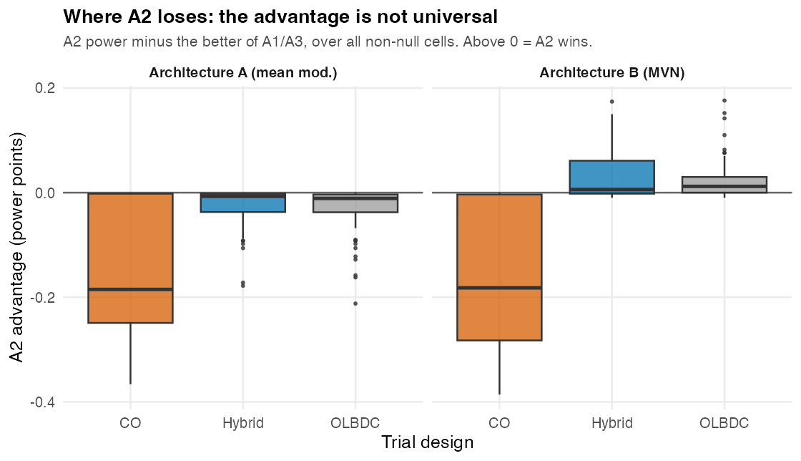
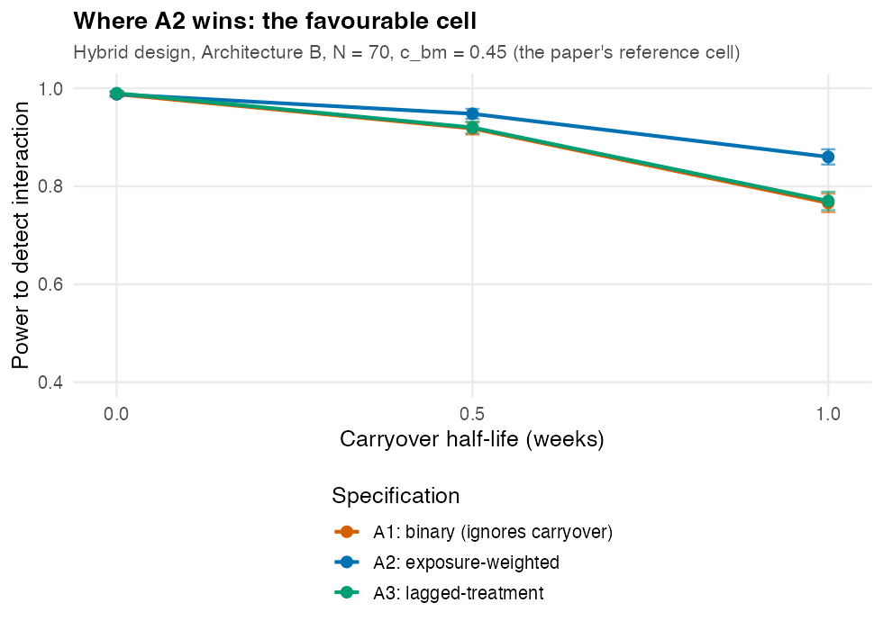
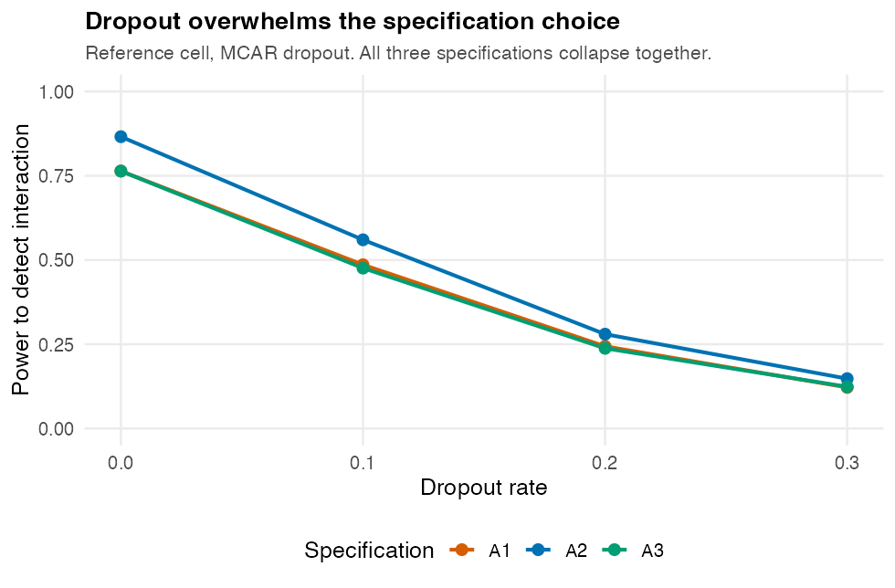

# Readability and Consistency Review: Paper 02 (Carryover Sensitivity)
*2026-06-16 16:10 PDT*

**Manuscript.** Robustness of carryover-mitigation analysis strategies
for biomarker-treatment interaction: a factorial simulation study.

**Assumed reader.** A strong undergraduate statistics major: comfortable
with regression, t-tests, confidence intervals, power, and Type I error,
but not with mixed models, `corCAR1` residual structures, N-of-1 trial
designs, pharmacokinetics, or ADEMP simulation conventions.

**What this document is.** A readability and internal-consistency review,
distinct from the referee report (`referee-report-2026-06-16.md`). It
(1) foregrounds a consistency problem large enough to change the paper's
headline claim, (2) assesses whether the target reader can actually
follow the paper, (3) supplies clean tables and figures that accurately
support the conclusions the data can bear, and (4) states the disposition
of every issue (M1-M7) raised in the prior referee report. All numbers
below were recomputed from the archived cell summaries
(`analysis/data/02-grid-summary.rds`, `02-sensitivity-summary.rds`).

---

## 1. The headline claim is not consistent with the paper's own data

This is the most important finding in either review, and it is a
consistency problem, not a matter of taste.

The Abstract, Discussion (Section 5.1), and Conclusion 1 state that the
exposure-weighted specification A2 'produced the highest power ... across
all 540 cells of the principal factorial' and that 'the ranking
A2 > A1 ~ A3 held across all three trial designs, both DGP architectures,
both sample sizes, and all carryover half-lives'. Recomputed from the
archived grid summary, this is false:

- A2 is strictly the highest-power specification in **68 of 360**
  non-null cells (**19%**).
- A2 is beaten by A1 or A3 in **221 of 360** cells (**61%**).

The advantage is confined to one architecture and two of the three
designs. The table below gives the mean A2 advantage (A2 power minus the
better of A1 and A3) and the share of cells in which A2 wins, by design
and architecture (60 non-null cells per stratum):

| Design | Architecture | Mean A2 advantage | Cells where A2 wins |
|---|---|---:|---:|
| CO (crossover) | A (mean moderation) | **-0.155** | **0%** |
| Hybrid | A (mean moderation) | -0.027 | **0%** |
| OL+BDC | A (mean moderation) | -0.034 | **0%** |
| CO (crossover) | B (MVN) | **-0.169** | **0%** |
| Hybrid | B (MVN) | +0.030 | 55% |
| OL+BDC | B (MVN) | +0.024 | 58% |

Read across the table: under Architecture A, A2 never wins in any design;
under the CO design, A2 never wins in either architecture and is worse by
roughly 16 power points on average. A2's advantage exists **only** under
Architecture B with the Hybrid or OL+BDC design, and even there only when
carryover is present. The worst single cell for A2 is CO / Architecture B
/ Weibull(k=0.7) / t1/2=1.0, where A2 = 0.484 against A3 = 0.870, a
38-point deficit.

Figure 2 shows this directly.

*Figure 2. A2 power minus the better of A1/A3, over all non-null cells.
Box above the zero line means A2 wins. A2 wins only in the two
right-hand boxes (Architecture B, Hybrid and OL+BDC). Under the CO
design (orange) it is heavily dominated in both architectures.*

Why this happens is mechanically sensible. Under a clean crossover (CO),
each participant has a long, well-defined off-drug period, and the binary
on/off contrast used by A1 and A3 is strong. A2's exponentially decayed
`Dbc` predictor pushes those off-drug timepoints toward zero, discarding
exactly the second-period information the crossover was designed to
provide. The Hybrid and OL+BDC designs have short blinded-discontinuation
windows where the graded `Dbc` predictor instead helps. The paper already
half-knows this: the caption of `fig-power-by-spec` says the advantage
appears 'particularly under Architecture B and in the Hybrid and OL+BDC
designs' and pointedly omits CO. The prose conclusions then overreach to
'all 540 cells'.

**Required fix.** Restate the central claim to the supportable version:
*A2 attains the highest power under Architecture B in the Hybrid and
OL+BDC designs; under the crossover design, or under Architecture A, the
binary (A1) and lagged (A3) specifications are at least as powerful and
often substantially more powerful.* The reference cell (Hybrid /
Architecture B) should be presented as the most favourable cell for A2,
not as a representative one. Every 'across all designs / both
architectures' sentence in the Abstract, Section 5.1, and the Conclusions
must be corrected.

This single change does not destroy the paper. A conditional,
design-aware recommendation is still useful and publishable. But the
current universal claim is contradicted by the archived results and
cannot stand.

---

## 2. Readability for the target reader

### 2.1 The single biggest obstacle: the draft is not in finished form

The submitted source renders three stacked versions of every paragraph
(see `claudecode.tex`): a bold bullet summary, a blue italic block, and a
gray prose block. Every blue block in the manuscript contains the
placeholder text 'Lorem ipsum dolor sit amet ...'. An undergraduate
opening the rendered PDF meets Latin filler in roughly one of every three
paragraphs. No reader, expert or novice, can assess a document in this
state. The repository's `strip-claudecode` tool exists precisely to
collapse the scaffold to a single clean prose stream; it must be run
before any readability claim can be made. For this review I read the gray
'orig' prose as the manuscript of record.

### 2.2 Vocabulary that will stop an undergraduate

The paper assumes a reader fluent in clinical-trial methodology. The
following terms are used without definition and will block comprehension.
Each needs a one-line gloss at first use, or a short 'Background' box.

| Term | Where it first appears | Why it blocks the reader |
|---|---|---|
| Aggregated N-of-1 trial | Title, Abstract | Core setting of the paper, never defined. The reader does not know what a single 'N-of-1' trial is, let alone an aggregated one |
| Carryover effect | Abstract | Defined only implicitly ('residual drug effect after the on-drug phase'); state it plainly and early |
| `corCAR1`, AR(1), random intercept | Section 3.3 | The entire analysis model is a mixed model with continuous-time autocorrelated residuals. An undergraduate knows OLS, not this. One paragraph of plain explanation is needed |
| Half-life, first-order elimination kinetics | Section 3.2 | Pharmacokinetic terms central to the decay forms |
| ADEMP | Abstract, Section 3 | Named as if known; expand once (Aims, Data-generating mechanisms, Estimands, Methods, Performance measures) |
| Estimand | Section 3.2 | Modern term; many undergraduates know 'parameter' or 'target', not 'estimand' |
| MCSE (Monte Carlo standard error) | Abstract | Distinguish explicitly from the ordinary standard error of an estimate; this distinction is exactly what an undergraduate will conflate |
| Architecture A / B | Abstract | Defined by reference to a companion paper. The paper must be self-contained: give the two-sentence version here |
| OL, CO, Hybrid, OL+BDC | Section 3.4 | Design abbreviations used throughout figures with no legend or schematic |

### 2.3 The three specifications need a plain-language anchor

The comparison of A1, A2, A3 is the spine of the paper, yet the
definitions are scattered across Section 3.3 in model notation. An
undergraduate needs a single comparison table early, in words:

| Spec | What the analyst assumes about carryover | Predictor in the model | Needs a half-life? |
|---|---|---|---|
| A1 | Carryover does not exist; a participant is simply 'on' or 'off' drug | Binary 0/1 indicator `Db` | No |
| A2 | Drug effect fades smoothly after stopping, halving every assumed half-life | Continuous `Dbc` in [0,1] | Yes |
| A3 | Carryover exists but its shape is unknown; add a flag for the first off-drug timepoint | Binary `Db` plus a lagged flag `L` | No |

One caution belongs in that table, because it is currently invisible and
materially affects interpretation: A3's lagged flag `L` enters only as a
nuisance main effect. The biomarker interaction A3 actually tests is
`bm:Db`, identical to A1's. So A3 is, by construction, A1 plus one extra
control variable. This is why A1 and A3 are nearly indistinguishable
everywhere; the paper presents 'A1 ~ A3' as an empirical discovery when
it is close to a structural certainty. State it.

### 2.4 Structure and length

- The body is long (about 8,500-9,000 words, 10,772 including
  appendices) for a methods paper whose message is one ranking. Removing
  the triple-paragraph scaffold (2.1) will cut a third of it.
- The sensitivity blocks S1-S6 are each given a near-identical subsection.
  An undergraduate loses the thread. Consider one summary table for
  S1-S5 (one row per block: what was varied, what happened to the
  ranking) with the detail relegated to a supplement.
- The toy `Dbc` table (Table, `toy-dbc`) is the most reader-friendly
  object in the paper and should come earlier; it is the clearest single
  explanation of what A2 does.

---

## 3. Clean tables and figures that accurately support the conclusions

These are offered as accessible, honest replacements for the current
exhibits. The numbers are recomputed from the archived summaries.

### 3.1 Where A2 genuinely helps (the favourable cell)

At the reference cell (Hybrid design, Architecture B, N = 70,
c_bm = 0.45) A2's advantage is real and grows with carryover.

| Half-life (wk) | A1 | A2 | A3 | A2 advantage |
|---:|---:|---:|---:|---:|
| 0.0 | 0.988 | 0.988 | 0.990 | -0.002 |
| 0.5 | 0.918 | 0.948 | 0.920 | +0.028 |
| 1.0 | 0.766 | 0.860 | 0.770 | +0.090 |

*All entries are power; MCSE about 0.005-0.019. At zero carryover there
is nothing to model and the three coincide; the gap opens only as
carryover grows.*

*Figure 1. The favourable cell. This is the strongest case for A2 and
should be labelled as such, not as typical.*

### 3.2 Where A2 does not help (the corrective exhibit)

This is the table the paper currently lacks and most needs. It is the
honest companion to Figure 2 and Section 1 above.

| Stratum | A1 | A2 | A3 | A2 best? |
|---|---:|---:|---:|:--:|
| CO, Architecture B, t1/2=1.0 | 0.830 | **0.488** | 0.834 | No |
| CO, Architecture B, Weibull k=0.7 | 0.866 | **0.484** | 0.870 | No |
| Hybrid, Architecture A, t1/2=1.0 | 0.972 | **0.960** | 0.972 | No |
| Hybrid, Architecture B, t1/2=1.0 | 0.766 | **0.860** | 0.770 | Yes |

*Same N = 70, c_bm = 0.45. A2 is the worst choice under the crossover
design and a slightly worse choice under Architecture A.*

### 3.3 Dropout dominates the specification choice

This conclusion (Section 5.4) is well supported and is the paper's most
practically useful message. It deserves a clean exhibit.

| MCAR dropout rate | A1 | A2 | A3 |
|---:|---:|---:|---:|
| 0.0 | 0.764 | 0.866 | 0.764 |
| 0.1 | 0.486 | 0.560 | 0.476 |
| 0.2 | 0.244 | 0.280 | 0.238 |
| 0.3 | 0.122 | 0.148 | 0.124 |

*Figure 3. Moving from 0% to 30% dropout costs about 0.72 in power; the
best-versus-worst specification gap is at most about 0.10 and shrinks to
0.03 as dropout rises. The design lever dwarfs the analysis lever.*

---

## 4. Internal-consistency audit (numbers and cross-references)

Beyond Section 1, the following inconsistencies should be reconciled.

1. **R version contradiction.** Section 3.6 states 'R 4.5.3'; the
   Reproducibility section states 'R 4.4.x'. Pick one.

2. **'Highest power across all 540 cells' vs the figure caption.**
   Section 5.1 says all cells; the `fig-power-by-spec` caption restricts
   the advantage to Architecture B and the Hybrid/OL+BDC designs. These
   are not compatible (Section 1).

3. **Architecture A claim.** Conclusion 5 says 'Under Architecture A ...
   A2's advantage is smaller but still positive'. The archived data show
   A2's advantage under Architecture A is **negative** in all three
   designs (Section 1 table). Correct or remove.

4. **Bias/coverage scored against one target.** The headline table
   reports bias, MSE, and coverage for all three specs against a single
   value (theta_true = -3.6), but A1/A3 estimate `bm:Db` and A2 estimates
   `bm:Dbc`: different parameters. A1's 'bias +1.09' and 'coverage 0.83'
   are artefacts of scoring against A2's target, not estimator defects
   (this is referee finding M1). For the target reader this is actively
   misleading; either match each estimand to its own target or drop those
   columns and compare only power and Type I error.

5. **Type I 'maximum 0.084' multiplicity argument.** Section 4.5 treats
   the 540 null cells as independent binomial draws. They are not: specs
   share common random numbers within a cell, and the t1/2=0 cells are
   exact duplicates across decay forms (item 6). Soften or replace the
   argument.

6. **'540 cells' overstates unique coverage.** At t1/2 = 0 the decay
   function returns 0 for all five decay-form levels
   (`functions.R:54`), so those five levels are identical DGPs. Of the
   180 cells at t1/2 = 0, only 36 are unique; 144 of the headline 540
   (27%) are exact duplicates. Report the unique count (396) alongside
   the nominal 540.

7. **High-precision rerun is on a different design.** The McNemar
   p = 6.6e-17 confirmation (Section 4.7) is computed on OL+BDC, while
   the reference cell is Hybrid. State this so the reader does not attach
   the p-value to the Hybrid cell.

8. **Sturdevant-Lumley citation.** Section 4.6 credits that paper with a
   'two-tier reporting convention'. The paper is a mixed-effects test for
   carryover effects (TROPHY hypertension), not a simulation-reporting
   method (referee finding M3). Remove or recite correctly.

9. **Unpublished companion dependency.** The Type I conservatism
   interpretation and the entire S6 recalibration rest on an unpublished
   companion (`pmsimstats_calibration2026`, paper 10). The reader cannot
   verify the load-bearing 6-10% standard-error inflation (referee
   finding M5). Make the key result self-contained.

10. **Architecture-B estimand description.** Section 3.2 calls it a
    'dimensionless correlation c_bm' but then scores bias in BR units
    with a negative sign (-3.6); the sign convention is never explained.

---

## 5. Disposition of the prior referee findings (M1-M7)

| Finding | Status in this review | Where addressed |
|---|---|---|
| **M1** Bias/MSE/coverage scored against one estimand | Confirmed; recast as a readability hazard for the target reader | Section 4, item 4 |
| **M2** A3 tests the same interaction as A1 (`L` is nuisance only) | Confirmed; folded into the plain-language spec table the reader needs | Section 2.3 |
| **M3** Sturdevant-Lumley misattributed | Confirmed; listed as a consistency defect | Section 4, item 8 |
| **M4** '540 cells' includes 27% exact duplicates | Confirmed | Section 4, item 6 |
| **M5** Depends on unpublished companion | Confirmed | Section 4, item 9 |
| **M6** Type I multiplicity assumes independence | Confirmed | Section 4, item 5 |
| **M7** Lorem ipsum draft scaffold | Confirmed; this is the first readability blocker | Section 2.1 |
| **NEW** A2 is not universally dominant | Not in the prior report; the most serious issue | Section 1 |

The new finding in Section 1 supersedes the prior review's framing. The
referee report verified the reference cell and accepted the 'across all
cells' language on the strength of it; the full-grid recomputation shows
that language is false. Both documents should be read with Section 1 as
the controlling result.

---

## 6. Prioritised recommendations

1. **Correct the central claim** to the design-and-architecture-
   conditional version (Section 1). Nothing else matters until this is
   done, because the Abstract, Discussion, and Conclusions currently
   assert something the data contradict.
2. **Strip the `claudecode` scaffold** and proof-read the result as
   continuous prose (Section 2.1).
3. **Add the corrective exhibit** (Section 3.2 / Figure 2) so the
   conditional nature of the advantage is visible, not buried.
4. **Add a plain-language onboarding** for the target reader: define the
   setting, the three specifications (Section 2.3 table), and the model
   in words before the notation.
5. **Fix the bias/coverage estimand mismatch** (Section 4, item 4) or
   restrict the cross-spec comparison to power and Type I error.
6. **Reconcile the ten consistency items** in Section 4 (R version,
   unique-cell count, rerun design, citation, companion dependency).
7. **Lead with the dropout result** (Section 3.3): it is the most robust
   and most useful finding and survives every caveat above.

---
*Rendered on 2026-06-16 at 16:10 PDT.* 
*Source: ~/prj/res/36-pmsimstats-ng/pmsimstats-ng/analysis/report/02-carryover-sensitivity/readability-review/readability-consistency-review-2026-06-16.md*
