# Feasible Range of the Biomarker Moderation Parameter Under AR(1) and Compound-Symmetry Correlation Structures {.unlisted .unnumbered}
*2026-09-30 09:40 PDT*

**Author:** pmsimstats team

**Scope.** This whitepaper determines how the choice of temporal
correlation structure in the covariance-moderation data-generating
process (DGP) affects the largest biomarker moderation parameter
$c_{bm}$ for which the joint correlation matrix remains positive
definite. It replaces a grid search with an exact closed-form ceiling,
evaluates that ceiling on the three trial designs of paper 01
(`analysis/report/01-dgp-mean-moderation-vs-mvn/`), and supplies the
numbers requested by the `[TO RE-VERIFY]` note at the end of that
paper's Appendix B.7.

It then asks a design question: which features of a trial schedule
(number of visits, spacing between visits, the gap at a treatment
switch, the number of on/off switches, the share of visits on drug)
determine how large a biomarker-response correlation a simulation can
test? The ceiling is the largest testable $c_{bm}$: a value above it
cannot be simulated, because no valid covariance matrix carries it.
The figures in Section 5 are intended as design aids for that
decision. Throughout, "largest testable $c_{bm}$" and "ceiling" mean
the same thing.

```{=latex}
\clearpage
\tableofcontents
\listoftables
\listoffigures
\clearpage
```

## 1. Summary

The ceiling on $c_{bm}$ is available in closed form,
$c_{bm}^{\ast} = (v^{\top} M^{-1} v)^{-1/2}$, where $M$ is the
correlation block of the three response factors and $v$ is the
on-drug and off-drug coupling pattern with $c_{bm}$ factored out. We
computed it for every path of the CO, Hybrid, and OL+BDC designs
under a crossed set of correlation structures, and on synthetic
schedules that vary one design feature at a time, and under
alternative shapes of carryover decay. Nine findings follow.

1. **The reference value sits at the ceiling.** Under the
   covariance-moderation DGP as implemented (Architecture B,
   `dgp_architecture = 'mvn'`), the ceiling at $t_{1/2} = 0$ is 0.456
   in Hybrid and 0.452 in OL+BDC. Paper 01's reference value
   $c_{bm} = 0.45$ therefore lies within 0.002 to 0.006 of the
   boundary in its no-carryover cells.
2. **AR(1) widens the feasible range at the production value of
   $\rho$.** At $\rho = 0.7$, replacing compound symmetry (CS) with
   AR(1) in the within-factor block raises the ceiling in every design,
   by 0.09 to 0.25 with a constant cross-factor block and by 0.21 to
   0.45 with a decaying one.
3. **The widening is not general.** At $\rho = 0.3$, compound symmetry
   admits a higher ceiling than AR(1) in all three designs, and at
   $\rho = 0.5$ it still does in OL+BDC.
4. **The ceiling depends on carryover.** Under Architecture B the
   ceiling rises with the carryover half-life, to 0.544 (Hybrid) and
   0.533 (OL+BDC) at $t_{1/2} = 1$.
5. **The published configuration cannot run the reference value
   without carryover.** For the specification described as
   Hendrickson et al.'s published code (CS, constant cross-factor
   block, step coupling), the ceiling at $t_{1/2} = 0$ is 0.346 to
   0.352. It jumps to 0.841 at any positive half-life in Hybrid and
   OL+BDC, but not in CO.
6. **Values just above the ceiling are altered without warning.** The
   positive-definiteness repair applied by `buildSigma()` perturbs the
   specified correlations by at most 0.004 just above the ceiling, and
   reports nothing unless `verbose = TRUE`.
7. **Under compound symmetry, schedule design is irrelevant to the
   ceiling.** It depends only on the number of visits $n$, the number
   of visits with the coupling on $k$, and the correlation parameters,
   through an exact closed form. Spacing, the gap at a switch, the
   number of switches, and the order of on-drug visits have no effect.
8. **Under AR(1), schedule design governs the ceiling.** Each
   additional on/off switch lowers it, sharply when visits are close
   together; with 16 weekly visits it falls from 0.51 with one switch
   to 0.15 with fifteen. A short gap at the switch lowers it (0.33 at a
   half-week gap, 0.72 at an eight-week gap, at fixed study length).
   Uneven spacing in the paper 01 Hybrid and OL+BDC schedules costs
   0.04 to 0.09 relative to even spacing over the same span.
9. **The shape of carryover decay would matter, moderately.** If the
   biomarker-response correlation decayed as one of the Weibull shapes
   of paper 02 rather than exponentially, faster washout would lower
   the ceiling toward its no-carryover value and a heavier tail would
   raise it, by up to 0.09 in the paper 01 designs and 0.13 in a
   multi-cycle design, at short half-lives. The package currently
   decays the correlation exponentially only, so this is a
   counterfactual.

## 2. Evidence basis

Evidence labels follow the project convention: **verified** (computed
and checked in this analysis), **inspected** (confirmed by reading
code or documents), **inferred** (follows from verified results but
not checked directly), and **unverified**.

- The matrix builder used here reproduces the package's
  `buildSigma()` correlation matrix for Architecture B to
  $1.1 \times 10^{-16}$ on all eight design paths at all three
  half-lives. (Verified.)
- The closed-form ceiling agrees with a bisection on the smallest
  eigenvalue of the full matrix to $2.0 \times 10^{-11}$ across all
  192 path configurations. (Verified.)
- The compound-symmetry and step-coupling levels implement the
  specification of Hendrickson et al.'s published code at commit
  `58b32a9` as described in paper 01 Sections 2.2.4 and B.2 to B.4.
  That commit is not present in this repository; the only vendored
  copy (`analysis/scripts/quick-sim/hendrickson-original-comparison/`)
  is the 2024 revision. Ceilings for those levels are therefore
  ceilings for the specification as described, not for the published
  code. (Unverified against the source.)
- The ceiling does not depend on how carryover is applied to the
  response mean, and in particular not on the recursive-versus-anchored
  error in that calculation corrected in commit `955c604`. Under
  Architecture B the coupling is set from $t_{sd}$ and $\lambda$
  directly (`R/generateData.R:341-356`), and the response means do not
  enter the correlation matrix (inspected). Under the step coupling
  only whether the response mean is nonzero matters, and the recursive
  and anchored forms have the same zero pattern (inferred from the two
  formulas). The error does affect the paper 01 power results; that is
  addressed in `docs/33-paper01-dgp-architecture-review.md`.
- The run used the host R session without `renv`, at commit
  `c0b31f5` with uncommitted working-tree changes. No function in the
  package source was modified.

## 3. Method

### 3.1 The correlation matrix

For one participant on one randomization path with $n$ measurement
occasions at cumulative weeks $w_1 < \cdots < w_n$, the DGP draws
$(B, \mathrm{BL}, TV_{1:n}, PB_{1:n}, BR_{1:n})$ from a multivariate
normal distribution. On the correlation scale the matrix is

$$
R = \begin{pmatrix}
1 & 0 & \tilde r^{\top} \\
0 & 1 & 0^{\top} \\
\tilde r & 0 & M
\end{pmatrix},
\qquad
M = \begin{pmatrix}
A & C & C \\
C & A & C \\
C & C & A
\end{pmatrix},
$$

where $A$ is the $n \times n$ within-factor block, $C$ the
cross-factor block, and $\tilde r$ the biomarker coupling vector,
nonzero only on the $BR$ positions. The baseline row factors out of
every determinant and is dropped below.

### 3.2 The exact ceiling

Write $\tilde r = c_{bm} v$. By the Schur complement on the biomarker
row, $R$ is positive definite if and only if $M$ is positive definite
and $1 - c_{bm}^2\, v^{\top} M^{-1} v > 0$. The quantity
$c_{bm}^2\, v^{\top} M^{-1} v$ is the coefficient of determination
from regressing the biomarker on all response variables, so the
condition states only that the biomarker cannot be more than
perfectly predictable. The ceiling is

$$
c_{bm}^{\ast} = \bigl(v^{\top} M^{-1} v\bigr)^{-1/2},
$$

and it is attained: at $c_{bm} = c_{bm}^{\ast}$ the smallest eigenvalue
of $R$ is exactly zero. A design's feasible range is the minimum of
$c_{bm}^{\ast}$ over its paths, since every path's matrix must be valid
at the common $c_{bm}$.

### 3.3 Crossed factors

The two blocks that "AR(1)" touches in the implementation, and the
coupling rule that sets $v$, were crossed so that the effect of each
could be read with the others held fixed.

| Factor | Levels |
|---|---|
| Within-factor block $A$ | CS: $A_{ts} = \rho$ for $t \neq s$. AR(1): $A_{ts} = \rho^{\lvert w_t - w_s \rvert}$ |
| Cross-factor off-diagonal $C_{ts}$, $t \neq s$ | Constant: $c_\times$. Decaying: $c_\times \rho^{\lvert w_t - w_s \rvert}$ |
| Coupling $v$ at off-drug occasions | Graded: $\phi_t$. Step: $\mathbf{1}[\phi_t > 0]$ |
| Carryover half-life $t_{1/2}$ | 0, 0.5, 1.0 weeks |
| Design and path | CO (2 paths), Hybrid (4), OL+BDC (2) |

Table: Crossed factors and their levels in the ceiling computation

In every configuration, $C_{tt} = c_1$ on the diagonal and $v_t = 1$ at
on-drug occasions. The residual fraction is
$\phi_t = (1/2)^{t_{sd,t}/t_{1/2}}$ at an off-drug occasion that follows
drug exposure when $t_{1/2} > 0$, and $\phi_t = 0$ otherwise, including
at off-drug occasions before first exposure.

Two corners of the first three rows correspond to named processes.

- **Architecture B (`covar`)**: AR(1), decaying cross-factor, graded.
  This is what `buildSigma()` constructs for
  `dgp_architecture = 'mvn'`.
- **Published specification (`orig`)**: CS, constant cross-factor,
  step.

The remaining configurations are counterfactual combinations used to
isolate one choice at a time.

### 3.4 Parameters and designs

Production parameters were taken from the paper 01 driver
(`analysis/scripts/quick-sim/01-dgp-prototype.R`, lines 181-182):
$\rho = 0.7$ for all three response factors, $c_1 = 0.2$,
$c_\times = 0.1$. The designs are those of the same driver (lines
65-103).

| Design | Occasions (weeks) | Paths |
|---|---|---|
| CO | 2.5, 5, ..., 20 | A: on drug at occasions 1-4. B: on drug at occasions 5-8 |
| Hybrid | 4, 8, 9, 10, 11, 12, 16, 20 | A-D: open label, blinded discontinuation, one crossover cycle |
| OL+BDC | 4, 8, 12, 16, 17, 18, 19, 20 | A: off drug at 19-20. B: off drug at 18-20 |

Table: Occasion schedules and paths of the CO, Hybrid and OL+BDC designs

Because the three response factors share one value of $\rho$, the
loop-order dependence of the cross-factor decay rate noted in paper 01
Appendix B.5.2 does not arise.

A sensitivity sweep over $\rho \in \{0.3, 0.5, 0.7, 0.9\}$ was run for
Architecture B and for CS with a constant cross-factor block under
both couplings.

## 4. Results

### 4.1 Ceilings at production parameters

Design-level ceilings (minimum over paths), reported as
$t_{1/2} = 0 \,/\, 0.5 \,/\, 1$ (verified):

| $A$ | $C$ off-diagonal | Coupling | CO | Hybrid | OL+BDC |
|---|---|---|---|---|---|
| AR(1) | decaying | graded (**`covar`**) | .619 / .619 / .619 | .456 / .506 / .544 | .452 / .500 / .533 |
| AR(1) | decaying | step | .619 / .494 / .494 | .456 / .519 / .519 | .452 / .519 / .519 |
| AR(1) | constant | graded | .591 / .591 / .591 | .452 / .490 / .514 | .438 / .472 / .491 |
| AR(1) | constant | step | .591 / .430 / .430 | .452 / .462 / .462 | .438 / .463 / .463 |
| CS | constant | graded | .346 / .346 / .346 | .346 / .370 / .411 | .352 / .386 / .456 |
| CS | constant | step (**`orig`**) | .346 / .346 / .346 | .346 / .841 / .841 | .352 / .841 / .841 |
| CS | decaying | graded | .164 / .164 / .164 | .247 / .265 / .299 | .151 / .170 / .214 |
| CS | decaying | step | .164 / .164 / .164 | .247 / .845 / .845 | .151 / .832 / .832 |

Table: Design-level $c_{bm}$ ceilings by correlation structure, coupling and half-life

The binding path for Architecture B is path A in Hybrid and OL+BDC at
$t_{1/2} = 0$, switching to path B in Hybrid at $t_{1/2} = 1$. In CO
it is path A at $t_{1/2} = 0$ and path B at positive half-lives.

Figure 1 shows the two named processes. Values above a curve cannot
be simulated under that structure.

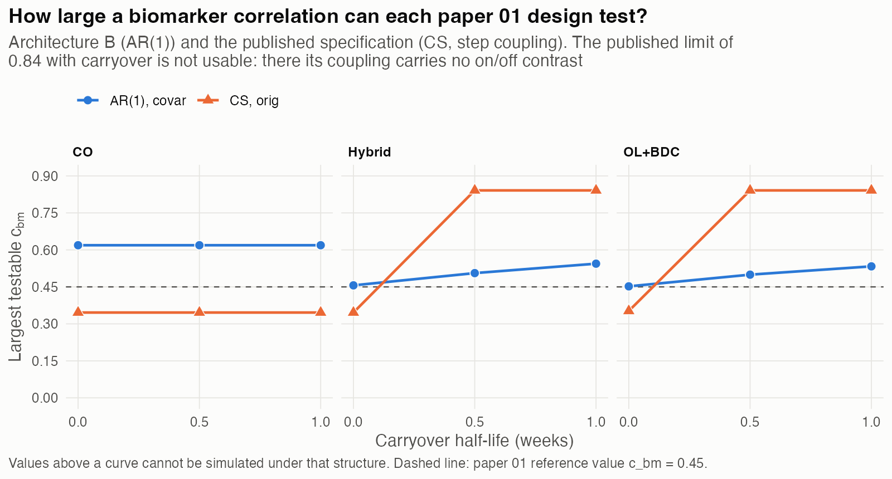

*Figure 1. Largest testable $c_{bm}$ for each paper 01 design, by
carryover half-life, under Architecture B and the published
specification. The published limit of 0.84 at positive half-lives is
not usable: in that regime its coupling carries no on-drug versus
off-drug contrast (Section 4.6).*

### 4.2 The response block on its own

The response block $M$ must itself be positive definite for any
$c_{bm} > 0$ to be feasible. Its smallest eigenvalue at production
parameters is (verified):

| $A$ | $C$ off-diagonal | CO | Hybrid | OL+BDC |
|---|---|---|---|---|
| AR(1) | decaying | 0.288 | 0.074 | 0.074 |
| AR(1) | constant | 0.331 | 0.093 | 0.093 |
| CS | constant | 0.200 | 0.200 | 0.200 |
| CS | decaying | 0.034 | 0.039 | 0.015 |

Table: Smallest eigenvalue of the response block $M$ by structure and design

For CS with a constant cross-factor block, the analytical expression
$(1 - \rho) - (c_1 - c_\times)$ given in paper 01 Appendix B.7 predicts
$0.3 - 0.1 = 0.2$, which matches exactly. The design-dependent values
for AR(1) reflect the unequal spacing of the Hybrid and OL+BDC
schedules, whose one-week gaps produce strongly correlated adjacent
occasions.

### 4.3 The effect of AR(1), isolated

Holding the cross-factor block and the coupling fixed (graded
coupling, $t_{1/2} = 0$), replacing CS by AR(1) in the within-factor
block changes the ceiling as follows (verified):

| Cross-factor block | CO | Hybrid | OL+BDC |
|---|---|---|---|
| Constant | 0.346 to 0.591 | 0.346 to 0.452 | 0.352 to 0.438 |
| Decaying | 0.164 to 0.619 | 0.247 to 0.456 | 0.151 to 0.452 |

Table: Ceiling change from CS to AR(1) by cross-factor block and design

At the production value of $\rho$, AR(1) widens the feasible range
under either cross-factor choice. The size of the gain depends on the
cross-factor block, because the two choices interact. A decaying
cross-factor block combined with a CS within-factor block produces
the lowest ceilings in the table, consistent with paper 01 Appendix
B.7's statement that this combination lowers the feasible range
substantially. That combination asserts that a factor's correlation
with *another* factor decays with lag while its correlation with
*itself* does not, and $M$ is then close to singular (Section 4.2).

### 4.4 Dependence on $\rho$

Design-level ceilings at $t_{1/2} = 0$, reported as CO / Hybrid /
OL+BDC (verified; "not PD" means $M$ itself is not positive definite):

| $\rho$ | CS, constant cross, graded | AR(1), decaying cross, graded |
|---|---|---|
| 0.3 | .520 / .504 / .504 | .502 / .475 / .428 |
| 0.5 | .458 / .458 / .458 | .549 / .489 / .448 |
| 0.7 | .346 / .346 / .352 | .619 / .456 / .452 |
| 0.9 | not PD | .449 / not PD / not PD |

Table: Design-level ceilings at $t_{1/2} = 0$ across values of $\rho$

The two structures respond to $\rho$ differently. Under CS the
ceiling falls steadily as $\rho$ rises, and $M$ reaches singularity at
$\rho = 0.9$, where $(1 - \rho) - (c_1 - c_\times) = 0$. Under AR(1)
the ceiling rises with $\rho$ through 0.7 in CO and OL+BDC, and in
Hybrid peaks at $\rho = 0.5$ before falling. At $\rho = 0.9$ it
collapses: the one-week gaps in Hybrid and OL+BDC make adjacent
occasions so strongly correlated that $M$ is no longer positive
definite, and the CO ceiling falls to 0.449.

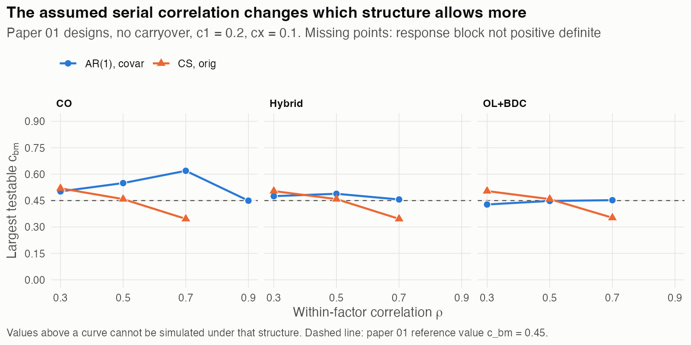

*Figure 2. Largest testable $c_{bm}$ by the assumed within-factor
correlation $\rho$, for the paper 01 designs without carryover.
Missing points mark values of $\rho$ at which the response block is
not positive definite.*

The consequence is that "AR(1) expands the feasible range of
$c_{bm}$" is true at $\rho = 0.7$ and false at $\rho = 0.3$. At
$\rho = 0.5$ it holds in CO and Hybrid but not in OL+BDC.

### 4.5 Dependence on carryover

Under Architecture B the ceiling rises with carryover in Hybrid
(0.456 to 0.544) and OL+BDC (0.452 to 0.533), and is flat in CO
(0.619). The following interpretation is inferred and consistent with
Appendix B.7 of paper 01: graded off-drug entries make $v$ smoother
across occasions, moving it toward the constant direction in which
$M$ is best conditioned. CO is flat because its binding path at
positive half-lives is the placebo-first path B, whose coupling
pattern does not change with carryover, since $\phi_t = 0$ before
first exposure.

The practical implication is that a $c_{bm}$ grid chosen to be
feasible at positive half-lives may be infeasible at $t_{1/2} = 0$.
The no-carryover cell is the binding constraint.

### 4.6 The ceiling reversal under step coupling

Paper 01 Appendix B.7 states that the published coupling has the
lower ceiling at $t_{1/2} = 0$ and the higher ceiling at any positive
half-life. For Hybrid and OL+BDC this is confirmed: 0.346 against
0.456 at $t_{1/2} = 0$, and 0.841 against 0.51 to 0.54 at positive
half-lives (verified). The mechanism is the one given there. Once any
carryover is present, the step coupling assigns the full $c_{bm}$ at
every post-exposure occasion, so $v$ is constant on paths that begin on
drug, and a constant vector aligns with the leading eigenvector of a
compound-symmetric block.

Two qualifications are needed.

- **The reversal does not occur in CO.** There the published ceiling
  is 0.346 at every half-life. CO's placebo-first path has
  pre-exposure zeros in $v$ at every half-life, so $v$ never becomes
  constant. Appendix B.7 states the reversal without this
  qualification.
- **The jump depends on compound symmetry.** With step coupling but an
  AR(1) within-factor block, the ceiling at positive half-lives is
  0.519 rather than 0.841. The large apparent gain in the published
  configuration therefore requires both the step and the
  compound-symmetric block.

As Appendix B.7 argues, the higher ceiling is not an advantage: it is
available precisely because the coupling vector has stopped carrying
any on-drug versus off-drug contrast.

### 4.7 Behavior of the positive-definiteness repair

The simulation driver calls `generateData()` with
`makePositiveDefinite = TRUE`. When the covariance matrix fails
`is.positive.definite()`, `buildSigma()` replaces it with
`make.positive.definite(sigma, tol = 1e-3)`
(`R/generateData.R:377-388`) and issues a warning only when
`verbose = TRUE` (inspected).

On each design's binding path for Architecture B at $t_{1/2} = 0$, the
specified correlations were compared with those in the repaired
matrix at $0.99\,c_{bm}^{\ast}$ and $1.01\,c_{bm}^{\ast}$ (verified):

| Design | $c_{bm}$ | Largest change in $r$ |
|---|---|---|
| CO | 0.6127 | 0.0000 |
| CO | 0.6251 | 0.0041 |
| Hybrid | 0.4516 | 0.0000 |
| Hybrid | 0.4608 | 0.0008 |
| OL+BDC | 0.4477 | 0.0000 |
| OL+BDC | 0.4567 | 0.0008 |

Table: Largest change in correlations after repair near the ceiling, by design

Below the ceiling the repair does not act, so the paper 01 production
run at $c_{bm} = 0.45$ drew from the matrices as specified. This is
consistent with an earlier check showing a smallest eigenvalue of
0.0021 in OL+BDC and 0.0057 in Hybrid at that value. Just above the
ceiling the repair acts, and the perturbation is small enough to pass
unnoticed. A run at $c_{bm} = 0.46$ in OL+BDC would therefore be
silently perturbed rather than rejected.

## 5. Which design decisions change the largest testable $c_{bm}$

Section 4 evaluated three fixed designs. This section varies the
schedule itself, one feature at a time, to identify which design
decisions move the largest testable $c_{bm}$ and by how much. Each
correlation structure is paired with its own cross-factor form: AR(1)
with decaying cross-factor entries (Architecture B, `covar`) and CS
with constant ones (the published specification, `orig`). All
schedules use the production parameters and no carryover, where the
graded and step couplings coincide, so that only the correlation
structure and the schedule vary.

### 5.1 Compound symmetry: schedule design is irrelevant

Under CS every block of $M$ is a linear combination of $I_n$ and the
all-ones matrix $J_n$, so $M = K_1 \otimes I_n + K_2 \otimes J_n$ with

$$
K_1 = (1-\rho) I_3 + (c_1 - c_\times)(J_3 - I_3), \qquad
K_2 = \rho I_3 + c_\times (J_3 - I_3).
$$

$M^{-1}$ then separates into a part acting on the constant direction
and a part acting on its complement, and for a 0/1 coupling pattern
with $k$ of $n$ visits on,

$$
\frac{1}{c_{bm}^{\ast\,2}} = a\,\frac{k(n-k)}{n} + b_n\,\frac{k^2}{n},
\qquad a = [K_1^{-1}]_{33}, \quad b_n = [(K_1 + nK_2)^{-1}]_{33}.
$$

This expression agrees with the numerical ceiling to
$2.8 \times 10^{-16}$ in every schedule examined (verified). It
contains only $n$, $k$, $\rho$, $c_1$ and $c_\times$. The times of the
visits, the gaps between them, the number of switches, and the order
of on-drug and off-drug visits do not appear. The reason is structural:
under CS every pair of visits is equally correlated, so the matrix
cannot distinguish one visit from another, and only how many visits
carry the coupling can matter.

Figure 3 shows this directly. It collects every schedule in the
analysis with 8 visits of which 4 are on drug. The CS limit is 0.346 in
all twenty, while the AR(1) limit ranges from 0.33 to 0.74 across the
same schedules.

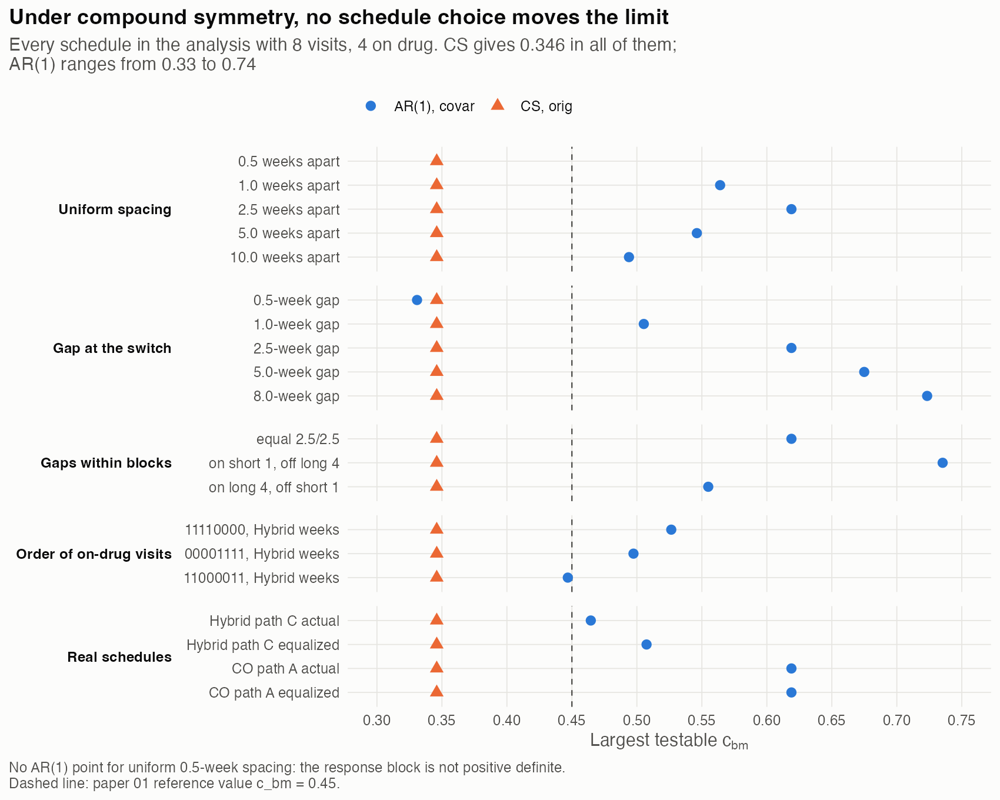

*Figure 3. Largest testable $c_{bm}$ for every 8-visit, 4-on-drug
schedule in the analysis, grouped by the design feature varied. The
compound-symmetry limit is identical in every schedule.*

What does matter under CS is the number of visits and the share with
the coupling on, and Figure 4 is therefore a complete lookup for any
CS design at these parameters. The limit falls roughly as $n^{-1/2}$ at
a fixed share, and is lowest when about half the visits carry the
coupling. At these parameters no CS design with 16 or more visits can
test $c_{bm} = 0.45$; with 8 visits only the most unbalanced shares
(1 or 7 of 8) can.

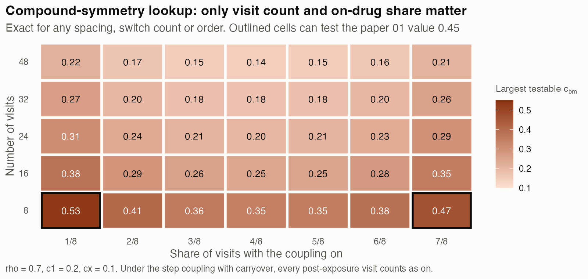

*Figure 4. Largest testable $c_{bm}$ under compound symmetry, from the
closed form. Exact for any spacing, switch count or order. Under the
step coupling with carryover, every post-exposure visit counts as on,
so $k$ is the number of visits from first exposure onward.*

The cross-factor parameters enter almost entirely through their
difference $c_1 - c_\times$ (verified, Hybrid path C):

| $c_1$ | $c_\times$ | $c_1 - c_\times$ | CS limit | AR(1) limit |
|---|---|---|---|---|
| 0.1 | 0.0 | 0.1 | 0.346 | 0.485 |
| 0.2 | 0.1 | 0.1 | 0.346 | 0.465 |
| 0.3 | 0.2 | 0.1 | 0.345 | 0.435 |
| 0.1 | 0.1 | 0.0 | 0.378 | 0.504 |
| 0.2 | 0.2 | 0.0 | 0.377 | 0.491 |
| 0.2 | 0.0 | 0.2 | 0.261 | not PD |
| 0.3 | 0.1 | 0.2 | 0.261 | not PD |

Table: CS and AR(1) limits across cross-factor parameters $c_1$ and $c_\times$

Under AR(1) the difference also dominates, but the levels themselves
matter too, and a large difference makes the response block itself
invalid.

### 5.2 AR(1): schedule design governs the limit

Under AR(1) every schedule feature examined moves the limit (verified).

| Design decision | Effect on the largest testable $c_{bm}$ under AR(1) | Figure |
|---|---|---|
| More visits | Lowers it: 0.605 to 0.434 from 4 to 32 visits at 1-week spacing; 0.758 to 0.358 at 2.5-week spacing | 5 |
| More on/off switches | Lowers it sharply: 0.508 to 0.149 from 1 to 15 switches at 1-week spacing; 0.480 to 0.278 at 2.5-week spacing | 6 |
| Shorter gap at the switch | Lowers it: 0.723 at an 8-week gap to 0.331 at a half-week gap, at fixed study length | 7 |
| Uniform spacing | Non-monotone: 0.564 at 1 week, 0.619 at 2.5, 0.494 at 10; at 0.5 weeks the response block is not positive definite | 7 |
| Clustering on-drug visits | Raises it: 0.735 with 1-week gaps on drug and 4-week gaps off, against 0.555 for the reverse | 3 |
| More on-drug visits | Lowers it steadily: 0.867 with 1 of 8 on drug to 0.506 with 7 of 8 | 8 |
| Order of on-drug visits | Matters: 0.526, 0.497 and 0.447 for three orders with the same visit count and on-drug count | 3 |

Table: Effect of schedule design decisions on the AR(1) ceiling

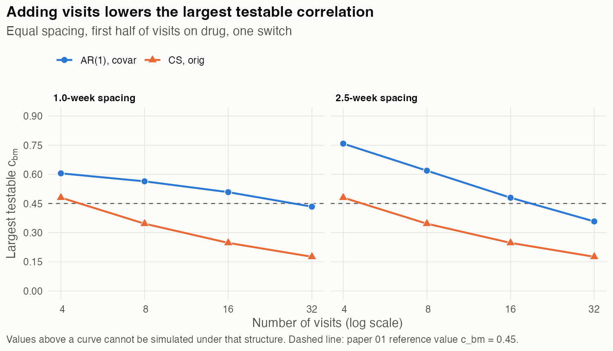

*Figure 5. Largest testable $c_{bm}$ by number of visits, at two
uniform spacings, with the first half of visits on drug and one
switch.*

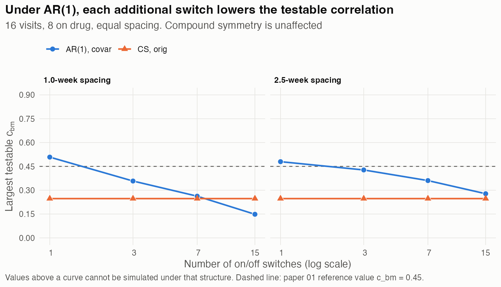

*Figure 6. Largest testable $c_{bm}$ by number of on/off switches, for
16 visits of which 8 are on drug. Under AR(1) each switch lowers the
limit, and the cost per switch is larger at 1-week than at 2.5-week
spacing. The compound-symmetry limit is unaffected.*

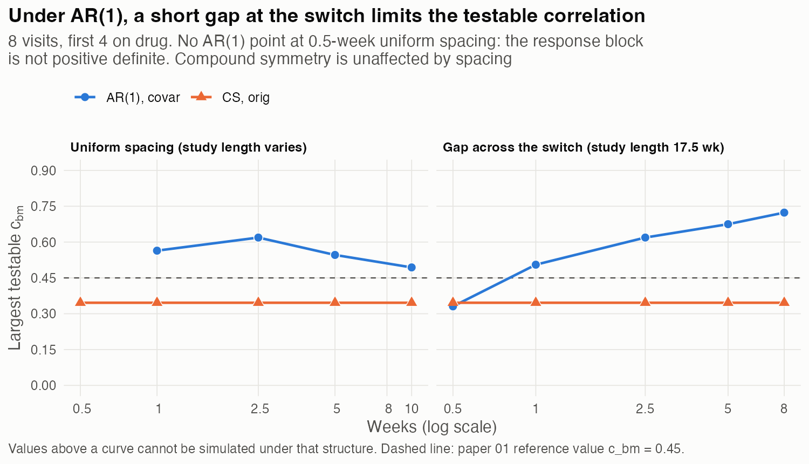

*Figure 7. Largest testable $c_{bm}$ by uniform spacing (left), where
study length grows with spacing, and by the gap across the single
switch at a fixed study length of 17.5 weeks (right).*

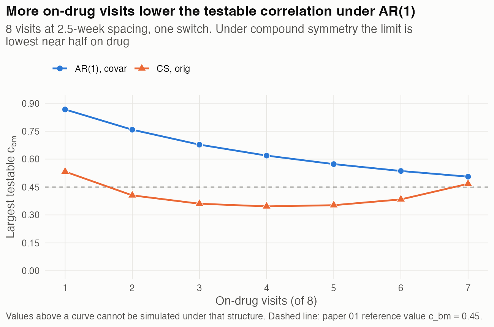

*Figure 8. Largest testable $c_{bm}$ by the number of on-drug visits,
for 8 visits at 2.5-week spacing with one switch.*

Two features of these results bear directly on design choices. First,
the number of switches is the most consequential decision under
AR(1), and its cost depends on spacing: at 1-week spacing, going from
one switch to three costs 0.15, whereas at 2.5-week spacing it costs
0.05. Multi-cycle N-of-1 designs, which exist to create many
switches, are therefore the designs in which a covariance-moderation
simulation can test the smallest biomarker correlations. Second, the
gap across a switch matters more than the average spacing: holding
study length fixed, widening only the switch gap from 1 to 2.5 weeks
raises the limit from 0.505 to 0.619.

### 5.3 A lookup for spacing and switches

Figure 9 crosses the two most consequential decisions, visit spacing
and number of switches, for a 16-visit design with half the visits on
drug. It shows a trade-off that neither factor reveals alone. With a
single switch, closer spacing gives the higher limit (0.52 at 1.5
weeks against 0.40 at 5 weeks), because the one switch is the only
place where closeness is costly and a shorter study keeps the
on-drug visits correlated. With many switches the ordering reverses
(0.15 at 1 week against 0.33 at 5 weeks with fifteen switches),
because every switch then pays the cost of a short gap. Only 4 of the
24 designs in the grid can test $c_{bm} = 0.45$, all with a single
switch and spacing of 2.5 weeks or less.

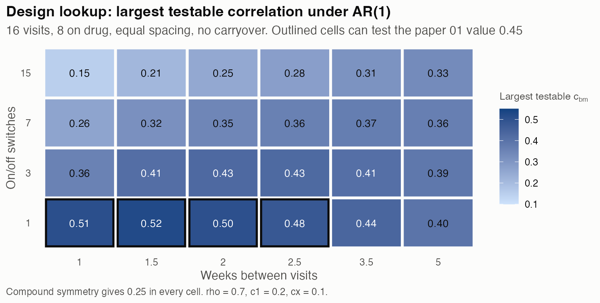

*Figure 9. Largest testable $c_{bm}$ under AR(1) for 16 visits, 8 on
drug, equal spacing and no carryover. Outlined cells can test the
paper 01 reference value 0.45. Compound symmetry gives 0.25 in every
cell.*

### 5.4 The paper 01 schedules

The Hybrid and OL+BDC schedules place one-week gaps at their switches.
Replacing each binding path's visit times with evenly spaced times
over the same study length, keeping the order of on-drug and off-drug
visits, raises the AR(1) limit from 0.465 to 0.507 for Hybrid path C
and from 0.452 to 0.545 for OL+BDC path A. The CO schedule is already
evenly spaced. Uneven spacing therefore accounts for part of the gap
between the CO limit (0.619) and the other two: just over half of it
for OL+BDC (0.093 of 0.167), and about a quarter for Hybrid (0.042 of
0.154). The remainder for Hybrid is consistent with its three
switches against CO's one (Section 5.2), although this attribution
was not isolated directly.

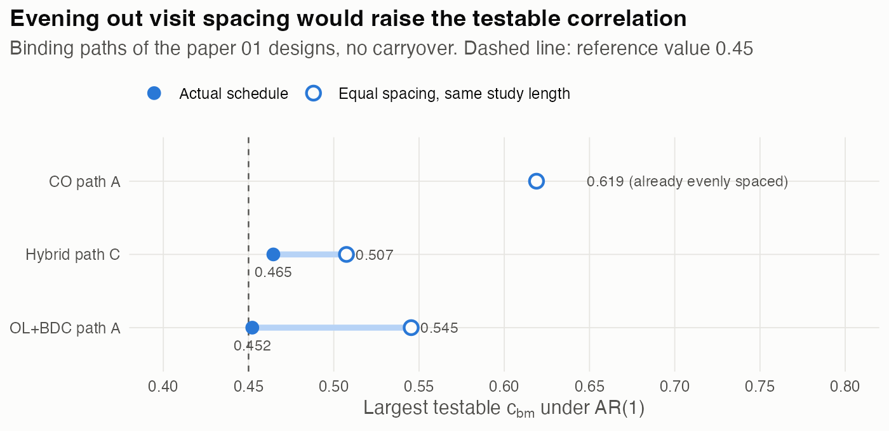

*Figure 10. Largest testable $c_{bm}$ under AR(1) for the binding path
of each paper 01 design, as scheduled and with evenly spaced visits
over the same study length.*

### 5.5 Why AR(1) is sensitive to schedule design

For unit-variance variables, the biomarker's correlations with two
response visits cannot differ by more than their own dissimilarity
allows:

$$
\bigl|\mathrm{Cor}(B, BR_t) - \mathrm{Cor}(B, BR_s)\bigr| \le
\sqrt{2\bigl(1 - \mathrm{Cor}(BR_t, BR_s)\bigr)}.
$$

Covariance moderation requires exactly such a difference, from
$c_{bm}$ at an on-drug visit to about zero at the adjacent off-drug
visit. Under AR(1), visits one week apart correlate at $\rho = 0.7$,
so a switch across a short gap uses much of the available room, and
each further switch uses more. Under CS every pair of visits
correlates at $\rho$ regardless of separation, so where a switch falls
cannot matter.

The standard precision form of an AR(1) process with unequal gaps
$d_t$ makes the accounting explicit for the response block alone:

$$
u^{\top} A^{-1} u = u_1^2 + \sum_{t \geq 2}
\frac{(u_t - \rho^{d_t} u_{t-1})^2}{1 - \rho^{2d_t}}.
$$

A switch across a gap $d$ contributes about $1/(1 - \rho^{2d})$,
which is large when $d$ is short. A step between consecutive on-drug
visits contributes $(1 - \rho^{d})/(1 + \rho^{d})$, which is small when
$d$ is short. Larger contributions mean a lower limit, which accounts
for the direction of every effect in Section 5.2. The expression
omits the cross-factor conditioning, so it explains the direction of
the effects; the numbers in this section come from the full matrix.

### 5.6 Shape of carryover decay

The analyses above decay the biomarker-response correlation
exponentially, as `buildSigma()` does. Paper 02 examines alternative
decay shapes for the carryover mean, using the Weibull family
$\phi(t) = \exp\{-(\lambda_w t)^k\}$ with
$\lambda_w = (\ln 2)^{1/k}/t_{1/2}$, which passes through
$\phi = 0.5$ at $t_{1/2}$ for every $k$ (verified) and reduces to the
exponential at $k = 1$. Shapes with $k < 1$ fall faster before the
half-life and more slowly after it, giving a heavier tail; shapes with
$k > 1$ give accelerated washout. We asked what the ceiling would be if
the correlation decayed as each of the paper 02 shapes,
$k \in \{0.25, 0.5, 1, 2, 4\}$.

Decay shape enters the ceiling only through the off-drug entries of
the coupling vector. It does not affect $M$, and it has no effect at
$t_{1/2} = 0$. Two consequences follow before any computation. First,
because the binding cell for the paper 01 reference value is the
no-carryover cell, decay shape cannot change whether $c_{bm} = 0.45$
is feasible in those designs. Second, changing only the shape of the
carryover *mean*, as paper 02 does, leaves the ceiling unchanged,
because the means do not enter the correlation matrix.

The computation added a fourth design to the paper 01 three: a
multi-cycle schedule of 16 weekly visits in the repeating pattern
on, on, off, off (seven switches), representing the many-switch
designs of Section 5.2. Under Architecture B (verified):

| Design | $t_{1/2}$ | $k = 0.25$ | 0.5 | 1 (exp.) | 2 | 4 | No carryover |
|---|---|---|---|---|---|---|---|
| Hybrid | 0.5 | 0.543 | 0.531 | 0.506 | 0.469 | 0.456 | 0.456 |
| Hybrid | 1 | 0.551 | 0.551 | 0.544 | 0.527 | 0.518 | |
| Hybrid | 2 | 0.556 | 0.563 | 0.563 | 0.551 | 0.529 | |
| OL+BDC | 0.5 | 0.524 | 0.518 | 0.500 | 0.465 | 0.452 | 0.452 |
| OL+BDC | 1 | 0.530 | 0.533 | 0.533 | 0.523 | 0.516 | |
| OL+BDC | 2 | 0.534 | 0.540 | 0.546 | 0.542 | 0.526 | |
| Multi-cycle | 0.5 | 0.390 | 0.353 | 0.301 | 0.271 | 0.262 | 0.262 |
| Multi-cycle | 1 | 0.415 | 0.400 | 0.364 | 0.308 | 0.292 | |
| Multi-cycle | 2 | 0.440 | 0.448 | 0.451 | 0.430 | 0.395 | |
| CO | any | 0.619 | 0.619 | 0.619 | 0.619 | 0.619 | 0.619 |

Table: Architecture B ceilings by Weibull decay shape, design and half-life

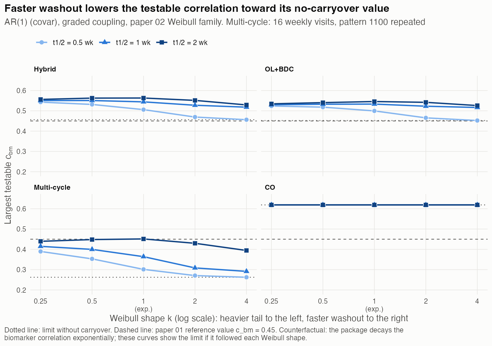

*Figure 11. Largest testable $c_{bm}$ under Architecture B if the
biomarker-response correlation decayed as a Weibull curve of shape
$k$, for three carryover half-lives. The dotted line is each design's
limit without carryover. In CO the three half-life curves coincide.*

Three patterns stand out.

- **At short half-lives, faster washout acts like less carryover.** At
  $t_{1/2} = 0.5$ and 1 the ceiling falls monotonically as $k$ rises.
  At $k = 4$ and $t_{1/2} = 0.5$ the residual fraction one week after
  discontinuation is $1.5 \times 10^{-5}$, so every off-drug entry is
  effectively zero and Hybrid, OL+BDC and the multi-cycle design
  return exactly to their no-carryover limits. A heavier tail keeps
  more residual at the sampled visits and raises the ceiling. The
  spread across shapes is 0.07 to 0.09 in Hybrid and OL+BDC and up to
  0.13 in the multi-cycle design.
- **At long half-lives, the ordering is not monotone.** At
  $t_{1/2} = 2$ the ceiling peaks near $k = 0.5$ to 1, and $k = 0.25$
  is lower. The off-drug visits in these designs fall one to three
  weeks after discontinuation, before or near a two-week half-life,
  where a small-$k$ curve lies *below* the exponential. What governs
  the ceiling is the residual fraction at the visits actually sampled,
  not the heaviness of the tail as such.
- **CO is unaffected by shape.** With carryover present, its binding
  path is the placebo-first path, which carries no carryover.

**Step coupling and floating-point underflow.** Under the published
step coupling, only whether the residual is nonzero matters. A Weibull
curve never reaches zero analytically, so for $k \leq 2$ the step
coupling is constant after exposure and the ceiling is 0.84 in Hybrid,
OL+BDC and the multi-cycle design, as under the exponential. At
$k = 4$ it is not: the residual underflows to exactly zero in double
precision ($8.6 \times 10^{-78}$ at two weeks and 0 at four weeks for
$t_{1/2} = 0.5$), the step coupling detects the zero, and the ceiling
falls to 0.384 (Hybrid) and 0.467 (OL+BDC) at $t_{1/2} = 0.5$, and to
0.467 (Hybrid) at $t_{1/2} = 1$ (verified). The ceiling of a
step-coupled process under fast washout is therefore determined by
floating-point underflow rather than by the model, which is a further
reason to regard a step on "any residual effect" as fragile.

### 5.7 Using the figures for design decisions

- **Identify the structure first.** Under CS (Figures 3 and 4), only
  the number of visits and the share with the coupling on can change
  the limit; no scheduling decision helps. Under AR(1) (Figures 5 to
  10), the schedule is the principal lever.
- **Under AR(1), the decisions that raise the limit** are, in order of
  effect in these experiments: fewer on/off switches; a wider gap at
  each switch; fewer visits overall; clustering on-drug visits
  closely; and fewer on-drug visits.
- **Compute the limit for the actual schedule before simulating.** The
  synthetic results indicate direction and rough size, but the
  interaction between spacing and switch count (Figure 9) means the
  limit for a specific schedule should be computed with
  `analysis/scripts/quick-sim/cbm-ceiling/01-cbm-ceiling.R` or the
  closed form of Section 3.2.
- **When the decay shape is uncertain, plan against the no-carryover
  limit.** Fast washout returns the Architecture B ceiling to its
  no-carryover value (Section 5.6), which is the lowest the ceiling
  takes across the shapes and half-lives examined. A target $c_{bm}$
  below that value is feasible whatever the shape.
- **Leave a margin below the limit.** Because the positive-definiteness
  repair acts silently (Section 4.7), a target $c_{bm}$ just above the
  limit would be simulated with altered correlations rather than
  rejected.
- **The limit is a feasibility bound, not a power statement.** A design
  that can test a larger $c_{bm}$ is not thereby more powerful; the
  limit only bounds which values of the moderation parameter a
  covariance-moderation simulation can represent.

## 6. Implications

### 6.1 For paper 01

- **Replace the Appendix B.7 placeholder.** The `[TO RE-VERIFY]` note
  asks for design-specific ceilings under the published specification
  and under Architecture B. Section 4.1 supplies them, subject to the
  caveat in Section 2 about the published code. Draft replacement text
  is given in Section 7.
- **Qualify the reversal statement.** Appendix B.7 should state that
  the reversal requires every path to begin on drug and depends on the
  compound-symmetric block (Section 4.6).
- **Qualify the claim that CS restricts $c_{bm}$ more tightly.**
  Section 2.2.4 (the paragraph beginning "The
  compound-symmetry-to-AR(1) change") and Appendix B.2 state this as a
  general property. It holds at $\rho = 0.7$ and fails at
  $\rho = 0.3$. The explanation offered in Section 2.2.4, that "a
  constant correlation applied uniformly across many timepoints
  depletes the matrix faster than a correlation that decays with
  lag", does not match what the computation shows. Under CS the
  ceiling is governed by the conditioning of $M$, whose smallest
  eigenvalue $(1 - \rho) - (c_1 - c_\times)$ falls with $\rho$ and
  contains no dependence on the number of occasions. Consistent with
  this, the CS ceilings are nearly identical across the three designs
  (0.346 to 0.352 at $t_{1/2} = 0$).
- **State the margin at the reference value.** $c_{bm} = 0.45$ lies
  within 0.006 of the ceiling in the Hybrid and OL+BDC no-carryover
  cells. The manuscript should report this, since any sensitivity
  analysis at a larger $c_{bm}$ in those cells would engage the silent
  repair.
- **Constrain the Hendrickson comparison arm.** Under the published
  specification the ceiling at $t_{1/2} = 0$ is 0.346 to 0.352. The
  planned re-run against `58b32a9` cannot use $c_{bm} = 0.45$ in the
  no-carryover cells without the repair altering the published
  correlation structure. The comparison should either run at a common
  $c_{bm}$ below 0.346 or report that the published specification is
  infeasible at the paper's reference value.

### 6.2 For the project

- **Correct the `CLAUDE.md` figures.** The project `CLAUDE.md` states
  that AR(1) expands the feasible range "from max 0.25 under CS to
  0.49+ under AR(1)". Neither figure describes the published or the
  implemented configuration at production parameters. The ceiling is
  0.346 to 0.352 for the published specification and 0.452 to 0.456
  for Architecture B at $t_{1/2} = 0$. The value 0.25 matches CS with a
  decaying cross-factor block and graded coupling in Hybrid (0.247), a
  counterfactual combination (inferred). The value 0.49 is reached
  under Architecture B only once carryover is present.
- **Make the repair visible.** `buildSigma()` should either warn
  unconditionally when it repairs a matrix, or the drivers should call
  `validateParameterGrid()` before simulation and stop on failure. In
  either case the ceiling in Section 3.2 is cheap enough to compute
  for every cell of a grid before any simulation is run.
- **Decide whether the correlation should follow the mean's decay
  shape.** `buildSigma()` decays the biomarker-response correlation
  exponentially regardless of the shape used for the carryover mean.
  A pipeline that gives the mean a Weibull shape therefore decays the
  mean and the correlation with different shapes. Whether that is
  intended should be settled before decay-shape results are
  interpreted as properties of Architecture B.
- **Two defects in `nof1power::carryover_decay()`**, found while
  preparing Section 5.6 (both verified by running the function). The
  power form returns `NaN` for every time beyond three half-lives,
  because it raises a negative base to a fractional power before
  clamping at zero. And its documentation states that every form
  equals 0.5 at the half-life, whereas the power form with its default
  exponent 1.5 gives 0.544 there. Neither affects this whitepaper, which
  uses only the Weibull family, but both affect any analysis that uses
  the power form.

## 7. Draft replacement for the Appendix B.7 placeholder

The following text is proposed in place of the `[TO RE-VERIFY]`
paragraph at the end of the feasible-range discussion in Appendix
B.7. It has not been inserted into the manuscript.

> Evaluated on the three designs of Section 2.3 at the production
> parameters ($\rho_c = 0.7$ for all factors, $c_1 = 0.2$,
> $c_\times = 0.1$), the ceiling under Architecture B is 0.619 in CO,
> 0.456 in Hybrid and 0.452 in OL+BDC at $t_{1/2} = 0$, rising to 0.544
> and 0.533 in Hybrid and OL+BDC at $t_{1/2} = 1.0$ and remaining at
> 0.619 in CO. The reference value $c_{bm} = 0.45$ is therefore feasible
> in every cell, but lies within 0.006 of the ceiling in the
> no-carryover cells of the Hybrid and OL+BDC designs. Under the
> published specification the ceiling is 0.346 to 0.352 at
> $t_{1/2} = 0$ in all three designs, and 0.841 at positive half-lives
> in Hybrid and OL+BDC, where every path begins on drug; in CO it
> remains 0.346. The published specification cannot carry
> $c_{bm} = 0.45$ without carryover. The comparison of within-factor
> structures depends on $\rho_c$: at $\rho_c = 0.7$ the AR(1) form
> admits the higher ceiling in every design, whereas at $\rho_c = 0.3$
> compound symmetry does.

## 8. Limitations and what was not done

- **Published code.** The CS and step-coupling configurations were
  built from the manuscript's description of commit `58b32a9`, not from
  that code (Section 2).
- **Parameter scope.** Ceilings were computed at $c_1 = 0.2$ and
  $c_\times = 0.1$ only, and for a common $\rho$ across the three
  response factors. Unequal $\rho_c$ values would reintroduce the
  loop-order dependence of the cross-factor decay rate in the current
  implementation.
- **Number of occasions.** Appendix B.7's statement that both ceilings
  fall in similar proportion as occasions are added was not tested.
- **Mean moderation.** Architecture A writes no biomarker-response
  correlation into $R$, so its covariance matrix has no ceiling of this
  kind, and it was not analyzed.
- **Power.** The ceiling bounds which values of $c_{bm}$ can be
  simulated; it says nothing about power near the boundary. Whether
  near-singular matrices at $c_{bm} = 0.45$ affect the Monte Carlo
  behavior of the no-carryover cells was not examined.
- **Sensitivity sweep.** The $\rho$ sweep covered Architecture B and
  CS with a constant cross-factor block only, not the two
  counterfactual combinations.
- **Design experiments without carryover.** The schedule experiments of
  Section 5 were run at $t_{1/2} = 0$ only. Carryover raises the
  Architecture B ceiling on the paper 01 designs (Section 4.5), but its
  interaction with switch count and spacing was not examined.
- **Synthetic schedules.** Section 5 varies one feature at a time on
  synthetic schedules. The attribution in Section 5.4 of the remaining
  Hybrid gap to its switch count is inferred, not isolated. The
  multi-cycle N-of-1 designs of papers 05 and 12 were not evaluated
  directly.
- **Decay shape is a counterfactual.** Section 5.6 computes the ceiling
  that would hold if the correlation decayed as a Weibull curve. The
  package does not implement that, and no simulation was run under it.
  The shapes examined are the Weibull family of paper 02 only.
- **Two-component DGPs.** The `components` argument permits a response
  built from BR and one other factor (papers 13 and 14). The ceilings
  here assume all three components; with two, the constants of the CS
  closed form change and the numbers would differ.

## 9. Reproducibility

The analysis consists of four scripts with no Monte Carlo component.
They are deterministic and together run in about a minute. Run them
from the repository root, in order.

```bash
Rscript analysis/scripts/quick-sim/cbm-ceiling/01-cbm-ceiling.R
Rscript analysis/scripts/quick-sim/cbm-ceiling/02-ceiling-determinants.R
Rscript analysis/scripts/quick-sim/cbm-ceiling/03-decay-shape.R
Rscript analysis/scripts/quick-sim/cbm-ceiling/04-ceiling-figures.R
```

`01-cbm-ceiling.R` loads the package source with
`pkgload::load_all('.')`, validates its matrix builder against
`buildSigma()`, and checks the closed-form ceiling by bisection
(Sections 3 and 4). `02-ceiling-determinants.R` runs the synthetic
schedule experiments and checks the compound-symmetry closed form
against the numerical ceiling (Sections 5.1 to 5.4).
`03-decay-shape.R` computes the ceilings under the Weibull decay
family (Section 5.6). `04-ceiling-figures.R` reads the saved tables
and draws the eleven figures. Tables are written to
`analysis/data/quick-sim/cbm-ceiling/` and figures to
`docs/figures/`.

| File | Contents |
|---|---|
| `design.csv` | Design-level ceilings (minimum over paths) and binding path, for all crossed configurations |
| `path.csv` | Path-level ceilings and smallest eigenvalue of $M$ |
| `rho.csv` | Design-level ceilings across $\rho \in \{0.3, 0.5, 0.7, 0.9\}$ |
| `determinants.csv` | Ceilings for every synthetic schedule of Section 5, both structures |
| `determinants-crossfactor.csv` | Ceilings across $c_1$ and $c_\times$ on Hybrid path C |
| `determinants-grid.csv` | Spacing by switch-count lookup grid (Figure 9) |
| `determinants-cs-grid.csv` | Compound-symmetry lookup by visit count and on-drug share (Figure 4) |
| `decay-shape.csv` | Design-level ceilings by Weibull shape, half-life and coupling (Figure 11) |

Table: Output files of the ceiling scripts and their contents

The figures use categorical palette slots 1 and 2 of the reference
design palette, validated for color-vision-deficiency separation and
contrast on the light chart surface, with shape as a second encoding
of structure. Figure 11 encodes the ordered half-life with a
single-hue sequential ramp from the same palette, validated as an
ordinal ramp, again with shape as a second encoding.
