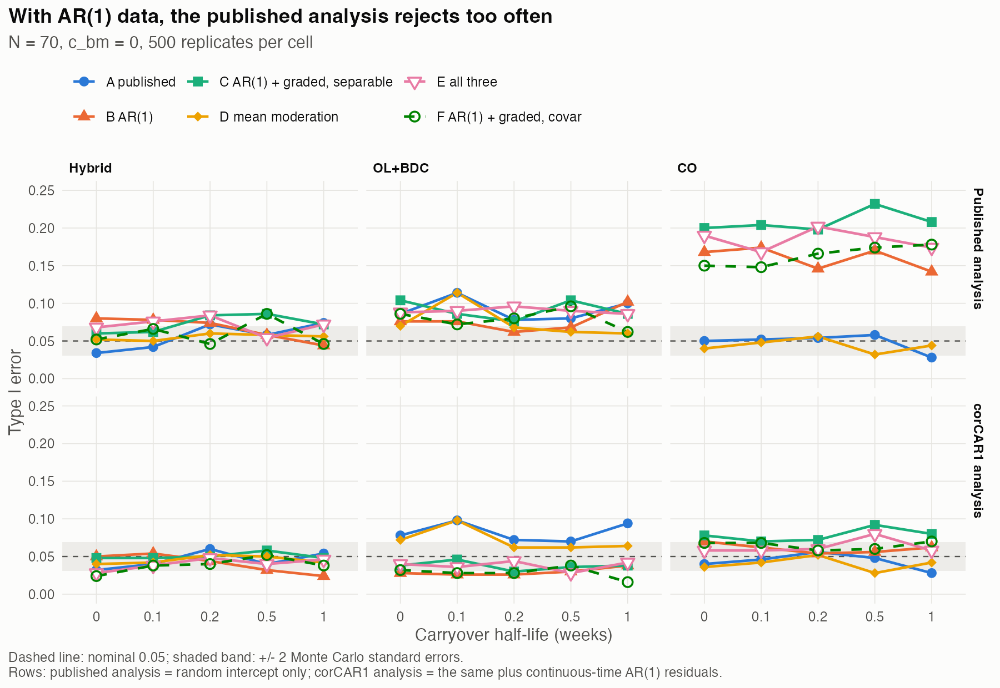
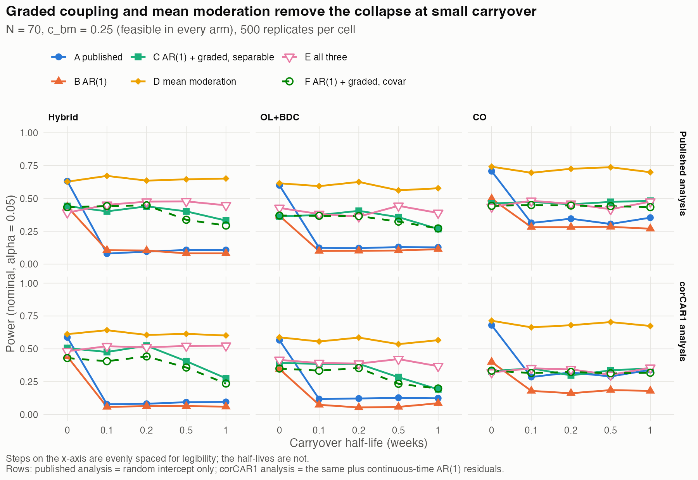
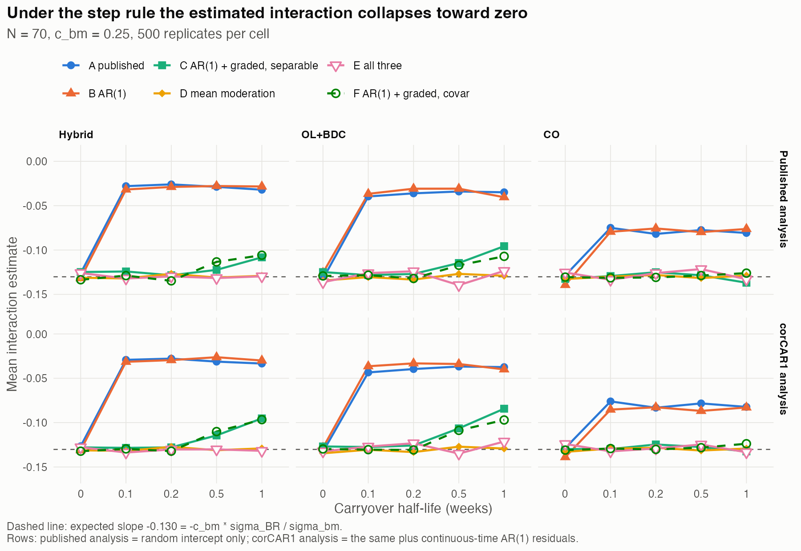

# Positive Definiteness and Carryover Sensitivity in the Hendrickson et al. (2020) Simulation Framework {.unlisted .unnumbered}
*2026-10-01 18:00 PDT. Working draft.*

**Author:** pmsimstats team

**Purpose.** The simulation framework of Hendrickson et al. [1] has two
known problems. First, many of the correlation matrices its
data-generating process (DGP) builds are not positive definite, and the
code forces them to positive definiteness by a step the paper does not
describe. Second, the power of the Hybrid N-of-1 design is extremely
sensitive to even very small carryover. This paper documents both
problems from the published code and results, identifies a common cause,
and evaluates three adjustments proposed to address them: (1) replacing
compound symmetry (CS) with AR(1) within-factor correlation, (2) letting
the biomarker-response correlation decay off drug, and (3) carrying the
biomarker-treatment interaction in the mean of the DGP.

```{=latex}
\clearpage
\tableofcontents
\listoftables
\listoffigures
\clearpage
```

## 1. Summary

1. **Problem 1 is confined to the biomarker row and is systematic.**
   Running the published `generateData()` at the published parameters,
   40 of the 162 design-path-cell matrices fail the code's own positive
   definiteness check: every matrix with $c_{bm} > 0$ and no carryover
   in the CO, OL+BDC and Hybrid designs, plus the placebo-first CO path
   at every half-life. The response block itself is always valid. The
   failures occur because the requested biomarker-response correlation
   exceeds the largest value the CS structure can carry, 0.256 to 0.262
   in these designs, well below the published values of 0.3 and 0.6
   (Section 4).
2. **The undisclosed repair changes the simulated effect.** At
   $c_{bm} = 0.6$ the repair lowers the on-drug biomarker-response
   correlation to 0.54-0.57, introduces 0.03-0.04 at off-drug visits,
   and moves other correlations by up to 0.10. At $c_{bm} = 0.3$ the
   change is at most 0.007 (Section 4.3).
3. **Problem 2 is an artifact of the coupling rule, not of carryover.**
   In the published results, Hybrid power at $N = 70$, $c_{bm} = 0.3$
   falls from 0.74 with no carryover to 0.12 at a half-life of 0.1
   weeks, about 17 hours, when the residual drug effect one week after
   stopping is 0.1% of its on-drug value. The published rule sets the
   biomarker-response correlation to its full value wherever any
   residual effect remains, so with any carryover the coupling is
   constant across visits, the on/off contrast that identifies the
   interaction disappears, and the estimate collapses toward zero
   ($-0.28$ to $-0.07$ at $c_{bm} = 0.6$) (Section 5).
4. **The two problems share one cause.** Under the step rule, a cell
   without carryover has the contrast but an invalid matrix, and a cell
   with any carryover has a valid matrix but no contrast. The
   "sensitivity to small carryover" is the jump between those two
   regimes at a half-life of zero (Section 5.4).
5. **The three adjustments are not independent.** Decaying coupling
   (adjustment 2) removes the jump, but under CS it leaves the ceiling at
   0.26 in every cell, so applied alone it converts problem 2 into
   problem 1 everywhere. AR(1) (adjustment 1) raises the ceiling where
   the coupling has an on/off contrast, lowers it where the coupling is
   constant (OL falls from 0.893 to 0.576), and does not remove the
   jump; on the published grid it leaves more matrices to repair, not
   fewer (48% against 37%). Together, with the separable AR(1)
   structure of `docs/35`, the Hybrid ceiling is 0.44 at the published
   $\rho = 0.8$: enough for $c_{bm} = 0.3$, not for 0.6. Mean
   moderation (adjustment 3) removes the ceiling altogether, but it is a
   different model of the biomarker rather than a repair of the
   covariance construct (Section 6).
6. **A generator that cannot simulate an invalid model.** The current
   package retains a second, undocumented repair in its sampler. Under
   the separable AR(1) structure, a factored generator draws each
   participant from three AR(1) recursions, a $3 \times 3$ mixing step
   and a conditional draw of the biomarker, without forming the full
   correlation matrix. Its conditional variance is positive exactly
   below the ceiling, so an infeasible effect size stops the simulation
   instead of being repaired. It reproduces the target matrix as
   closely as a standard draw does (Section 6.7).
7. **Simulation confirms both diagnoses and the remedy.** Re-simulating
   the published construct without any repair reproduces the collapse
   (Hybrid power 0.59 to 0.08 at $t_{1/2} = 0.1$ for $c_{bm} = 0.25$),
   so the repair is not its cause. AR(1) alone leaves the collapse in
   place. AR(1) with graded coupling removes it: Hybrid power at
   $c_{bm} = 0.3$ is 0.69, 0.70 and 0.72 at half-lives of 0, 0.1 and 0.2
   weeks, declining only with genuinely large carryover. Mean moderation
   shows no loss at any half-life (Sections 5.5 and 6.8).
8. **AR(1) data require an analysis that models serial correlation.**
   The published analysis assumes a constant within-participant
   correlation; with AR(1) data its Type I error reaches 0.14-0.23 in
   CO. Adding `corCAR1` residuals restores it to 0.02-0.09. Adjustment 1
   is therefore a change to the analysis as well as to the DGP
   (Section 6.8).
9. **Separability buys feasibility, not power.** With graded coupling,
   the separable cross-factor block (C) and the current `covar` block
   (F) give the same power once each test is judged against its own
   null (within $\pm 0.04$ in Hybrid). Separability raises the ceiling
   (Hybrid 0.291 to 0.440), so $c_{bm} = 0.3$ becomes feasible in every
   cell, and it makes the response block valid for every schedule
   (Sections 6.4, 6.5 and 6.8).

## 2. Evidence basis

Evidence labels: **verified** (computed in this work), **inspected**
(read in code or documents), **inferred** (follows from verified facts),
**unverified**.

- **Published code and results.** All statements about the published
  framework refer to `github.com/rchendrickson/pmsimstats` at commit
  `58b32a9` (19 November 2020), the last commit before publication, here
  called `orig`. The repository at that commit contains the publication
  vignettes and the saved replicate-level results (`results_core`:
  4 designs, 18 model cells, 5 censoring conditions, 1,000 replicates per
  cell). The data-generating code at `58b32a9` is identical to the
  initial commit `42ac030` (inspected, git history).
- **Problem 1** was established by running the published
  `generateData()` itself with the published parameters, capturing the
  covariance matrix passed to `mvrnorm`, and applying the published
  check and repair (verified). An independent reconstruction of the
  matrices from the specification gave identical failure patterns
  (verified).
- **Problem 2** was established from the published saved results
  (verified) and confirmed by re-simulating the published construct
  without repair (verified, Section 5.5).
- **Adjustments** were evaluated by exact positive-definiteness ceilings
  at the published parameters, and by a power simulation of five
  configurations, each analyzed with the published model and with
  serial-correlation residuals: 261,000 model fits, all converged
  (verified, Section 6.8).

## 3. The published framework

Each participant's outcome is $Y_{it} = \mathrm{BL}_i - (TV_{it} +
PB_{it} + BR_{it})$, with the biomarker $B_i$, baseline and the three
response components drawn jointly from a multivariate normal
distribution. The parameters used for the published results were
(inspected, `Produce_Publication_Results_1_generate_data.Rmd`, and the
saved `parameterselections`):

| Parameter | Published values |
|---|---|
| Designs | OL, OL+BDC, CO, Hybrid ("N-of-1"); 8 visits over 20 weeks |
| $N$ | 35, 70 |
| $c_{bm}$ | 0, 0.3, 0.6 |
| Carryover half-life $t_{1/2}$ | 0, 0.1, 0.2 weeks |
| Within-factor correlation $\rho$ | 0.8 for all three components, constant at every lag (CS) |
| Cross-factor correlation | $c_1 = 0.2$ same visit, $c_\times = 0.1$ otherwise |
| Biomarker-BR correlation | $c_{bm}$ wherever the carryover-adjusted BR mean is nonzero, 0 elsewhere |
| Carryover on BR mean | recursive, $\mu_{p-1}(1/2)^{t_{sd}/t_{1/2}}$ with cumulative $t_{sd}$ |
| Positive definiteness | `makePositiveDefinite = TRUE` in every call: `corpcor::make.positive.definite(sigma, tol = 1e-3)` when the check fails |
| Analysis | `lmer`, random intercept, binary on-drug indicator, test of `bm:Db` |

Table: Parameters of the published Hendrickson et al. simulation framework

The Hybrid schedule places visits at weeks 4, 8, 9, 10, 11, 12, 16 and
20; all four of its paths begin on drug, as do both OL+BDC paths. CO
has one path on drug first and one placebo first.

## 4. Problem 1: correlation matrices that are not positive definite

### 4.1 Incidence

Failures of the published check, by design (verified):

| Design | Matrices checked | Failures | Where |
|---|---|---|---|
| OL | 18 | 0 | none |
| OL+BDC | 36 | 8 | both paths, $c_{bm} > 0$, $t_{1/2} = 0$ |
| CO | 36 | 16 | both paths at $t_{1/2} = 0$; the placebo-first path at every $t_{1/2}$ ($c_{bm} > 0$) |
| Hybrid | 72 | 16 | all four paths, $c_{bm} > 0$, $t_{1/2} = 0$ |
| Total | 162 | 40 | |

Table: Failures of the published positive definiteness check by design

Every matrix with $c_{bm} = 0$ passes. Counts treat the two values of
$N$ separately, as in `docs/07`, although $N$ does not enter the
matrix.

### 4.2 Mechanism

The response block (all $TV$, $PB$ and $BR$ entries) is positive
definite in every case: under CS with constant cross-factor terms its
smallest eigenvalue is $(1 - \rho) - (c_1 - c_\times) = 0.1$,
independent of the design (verified). Failure therefore always comes
from the biomarker row. With $\tilde r = c_{bm} v$ the biomarker's
correlations with the $BR$ visits, the Schur complement gives the exact
largest feasible value

$$
c_{bm}^{\ast} = \bigl(v^{\top} M^{-1} v\bigr)^{-1/2},
$$

where $M$ is the response block and $v$ the coupling pattern (`docs/34`,
Section 3.2). For the published construct at the published parameters
(verified):

| Design | $t_{1/2} = 0$ | $t_{1/2} = 0.1$ | $t_{1/2} = 0.2$ |
|---|---|---|---|
| OL | 0.893 | 0.893 | 0.893 |
| OL+BDC | 0.262 | 0.893 | 0.893 |
| CO | 0.256 | 0.256 | 0.256 |
| Hybrid | 0.256 | 0.893 | 0.893 |

Table: Ceiling $c_{bm}^{\ast}$ for the published construct by design and half-life

Both published effect sizes, 0.3 and 0.6, exceed the ceiling wherever it
is 0.26, which reproduces the failure pattern of Section 4.1 exactly.
The ceiling is high when the coupling pattern is constant across visits
(OL always; OL+BDC and Hybrid with any carryover, Section 5.3) and low
when it has an on/off contrast (no carryover, or CO's placebo-first
path, whose pre-exposure visits keep a zero coupling at every
half-life).

### 4.3 What the repair does

When the check fails, the code replaces the covariance matrix by a
nearby positive definite one, raising small and negative eigenvalues to
a floor, in the spirit of nearest-positive-definite approximation [2].
The effect on the correlations actually simulated (verified):

| $c_{bm}$ specified | On-drug correlation used | Off-drug correlation used | Largest change elsewhere |
|---|---|---|---|
| 0.3 | 0.298-0.300 | 0.000-0.001 | 0.007 |
| 0.6 | 0.540-0.568 | 0.029-0.042 | 0.097 |

Table: Correlations simulated after the published positive definiteness repair, by specified $c_{bm}$

At $c_{bm} = 0.3$ the repair is cosmetic. At $c_{bm} = 0.6$ the
simulated effect is materially smaller than specified, some interaction
signal is moved into off-drug visits, and the within- and cross-factor
correlations are altered as well. The published no-carryover results at
$c_{bm} = 0.6$ therefore describe a DGP other than the one stated.

## 5. Problem 2: sensitivity of Hybrid power to carryover

### 5.1 The published results

Power from the published saved results, without dropout (verified):

| Design | $N$ | $c_{bm}$ | $t_{1/2} = 0$ | 0.1 | 0.2 |
|---|---|---|---|---|---|
| Hybrid | 35 | 0.3 | 0.54 | 0.08 | 0.07 |
| Hybrid | 35 | 0.6 | 0.95 | 0.18 | 0.23 |
| Hybrid | 70 | 0.3 | 0.74 | 0.12 | 0.10 |
| Hybrid | 70 | 0.6 | 1.00 | 0.22 | 0.33 |
| OL+BDC | 70 | 0.3 | 0.74 | 0.19 | 0.13 |
| OL+BDC | 70 | 0.6 | 0.99 | 0.36 | 0.41 |
| CO | 70 | 0.3 | 0.85 | 0.44 | 0.46 |
| CO | 70 | 0.6 | 1.00 | 0.90 | 0.91 |

Table: Published Hybrid, OL+BDC and CO power by $N$, $c_{bm}$ and half-life

Type I error at $c_{bm} = 0$ lies between 0.01 and 0.09 across cells.

### 5.2 The carryover involved is negligible

With a half-life of 0.1 weeks, the residual drug effect one week after
discontinuation, the earliest off-drug visit in Hybrid and OL+BDC, is
$2^{-10} \approx 0.001$ of its on-drug value; at 0.2 weeks it is
$2^{-5} \approx 0.031$. A carryover this small cannot plausibly erase
three quarters of the power through its effect on the response mean.

### 5.3 Mechanism: the step rule removes the contrast

The published rule assigns $c_{bm}$ to every visit at which the
carryover-adjusted $BR$ mean is nonzero. Exponential and recursive
carryover never reach exactly zero, so with any positive half-life every
visit after first exposure receives the full $c_{bm}$. In Hybrid and
OL+BDC, whose paths all begin on drug, the coupling becomes constant
across all eight visits (verified, captured matrices: Hybrid path A
coupling 0.6 at every visit for $t_{1/2} = 0.1$). The biomarker then
predicts $BR$ equally on and off drug, which is a biomarker main effect,
and the biomarker-by-treatment interaction has no population
counterpart.

The published estimates show the consequence directly. The mean of the
interaction estimate in Hybrid at $N = 70$ (verified):

| $c_{bm}$ | $t_{1/2} = 0$ | 0.1 | 0.2 |
|---|---|---|---|
| 0.3 | $-0.151$ | $-0.036$ | $-0.036$ |
| 0.6 | $-0.279$ | $-0.065$ | $-0.081$ |

Table: Mean published Hybrid interaction estimate at $N = 70$ by $c_{bm}$ and half-life

The estimate shrinks toward zero by roughly three quarters. The loss of
power is primarily attenuation of the effect being estimated, not only
inflation of its standard error. CO is affected less because its
placebo-first path retains a zero coupling before first exposure, which
preserves some contrast (and keeps that path's matrix invalid). OL has
no off-drug visits, so its test does not rest on a drug contrast in the
first place.

### 5.4 The common cause

| | No carryover ($t_{1/2} = 0$) | Any carryover ($t_{1/2} > 0$) |
|---|---|---|
| Coupling pattern (Hybrid, OL+BDC) | on/off contrast | constant |
| Matrix at $c_{bm} = 0.3, 0.6$ | invalid, repaired | valid |
| Interaction identified | yes | no |

Table: Coupling pattern, matrix validity and identification with and without carryover

The step rule makes the coupling a discontinuous function of the
half-life: any positive value, however small, flips the pattern from
contrast to constant. Both problems are consequences of that one
feature. Problem 1 is the price of the contrast at $t_{1/2} = 0$, and
problem 2 is the loss of the contrast at $t_{1/2} > 0$.

### 5.5 Confirmation by simulation

The power simulation of Section 6.8 reproduces the published construct
without any repair (configuration A). Where the published code applied
no repair, it matches Hendrickson's saved results: for example, Hybrid
power at $c_{bm} = 0.6$ and $t_{1/2} = 0.1$ is 0.25 against the
published 0.22, and OL+BDC power at the same cell is 0.36 against 0.36
(verified; agreement within about two Monte Carlo standard errors in
all such cells except OL+BDC at $c_{bm} = 0.6$, $t_{1/2} = 0.2$, 0.35
against 0.41).

At $c_{bm} = 0.25$, just below the published ceiling of 0.256, the
published construct is valid in every cell and is never repaired. Its
Hybrid power still collapses, from 0.63 with no carryover to 0.08 at
$t_{1/2} = 0.1$, and the interaction estimate falls from $-0.13$ to
$-0.03$ (verified, published analysis). The collapse is therefore
produced by the step rule alone, not by the repair, and it does not
depend on the analysis model: with `corCAR1` residuals the same cell
falls from 0.59 to 0.08.

## 6. The three adjustments

Appendix A sets out the correlation matrix each configuration builds,
block by block, with a worked example at the published parameters.

### 6.1 Adjustment 1: AR(1) instead of compound symmetry

AR(1) lets correlation fall with the time between visits. At the
published $\rho = 0.8$ it raises the no-carryover ceiling modestly in
Hybrid and OL+BDC (0.256 to 0.291; 0.262 to 0.303) and substantially in
CO (0.256 to 0.627) (verified, Section 6.5). On its own it does not
change the step rule, so with any carryover the coupling is still
constant and the contrast is still lost. It addresses problem 1 in part
and problem 2 not at all.

### 6.2 Adjustment 2: a correlation that decays off drug

Under the graded rule the off-drug coupling is $c_{bm}\phi_t$, with
$\phi_t$ the residual fraction of the on-drug effect, so the coupling is
a continuous function of the half-life. At $t_{1/2} = 0.1$ the residual
at the first off-drug visit is 0.001, and the graded coupling is
indistinguishable from the no-carryover pattern: the discontinuity of
Section 5.4 is removed, and small carryover produces a small change.
This addresses problem 2 directly.

Two qualifications. First, the published rule does not send the
off-drug correlation to zero under carryover; it sends it to the full
on-drug value. The graded rule sits between the published rule's two
regimes, equal to zero-carryover behavior at negligible half-lives and
decaying smoothly as the half-life grows. Second, because the graded
pattern keeps the on/off contrast, it keeps the low ceiling: under CS
it is 0.256-0.265 in every cell (verified). Applied alone, adjustment 2
would make $c_{bm} = 0.3$ and 0.6 infeasible in every Hybrid and OL+BDC
cell, converting problem 2 into problem 1 everywhere. It must be
combined with a structure that admits a larger ceiling.

### 6.3 Adjustment 3: the interaction in the mean

Under mean moderation the biomarker shifts the on-drug $BR$ mean by
$\beta_{bm}\sigma_{BR}b_i$ and has no correlation with $BR$ in the
matrix. The biomarker row is then trivially valid and there is no
ceiling on the moderation parameter; only the response block must be
positive definite, which it is under the published CS structure for
every schedule (Section 4.2) and under the separable AR(1) structure of
`docs/35` for every schedule (inferred from `docs/35`, Section 4.2).
The interaction is carried by a mean shift that does not depend on the
coupling rule, so the discontinuity of Section 5.4 does not arise.
Adjustment 3 therefore addresses both problems.

It does so by changing the model rather than repairing it. Mean
moderation asserts that the biomarker fixes each participant's drug
effect; covariance moderation asserts that it predicts the effect only
probabilistically, which is the rationale Hendrickson et al. gave for
their construct [1] and the subject of paper 01 of this compendium. In
paper 01's terms, adjustment 3 replaces Architecture B with Architecture
A. It also introduces a known mismatch with an analysis model that uses
a continuous exposure variable, because the mean shift is applied on
drug only (paper 01, Section 2.2.1).

### 6.4 A fourth choice: separability

Adjustment 1 fixes how a factor is correlated with itself across visits
(AR(1) in calendar time). It leaves open how *different* factors are
correlated across visits, and that is a separate choice. The current
package (`covar`) keeps Hendrickson's two cross-factor values, $c_1$ at
the same visit and $c_\times$ at different visits, and lets the second
decay: $c_\times\rho^{|w_t - w_s|}$. The alternative is a separable
structure, in which the correlation between factor $c$ at visit $t$ and
factor $c'$ at visit $s$ is a product of a factor part and a time part,

$$
\mathrm{Cor}(X_{c,t}, X_{c',s}) = K_{cc'} A_{ts}, \qquad
M = K \otimes A, \qquad K = (1 - c_1)I_3 + c_1 J_3,
$$

so that cross-factor correlation decays at the same rate as
within-factor correlation and equals $c_1$ times it at every lag.
Separability is meaningful only alongside AR(1): under compound symmetry
it reduces to the published construct with $c_\times = c_1\rho$. The full
argument is in `docs/35-separable-response-covariance.md`; Appendix A.7
works it through numerically.

**What the current structure asserts.** The `covar` response block
decomposes exactly as

$$
M_{\text{covar}} = K_a \otimes A + K_b \otimes I_n, \qquad
K_a = (1 - c_\times)I_3 + c_\times J_3, \qquad
K_b = (c_1 - c_\times)(J_3 - I_3).
$$

$K_b$ has a zero diagonal and positive off-diagonal entries, so it is
indefinite, with eigenvalues $2(c_1 - c_\times)$ and $-(c_1 - c_\times)$.
It is the same-visit excess of cross-factor correlation (0.2 rather than
0.1), and it is attached to no variance: nothing in the model generates
it. Diagonalizing $A$ shows that

$$
M_{\text{covar}} \succ 0 \iff
\lambda_{\min}(A) > \frac{c_1 - c_\times}{1 - c_\times},
$$

which is 0.111 at the published values (verified, `docs/35` Section
4.4). The smallest eigenvalue of $A$ falls as visits become closer or
more numerous; for equally spaced visits it stays above
$(1 - \rho^d)/(1 + \rho^d)$, so at the published $\rho = 0.8$ validity at
any number of visits is guaranteed only for gaps of at least one week
(derived, `docs/35`). The Hybrid and OL+BDC designs, whose closest
visits are one week apart, sit at that boundary.

**What separability gives.**

- **Validity for every schedule.** The eigenvalues of $K \otimes A$ are
  products of those of $K$ and $A$, both positive definite for any
  visit times, so no schedule can break the response block.
- **A larger ceiling.** At the published parameters the ceiling rises
  from 0.291 to 0.440 in Hybrid, from 0.303 to 0.468 in OL+BDC, and from
  0.627 to 0.637 in CO (verified, Section 6.5).
- **An exact, factored ceiling and generator.** The ceiling factorizes
  as $c_{bm}^{\ast} = ([K^{-1}]_{33}\,u^{\top}A^{-1}u)^{-1/2}$, and data
  can be generated without forming the full matrix (Section 6.7).
- **Coherence with the analysis model.** The summed response is an
  AR(1) process under separability, which is the structure `corCAR1`
  assumes; under `covar` it is AR(1) plus a white-noise term contributed
  by $K_b$ (derived, `docs/35` Section 4.6).

**What it costs.** Lagged cross-factor correlations become
$c_1\rho^{\text{gap}}$ rather than $c_\times\rho^{\text{gap}}$, which
doubles them at the published values, and the three factors must share
one $\rho$ (the published values already do). A same-visit excess of
cross-factor association cannot be represented without adding a valid
occasion-level term.

Separability is therefore a fourth adjustment, distinct from the three
proposed. The power simulation isolates its effect by pairing
configuration C (separable) with configuration F, which differs only in
using the current `covar` cross-factor block (Section 6.8).

### 6.5 The adjustments in combination

**Two ways a matrix can fail.** Either the response block $M$ (the
$TV$, $PB$ and $BR$ visits) is itself not positive definite, which no
choice of $c_{bm}$ can repair, or $M$ is valid and the biomarker
coupling exceeds what it can support, the ceiling
$c_{bm}^{\ast} = \min_{\text{paths}}(u^{\top}M^{-1}u)^{-1/2}$ of
Section 4.2. On every grid examined here the first never happens. The
smallest eigenvalue of $M$, over paths and $t_{1/2} \in \{0, 0.1, 0.2,
0.5, 1\}$, is (verified):

| Response block | OL | OL+BDC | CO | Hybrid |
|---|---|---|---|---|
| A published (CS, constant cross) | 0.100 | 0.100 | 0.100 | 0.100 |
| B, F AR(1), `covar` cross | 0.153 | 0.010 | 0.153 | 0.010 |
| C, E AR(1), separable | 0.225 | 0.098 | 0.225 | 0.097 |

Table: Smallest eigenvalue of the response block by configuration and design

The `covar` block is valid but close to the boundary of Section 6.4 in
the two designs with weekly visits. Every failure counted below is
therefore a ceiling failure: the coupling, not the response structure,
is what the matrix cannot hold.

**The ceilings.** Ceilings at the published parameters ($\rho = 0.8$,
$c_1 = 0.2$, $c_\times = 0.1$), design-level minimum over paths
(verified). Configurations as in Appendix A.6: A published (CS,
constant cross-factor, step coupling); B adjustment 1 (AR(1), step);
F adjustments 1 + 2 with the `covar` cross-factor block; C adjustments
1 + 2, separable. D and E (mean moderation) have no ceiling.

| Config. | Design | $t_{1/2}$ = 0 | 0.1 | 0.2 | 0.5 | 1 |
|---|---|---|---|---|---|---|
| A | OL | 0.893 | 0.893 | 0.893 | 0.893 | 0.893 |
| A | OL+BDC | 0.262 | 0.893 | 0.893 | 0.893 | 0.893 |
| A | CO | 0.256 | 0.256 | 0.256 | 0.256 | 0.256 |
| A | Hybrid | 0.256 | 0.893 | 0.893 | 0.893 | 0.893 |
| B | OL | 0.576 | 0.576 | 0.576 | 0.576 | 0.576 |
| B | OL+BDC | 0.303 | 0.594 | 0.594 | 0.594 | 0.594 |
| B | CO | 0.627 | 0.576 | 0.576 | 0.576 | 0.576 |
| B | Hybrid | 0.291 | 0.595 | 0.595 | 0.595 | 0.595 |
| F | OL | 0.576 | 0.576 | 0.576 | 0.576 | 0.576 |
| F | OL+BDC | 0.303 | 0.303 | 0.314 | 0.404 | 0.517 |
| F | CO | 0.627 | 0.627 | 0.627 | 0.627 | 0.627 |
| F | Hybrid | 0.291 | 0.291 | 0.302 | 0.386 | 0.486 |
| C | OL | 0.567 | 0.567 | 0.567 | 0.567 | 0.567 |
| C | OL+BDC | 0.468 | 0.469 | 0.476 | 0.526 | 0.578 |
| C | CO | 0.637 | 0.637 | 0.637 | 0.637 | 0.637 |
| C | Hybrid | 0.440 | 0.440 | 0.446 | 0.491 | 0.544 |

Table: Ceilings for configurations A, B, F and C by design and half-life

Adjustment 2 alone (CS, graded coupling) was computed separately for
$t_{1/2} \le 0.2$: 0.256 / 0.256 / 0.257 in Hybrid, 0.262 / 0.262 /
0.265 in OL+BDC and 0.256 in CO (verified, `03-adjustment-ceilings.R`).
The ceilings predict the repair counts below exactly: a path's matrix
fails the published test if and only if $c_{bm}$ exceeds that path's
ceiling, for all 504 matrices counted (verified).

**Why a ceiling must exist.** The quantity $c_{bm}^2\,u^{\top}M^{-1}u$ is
the squared multiple correlation of the biomarker on the whole response
trajectory, so it cannot reach 1. A single biomarker cannot be
correlated 0.6 with each of several on-drug visits that are only partly
correlated with one another: jointly those correlations would account
for more than all of its variance. The bound tightens with every
additional on-drug visit that carries partly independent noise. This
is why AR(1) lowers the OL ceiling from 0.893 to 0.567-0.576. Under
compound symmetry the visits share a large person-level component that
the biomarker can correlate with once; under AR(1) far less is shared,
so the same correlation at every visit demands more of the biomarker.
The ceiling is therefore a property of encoding the interaction as a
correlation, not a defect of any one construct; better structure raises
it, and only moving the interaction into the mean removes it.

**The step rule's high ceilings are the cells without signal.** Under
the step rule, the Hybrid and OL+BDC ceilings jump from about 0.26 to
0.893 (A) or 0.595 (B) as soon as $t_{1/2} > 0$. The coupling becomes
constant after first exposure, and a constant vector pays almost no
switch cost (Appendix A.7.4). It also carries no on-drug against
off-drug contrast, which is the collapse of Section 5.3. In the
published construct, the cells that stop needing repair are the cells
that lose their signal.

**Repair counts.** The share of correlation matrices that the published
code would silently repair, counted with its own test
(`corpcor::is.positive.definite()`), one matrix per design path ×
$c_{bm}$ × $t_{1/2}$ (verified). For the strawman the published grid
uses the matrices of the 58b32a9 code itself; configuration A
reproduces them exactly (0 of 81 disagree), and a fresh run of the
58b32a9 code on the Figure 4 grid (`10-strawman-58b32a9.R`, 100
replicates) logged the same 20 repairs during the run.

| Configuration | Published grid, $c_{bm}$ 0.3 and 0.6 | Common grid, $c_{bm}$ 0.25 and 0.3 |
|---|---|---|
| Strawman (58b32a9 code) | 20/54 (37%) | 12/90 (13%) |
| B AR(1) | 26/54 (48%) | 3/90 (3%) |
| F AR(1) + graded, `covar` | 26/54 (48%) | 5/90 (6%) |
| C AR(1) + graded, separable | 21/54 (39%) | 0/90 (0%) |
| D mean moderation | 0/54 (0%) | 0/90 (0%) |
| E all three | 0/54 (0%) | 0/90 (0%) |

Table: Share of matrices repaired by configuration on the published and common grids

The published grid is that of Figure 4 (OL, OL+BDC, CO, Hybrid;
$t_{1/2} \in \{0, 0.1, 0.2\}$). The common grid is that of the
strawman-against-fixes contrast run through the 58b32a9 pipeline
(`12-common-grid-contrast.R`; same designs, $N = 70$,
$t_{1/2} \in \{0, 0.1, 0.2, 0.5, 1\}$; its power results are not yet
reported here). In
the common grid every strawman repair is at $c_{bm} = 0.3$: all CO cells,
and the $t_{1/2} = 0$ cells of OL+BDC and Hybrid. None is at 0.25.

Read against the published effect sizes:

- **$c_{bm} = 0.3$** is feasible in every cell only with adjustments 1
  and 2 together in the separable form, or with adjustment 3. The
  current `covar` form of 1 + 2 is marginal in Hybrid (0.291 against
  0.3).
- **$c_{bm} = 0.6$** exceeds every covariance-moderation ceiling in
  Hybrid and OL+BDC at $\rho = 0.8$. No covariance construct examined
  can represent the published large effect in those designs; only mean
  moderation can. At the project's $\rho = 0.7$ the separable Hybrid
  ceiling is 0.48-0.49 (`docs/35`), still below 0.6.

### 6.6 Which adjustment addresses which problem

| | Problem 1 (invalid matrices) | Problem 2 (carryover sensitivity) |
|---|---|---|
| 1. AR(1) | No, on balance: raises the ceiling where the coupling has contrast (CO; Hybrid and OL+BDC without carryover), lowers it where the coupling is constant (OL; carryover cells); 48% of published-grid matrices fail against 37% | No: the step remains |
| 2. Graded coupling | No: alone it lowers the ceiling in carryover cells to the no-carryover level | Yes: removes the discontinuity |
| 1 + 2 (separable) | Yes for $c_{bm} \le 0.44$ (Hybrid, $\rho = 0.8$) | Yes |
| 3. Mean moderation | Yes: no ceiling | Yes, by a different model |

Table: Which adjustment addresses each of the two problems

The problem-2 entries were first established from the structure of the
coupling and the ceiling, and are confirmed by the power simulation of
Section 6.8.

### 6.7 Implementation: a factored generator

Both problems were possible because the published code could simulate
a model that does not exist: when the requested correlation matrix was
not positive definite, it was repaired and sampled without notice. The
current package keeps that possibility in a second form. Its sampler
factors the covariance matrix once and caches the factor, and if the
factorization fails it repairs the matrix and continues, whether or not
`makePositiveDefinite` is set (inspected: `R/generateData.R:391-393`,
with identical fallbacks in `implementations/tidyverse`,
`implementations/nof1power` and `implementations/original-extended`).
Removing the documented repair flag is therefore not enough.

Under the separable AR(1) structure of adjustments 1 and 2, a
participant can instead be generated in three stages that never form
or factor the full $(2 + 3n) \times (2 + 3n)$ correlation matrix, and
in which an infeasible effect size cannot be simulated.

**1. Time.** Draw three independent AR(1) paths across the visits by
recursion on the gaps $d_t = w_t - w_{t-1}$:

$$
P_{j,1} \sim N(0, 1), \qquad
P_{j,t} = \phi_t P_{j,t-1} + \sqrt{1 - \phi_t^2}\,\varepsilon_{j,t},
\qquad \phi_t = \rho^{d_t}, \qquad j = 1, 2, 3.
$$

Each path has correlation $\rho^{|w_t - w_s|}$ between visits, for any
spacing [3, 4].

**2. Factors.** Mix the paths with the Cholesky factor of the
$3 \times 3$ factor correlation $K = (1 - c_1)I_3 + c_1 J_3$:

$$
(TV_t, PB_t, BR_t)^{\top} = L_K\,(P_{1,t}, P_{2,t}, P_{3,t})^{\top},
\qquad L_K L_K^{\top} = K .
$$

The response block then has correlation $K \otimes A$ exactly, because
$\mathrm{chol}(K \otimes A) = \mathrm{chol}(K) \otimes \mathrm{chol}(A)$
[5].

**3. Biomarker.** Draw the biomarker given the response:

$$
B \mid X \sim N\Bigl(c_{bm} \sum_{c} [K^{-1}]_{c3}\, X_c^{\top} A^{-1}u,\;\;
1 - c_{bm}^2\, q\Bigr), \qquad q = [K^{-1}]_{33}\, u^{\top} A^{-1} u,
$$

where $X_c$ is factor $c$'s vector of visits and $u$ the coupling
pattern of Appendix A.4. $A^{-1}u$ is computed from the bidiagonal AR(1)
precision, $A^{-1} = L^{\top}L$ with $L_{tt} = (1 - \phi_t^2)^{-1/2}$
and $L_{t,t-1} = -\phi_t (1 - \phi_t^2)^{-1/2}$, in a few
multiplications; the only matrix inverted is the $3 \times 3$ $K$. The
baseline is drawn independently. Means, standard deviations, carryover
on the mean and, under mean moderation, the on-drug shift are applied
after the draw, as in the existing generator.

**The ceiling is the draw.** The biomarker's conditional variance
$1 - c_{bm}^2 q$ is positive exactly when $c_{bm}$ is below the ceiling
$c_{bm}^{\ast} = q^{-1/2}$ of Section 4.2. If it is not, there is no
valid distribution to draw from, and the generator stops and reports
the ceiling rather than repairing anything.

**Checks** (verified,
`analysis/scripts/quick-sim/cbm-ceiling/07-factored-generator.R`; Hybrid
path A, graded coupling at $t_{1/2} = 0.5$, $\rho = 0.8$, $c_1 = 0.2$,
$c_{bm} = 0.3$):

| Check | Result |
|---|---|
| Ceiling, closed form against full matrix | 0.494329 against 0.494329 |
| $A^{-1}u$, closed form against `solve()` | agree to $7 \times 10^{-16}$ |
| Sampled correlations against the target, 5 seeds of 400,000 draws | largest deviation 0.0034-0.0056 |
| Same check for a standard full-matrix draw | largest deviation 0.0035-0.0060 |
| $c_{bm} = 0.6$ requested | refused: "exceeds the ceiling 0.494" |

Table: Checks of the factored generator against the full-matrix computation

The factored draws reproduce the target correlation matrix as closely
as a standard full-matrix draw does.

**Advantages.**

- **An invalid model cannot be simulated.** The validity check is part
  of generation, so the silent repair of both problems has no route
  back in (verified).
- **The ceiling is known before simulating** and can be reported with
  every power estimate (verified, closed form).
- **Each stage is a stated assumption:** one AR(1) clock over time, a
  fixed blend across factors, the biomarker given the response. The
  model is readable from the code and testable piece by piece
  (inferred).
- **Common random numbers across effect sizes.** The response block
  does not depend on $c_{bm}$, so the same response trajectories can be
  reused for every $c_{bm}$ in a grid, with only the biomarker redrawn;
  comparisons across effect sizes then differ by the effect alone
  (inferred; not implemented).
- **Any schedule, and long designs.** The recursion is valid for any
  gaps, and its cost grows linearly with the number of visits rather
  than with the cube of the matrix size. For eight visits this makes no
  practical difference; for designs with many visits it would
  (inferred, not timed).

**Limits.** The factored generator exists only for the separable AR(1)
structure with a common $\rho$; the current `covar` (separate
$c_\times$) and the published compound-symmetry construct cannot be
generated this way. With the same seed it produces different individual
participants from the existing generator, so existing results are
reproducible in distribution but not draw for draw. It has been checked
against its target distribution, but not yet integrated into
`buildSigma()` or used in a power simulation.

### 6.8 Power under the adjustments

**Design.** The six configurations of Appendix A.6 were simulated with
everything else held at the published values: $\rho = 0.8$,
$c_1 = 0.2$, $c_\times = 0.1$, the published Gompertz means and
standard deviations, the published recursive carryover on the $BR$
mean, and the three designs with $N = 70$ allocated across paths as in
the published code. The grid crossed $c_{bm} \in \{0, 0.25, 0.3, 0.6\}$
with $t_{1/2} \in \{0, 0.1, 0.2, 0.5, 1\}$ weeks, 500 replicates per
cell, giving a Monte Carlo standard error of about 0.022 on power near
0.5 and 0.010 on a Type I error of 0.05. The value $c_{bm} = 0.25$ lies
just below the published ceiling, so it is feasible in every
configuration. Cells whose matrix is not positive definite were skipped
rather than repaired (51 of 360, exactly those predicted by the ceilings
of Section 6.5). Each replicate was analyzed twice, with identical
data: by the published model (random intercept, binary on-drug
indicator, test of `bm:Db`), and by the same model with continuous-time
AR(1) residuals (`nlme::lme` with `corCAR1`). All 309,000 fits converged
(verified). Configuration F was run after A-E, with its own seeds; the
seeds of A-E were not changed.

**Calibration of the analysis.** The published analysis assumes the
within-participant correlation is constant, which is exactly right for
compound-symmetry data and wrong for AR(1) data. With AR(1) data it
rejects a true null too often: Type I error reaches 0.14-0.23 in CO and
0.04-0.10 in Hybrid and OL+BDC for configurations B, C, E and F,
against 0.03-0.06 in CO for the compound-symmetry configurations A and D
(Figure 1, verified). With `corCAR1` residuals, Type I error in the AR(1)
configurations falls to 0.02-0.09, close to nominal; F is the most
conservative of them in Hybrid and OL+BDC (0.016-0.052). Adopting AR(1) data
(adjustment 1) therefore requires an analysis that models serial
correlation; the results below use the `corCAR1` analysis. One pattern
is not explained by this: in OL+BDC, the compound-symmetry
configurations A and D run at 0.06-0.11 under both analyses.



*Figure 1. Type I error ($c_{bm} = 0$) by configuration, design and
carryover half-life, under the published analysis (top) and the
`corCAR1` analysis (bottom). Shaded band: $\pm 2$ Monte Carlo standard
errors around 0.05.*

**Power.** Nominal power in the Hybrid design, `corCAR1` analysis
(verified):

| Configuration | $c_{bm}$ | $t_{1/2} = 0$ | 0.1 | 0.2 | 0.5 | 1 |
|---|---|---|---|---|---|---|
| A Published | 0.25 | 0.59 | 0.08 | 0.08 | 0.09 | 0.10 |
| B AR(1) | 0.25 | 0.44 | 0.06 | 0.06 | 0.06 | 0.06 |
| F AR(1) + graded, `covar` | 0.25 | 0.43 | 0.41 | 0.44 | 0.36 | 0.24 |
| F AR(1) + graded, `covar` | 0.30 | infeasible | infeasible | 0.59 | 0.46 | 0.34 |
| C AR(1) + graded, separable | 0.25 | 0.51 | 0.48 | 0.52 | 0.41 | 0.28 |
| C AR(1) + graded, separable | 0.30 | 0.69 | 0.70 | 0.72 | 0.55 | 0.36 |
| D Mean moderation | 0.30 | 0.78 | 0.75 | 0.74 | 0.77 | 0.73 |
| E All three | 0.30 | 0.67 | 0.65 | 0.67 | 0.66 | 0.64 |

Table: Nominal Hybrid power by configuration, $c_{bm}$ and half-life, corCAR1 analysis



*Figure 2. Power at $c_{bm} = 0.25$ by configuration, design and
carryover half-life, under the published (top) and `corCAR1` (bottom)
analyses. Steps on the horizontal axis are evenly spaced; the
half-lives are not.*

Five findings follow.

1. **AR(1) alone does not help.** Configuration B collapses as A does,
   to 0.06 at $t_{1/2} = 0.1$ in Hybrid, because it keeps the step
   rule.
2. **Graded coupling removes the collapse.** Under configuration C,
   power at $t_{1/2} = 0.1$ and 0.2 equals power without carryover
   (0.69, 0.70, 0.72 at $c_{bm} = 0.3$), as Section 6.2 predicted. It
   then declines with genuinely large carryover (0.55 at
   $t_{1/2} = 0.5$, 0.36 at 1 week). That decline is real rather than
   artifactual: at those half-lives the off-drug visits carry part of
   the interaction, which a binary on-drug indicator codes as absent, and
   the estimate attenuates accordingly (from $-0.16$ to $-0.11$;
   Figure 3).
3. **Mean moderation is flat.** Configurations D and E show no loss at
   any half-life, and their estimates sit at the expected value
   throughout. Under mean moderation the interaction exists only on
   drug, which is exactly what the binary indicator codes, so the
   analysis is correctly aligned with the DGP. (Paper 01's mismatch for
   mean moderation arises from its continuous exposure variable, not
   from mean moderation itself.)
4. **The response structure matters for CO.** CO power at
   $c_{bm} = 0.3$ is 0.85 under D but 0.44 under E, which differ only in
   compound-symmetry against separable AR(1) responses. Under compound
   symmetry the on-drug and off-drug blocks remain correlated at 0.8 and
   the participant-level noise cancels from the contrast; under AR(1),
   with 2.5-week spacing, they are nearly independent. Hybrid is far
   less affected (0.78 against 0.67).
5. **Separability changes feasibility, not power.** Configurations F
   and C differ only in the cross-factor block (Section 6.4). Both
   remove the collapse, and their curves have the same shape (Figure 2).
   Nominal Hybrid power is higher under C by 0.04-0.08 at
   $c_{bm} = 0.25$, about one to two and a half standard errors of a
   difference (0.031). Most of that gap is a calibration effect: F's
   `corCAR1` test is the more conservative (Type I 0.024-0.052 against
   0.048-0.058 for C in Hybrid). Against each cell's own null the two
   are within $\pm 0.04$ in every Hybrid cell (C 0.52, 0.50, 0.53, 0.37,
   0.29; F 0.56, 0.47, 0.51, 0.35, 0.27), and OL+BDC and CO show no
   consistent ordering either. What separability does change is the
   feasible range: at $c_{bm} = 0.3$, F cannot be run in Hybrid for
   $t_{1/2} \le 0.1$ (ceiling 0.291) while C can (0.440), and C's
   response block is valid for every schedule. Its case therefore rests
   on structure (Section 6.4), not on power.



*Figure 3. Mean interaction estimate at $c_{bm} = 0.25$, with the
expected slope $-c_{bm}\sigma_{BR}/\sigma_{bm} = -0.130$ (dashed). Under
the step rule (A, B) the estimate collapses toward zero with any
carryover; under graded coupling (C) it holds until the carryover is
large; under mean moderation (D, E) it does not move.*

**Size adjustment.** Power computed against each cell's own null
distribution, rather than at the nominal 0.05, differs from nominal
power where Type I error departs from 0.05, by up to 0.15 (configuration
A, Hybrid, no carryover: 0.59 nominal against 0.74 adjusted, with Type I
error 0.032). The four findings above hold under size adjustment: in
Hybrid at $c_{bm} = 0.3$, configuration C runs 0.70, 0.71, 0.72, 0.52 and
0.37 across the half-lives, D runs 0.74-0.81 throughout, and E 0.65-0.75;
at $c_{bm} = 0.25$, configuration A falls from 0.74 to 0.09 (verified;
`power-summary-reps500-car1.csv`).

## 7. Implications

- **For the published results.** The no-carryover cells with
  $c_{bm} > 0$ in OL+BDC, CO and Hybrid, and the placebo-first CO path
  throughout, were generated from repaired matrices; at $c_{bm} = 0.6$
  the simulated effect was smaller than stated (inferred from
  Section 4.3). The large loss of Hybrid and OL+BDC power with carryover
  is a property of the coupling rule, not of carryover, and should not
  be read as evidence that these designs are fragile to realistic
  carryover (inferred from Section 5).
- **For the project's DGP.** Adopt adjustments 1 and 2 together, in the
  separable form, as the covariance-moderation DGP, generated with the
  factored generator of Section 6.7. That removes both silent repairs,
  the documented flag and the undocumented fallback in the sampler, so
  that an infeasible effect size is an error rather than a quietly
  different simulation. Choose effect sizes below the ceiling, and
  report the ceiling alongside power.
- **For the analysis.** AR(1) data analyzed without a serial-correlation
  term give anti-conservative tests (Section 6.8). Any simulation that
  adopts adjustment 1 should analyze with `corCAR1` (or an equivalent)
  residuals, and report Type I error alongside power.
- **On large effects.** If effect sizes near 0.6 must be studied in
  Hybrid or OL+BDC, the covariance construct cannot carry them, and the
  choice is between mean moderation (adjustment 3), with its different
  biological commitment, and a smaller within-factor correlation.

## 8. Relation to earlier project documents

- `docs/07` (positive definiteness failures) reports the same total of
  40 failures in 162 checks, but its breakdown by design (32 of 40 in
  OL+BDC, 2 of 24 in Hybrid) and its explanation through the expectancy
  scaling of the placebo variance do not reproduce: positive diagonal
  scaling cannot change positive definiteness, and the published code's
  own matrices fail as in Section 4.1. Superseded by Section 4.
- `docs/07a` gives an empirical ceiling of about 0.6 under an AR(1)
  structure the published code does not use. Superseded.
- `docs/09` (carryover correlation artifact) correctly identifies the
  step rule, but attributes the loss to standard-error inflation with an
  unbiased estimate; the published estimates attenuate by about three
  quarters (Section 5.3). It also contains arithmetic slips in the
  residual fractions.
- `docs/13` (Figure 4 walkthrough) labels its code as the initial commit
  but describes the 2024 revision's coupling, scale factor and analysis
  variable.
- `docs/32` and `docs/34`-`docs/35` are consistent with this paper and
  supply the ceiling formula and the separable structure.

## 9. Open work

The power simulation of Section 6.8 completed the original item 1
(power under the adjustments, with the published and a serial-correlation
analysis) and settled the question of repair against flattening: the
collapse occurs without repair (Section 5.5). Remaining:

1. **Continuous exposure in the analysis.** Section 6.8 uses the binary
   on-drug indicator throughout. Configuration C's decline at large
   half-lives reflects that indicator coding partial off-drug
   interaction as absent; a continuous exposure variable (`Dbc`) should
   recover it, and under mean moderation should introduce paper 01's
   mismatch instead. Both are predictions, not yet tested.
2. **The project's other changes.** The project DGP also corrects the
   recursive carryover on the mean and uses $\rho = 0.7$. Each should be
   added one at a time to configuration C.
3. **Smaller samples and other designs.** Only $N = 70$ and the three
   published designs were simulated; the published $N = 35$ and
   multi-cycle designs, where the ceiling is lowest, remain.
4. **Unexplained Type I error in OL+BDC.** The compound-symmetry
   configurations run at 0.06-0.11 in OL+BDC under both analyses
   (Section 6.8), which neither analysis model accounts for.
5. **The factored generator in the package.** Integrate Section 6.7
   into `buildSigma()`, and confirm by simulation that it reproduces
   configuration C's power.

## 10. Limitations

- The ceilings and failure counts are exact for the published designs
  and parameters; other designs and parameter values will differ.
- The repair was applied to the covariance matrix as in the published
  code, and its effect is reported on the correlation scale.
- The power simulation used 500 replicates per cell (Monte Carlo
  standard error about 0.022 on power near 0.5), one sample size
  ($N = 70$), the published parameters, and a binary on-drug indicator in
  the analysis. Differences between configurations smaller than about
  0.06 should not be read as real.
- It ran in the host R session rather than the project container.
- Reference [2] describes the class of method; the exact algorithm of
  `corpcor::make.positive.definite` was characterized here by its
  effect, not by source review.

## 11. Reproducibility

```bash
bash analysis/scripts/quick-sim/hendrickson-problems/00-fetch-58b32a9.sh
Rscript analysis/scripts/quick-sim/hendrickson-problems/01-published-matrices.R
Rscript analysis/scripts/quick-sim/hendrickson-problems/02-published-power.R
Rscript analysis/scripts/quick-sim/hendrickson-problems/03-adjustment-ceilings.R
Rscript analysis/scripts/quick-sim/hendrickson-problems/06-worked-example-matrices.R
Rscript analysis/scripts/quick-sim/hendrickson-problems/08-separable-factorization-example.R
Rscript analysis/scripts/quick-sim/hendrickson-problems/11-pd-repair-count.R
Rscript analysis/scripts/quick-sim/cbm-ceiling/07-factored-generator.R
Rscript analysis/scripts/quick-sim/hendrickson-problems/04-power-simulation.R --reps 500 --analysis published
Rscript analysis/scripts/quick-sim/hendrickson-problems/04-power-simulation.R --reps 500 --analysis car1
Rscript analysis/scripts/quick-sim/hendrickson-problems/04-power-simulation.R --reps 500 --analysis published --arms F
Rscript analysis/scripts/quick-sim/hendrickson-problems/04-power-simulation.R --reps 500 --analysis car1 --arms F
Rscript analysis/scripts/quick-sim/hendrickson-problems/05-summarize-power.R --reps 500 --analysis published
Rscript analysis/scripts/quick-sim/hendrickson-problems/05-summarize-power.R --reps 500 --analysis car1
Rscript analysis/scripts/quick-sim/hendrickson-problems/07-power-figures.R
```

Run from the repository root. The first script fetches the `58b32a9`
sources and saved results with the GitHub CLI into
`analysis/data/quick-sim/hendrickson-58b32a9/`; the others write their
tables to `analysis/data/quick-sim/hendrickson-problems/`. The power
simulation takes about 25 minutes with the published analysis and about
60 minutes with `corCAR1` on 8 cores; it saves each cell as it finishes
and resumes from those files if interrupted. Fixed per-cell seeds give
both analyses identical data. Configuration F was run afterwards with
`--arms F`; its cells keep their place in the full grid, so its seeds
do not disturb those of A-E, and the summary script merges the two
sets of output.

## 12. References

1. Hendrickson RC, Thomas RG, Schork NJ, Raskind MA. Optimizing
   aggregated N-of-1 trial designs for predictive biomarker validation:
   statistical methods and theoretical findings. *Frontiers in Digital
   Health* 2020;2. Code: `github.com/rchendrickson/pmsimstats`, commit
   `58b32a9`.
2. Higham NJ. Computing a nearest symmetric positive semidefinite
   matrix. *Linear Algebra and its Applications* 1988;103:103-118.
   (Cited from bibliographic knowledge; to be verified.)
3. Diggle PJ. An approach to the analysis of repeated measurements.
   *Biometrics* 1988;44(4):959-971. (Verified in PubMed, PMID 3233259.)
4. Jones RH, Boadi-Boateng F. Unequally spaced longitudinal data with
   AR(1) serial correlation. *Biometrics* 1991;47(1):161-175. (Verified
   in PubMed, PMID 2049497.)
5. Horn RA, Johnson CR. *Topics in Matrix Analysis*. Cambridge
   University Press; 1991. (Cited from bibliographic knowledge; to be
   verified.)

## Appendix A. Matrix representations of the data-generating processes

This appendix sets out the correlation matrix that each configuration
in this paper assembles, so that the differences discussed in Sections
4 to 6 can be read off directly. It adapts Appendix B of paper 01
(`analysis/report/01-dgp-mean-moderation-vs-mvn/report.Rmd`) in two
ways: it covers all six configurations of the power simulation
(Section 6.8), including the separable form and mean moderation, and its
worked example uses the published parameters ($\rho = 0.8$,
$c_1 = 0.2$, $c_\times = 0.1$) rather than paper 01's illustrative
values. The participant subscript is suppressed throughout.

### A.1 Variable ordering and block partition

Each participant's trajectory is one draw from a multivariate normal
distribution over the ordered variables

$$
X = \bigl(B,\; \mathrm{BL},\; TV_1, \dots, TV_n,\; PB_1, \dots, PB_n,\;
BR_1, \dots, BR_n\bigr)^{\top}, \qquad \dim X = 2 + 3n,
$$

for $n$ visits at cumulative weeks $w_1 < \cdots < w_n$. The ordering is
factor-major: all visits of one factor are contiguous. Writing $A_c$ for
the $n \times n$ within-factor block of factor $c \in \{tv, pb, br\}$,
$C_{cc'}$ for the cross-factor block, and $r$ for the vector of
biomarker-$BR$ correlations, the correlation matrix is

$$
R =
\begin{pmatrix}
1 & 0 & 0^{\top} & 0^{\top} & r^{\top} \\
0 & 1 & 0^{\top} & 0^{\top} & 0^{\top} \\
0 & 0 & A_{tv} & C_{tv,pb} & C_{tv,br} \\
0 & 0 & C_{pb,tv} & A_{pb} & C_{pb,br} \\
r & 0 & C_{br,tv} & C_{br,pb} & A_{br}
\end{pmatrix}.
$$

Two features hold in every configuration. The baseline term
$\mathrm{BL}$ is uncorrelated with every other variable, so its row and
column are those of the identity. The biomarker $B$ couples only to
$BR$, through $r$; its correlations with $TV$ and $PB$ are zero. The
configurations differ in $A_c$, in $C_{cc'}$, and in $r$. The lower
right $3n \times 3n$ submatrix is the response block $M$ of Section
4.2. The covariance matrix is $D R D$ with $D$ the diagonal of standard
deviations ($\sigma_{TV} = 10$, $\sigma_{PB} = 10e_t$ with $e_t$ the
expectancy weight, $\sigma_{BR} = 8$ in the published parameters);
because $D$ is positive diagonal, $D R D$ is positive definite exactly
when $R$ is.

### A.2 Within-factor block $A_c$

**Compound symmetry (published; configurations A and D).** One
constant for every pair of visits, irrespective of their separation:

$$
[A_c]_{ts} = \begin{cases} 1, & t = s \\ \rho, & t \neq s \end{cases}
\qquad\Longleftrightarrow\qquad A_c = (1 - \rho) I_n + \rho J_n,
$$

with $J_n$ the $n \times n$ matrix of ones. Its eigenvalues are
$1 + (n-1)\rho$ (once) and $1 - \rho$ ($n - 1$ times).

**AR(1) in calendar time (configurations B, C and E).** Correlation
decays with the elapsed weeks between visits, not with the difference
in visit index:

$$
[A_c]_{ts} = \rho^{|w_t - w_s|}.
$$

Unequally spaced designs therefore decay unequally: in the Hybrid
design, whose visits fall at weeks 4, 8, 9, 10, 11, 12, 16 and 20, the
one-week gaps of the discontinuation phase give adjacent correlations of
0.8, against $0.8^4 = 0.41$ across the four-week gaps.

### A.3 Cross-factor block $C_{cc'}$

Let $c_1$ be the same-visit cross-factor correlation (`c.cf1t`) and
$c_\times$ the different-visit one (`c.cfct`).

**Constant (published; configurations A and D).**

$$
[C_{cc'}]_{ts} = \begin{cases} c_1, & t = s \\ c_\times, & t \neq s
\end{cases}
\qquad\Longleftrightarrow\qquad
C_{cc'} = c_\times J_n + (c_1 - c_\times) I_n .
$$

**Decaying (configuration B; the current `covar`).** The same-visit
entry is unchanged and the different-visit entries inherit the AR(1)
decay:

$$
[C_{cc'}]_{ts} = \begin{cases} c_1, & t = s \\
c_\times \rho^{|w_t - w_s|}, & t \neq s . \end{cases}
$$

**Separable (configurations C and E).** The cross-factor block is the
within-factor kernel scaled by $c_1$, so that

$$
C_{cc'} = c_1 A, \qquad M = K \otimes A, \qquad
K = (1 - c_1) I_3 + c_1 J_3 .
$$

The three forms differ in what they imply for validity. The published
response block decomposes into a person-level and an occasion-level
term, both valid, and is positive definite for every schedule. The
decaying form contains a same-visit term with no variance behind it and
fails on dense schedules. The separable form is a single valid term and
is positive definite for every schedule. The derivations are in
`docs/35-separable-response-covariance.md`, Sections 4.4 and 4.5.

### A.4 Biomarker coupling vector $r$

All rules are written in terms of the residual fraction of the on-drug
response at visit $t$,

$$
\phi_t =
\begin{cases}
(1/2)^{t_{sd,t}/t_{1/2}}, & \text{visit } t \text{ off drug, after first
  exposure, } t_{1/2} > 0 \\
0, & \text{otherwise},
\end{cases}
$$

where $t_{sd,t}$ is the time since discontinuation.

**Step (published; configurations A and B).** The entry equals $c_{bm}$
wherever the carryover-adjusted $BR$ mean is nonzero and 0 elsewhere.
Because that mean is nonzero off drug exactly when $\phi_t > 0$,

$$
r_t = \begin{cases} c_{bm}, & \text{on drug} \\
c_{bm}\,\mathbf{1}[\phi_t > 0], & \text{off drug} . \end{cases}
$$

**Graded (configuration C).** The off-drug entry is scaled by the
residual fraction:

$$
r_t = \begin{cases} c_{bm}, & \text{on drug} \\
c_{bm}\,\phi_t, & \text{off drug} . \end{cases}
$$

**Mean moderation (configurations D and E).** $r = 0$: the biomarker
writes no correlation into the matrix. Instead, after the draw, the
$BR$ value at each on-drug visit is shifted by
$\beta_{bm}\,\sigma_{BR}\,b$, where $b = (B - \mu_{bm})/\sigma_{bm}$ is the
standardized biomarker and $\beta_{bm}$ is set equal to the nominal
$c_{bm}$. The shift reproduces, on drug, the conditional mean that
covariance moderation induces (paper 01, Section 2.2.1).

The step and graded rules switch the coupling on at the same visits.
They differ only in its size off drug: a step to the full on-drug value
as soon as any residual effect is present, against a value proportional
to the residual.

### A.5 A worked example at the published parameters

Take four visits of Hybrid path A at weeks $w = (10, 11, 12, 16)$: on
drug, off, off, on. The times since discontinuation are
$t_{sd} = (0, 1, 2, 0)$, and the matrix of week gaps is

$$
\bigl(|w_t - w_s|\bigr) =
\begin{pmatrix}
0 & 1 & 2 & 6 \\
1 & 0 & 1 & 5 \\
2 & 1 & 0 & 4 \\
6 & 5 & 4 & 0
\end{pmatrix}.
$$

Set $\rho = 0.8$, $c_1 = 0.2$, $c_\times = 0.1$ and $c_{bm} = 0.3$. All
entries below were computed (verified,
`analysis/scripts/quick-sim/hendrickson-problems/06-worked-example-matrices.R`).

**Within-factor block $A_{br}$.**

$$
A_{br}^{\text{CS}} =
\begin{pmatrix}
1.0000 & 0.8000 & 0.8000 & 0.8000 \\
0.8000 & 1.0000 & 0.8000 & 0.8000 \\
0.8000 & 0.8000 & 1.0000 & 0.8000 \\
0.8000 & 0.8000 & 0.8000 & 1.0000
\end{pmatrix},
\qquad
A_{br}^{\text{AR(1)}} =
\begin{pmatrix}
1.0000 & 0.8000 & 0.6400 & 0.2621 \\
0.8000 & 1.0000 & 0.8000 & 0.3277 \\
0.6400 & 0.8000 & 1.0000 & 0.4096 \\
0.2621 & 0.3277 & 0.4096 & 1.0000
\end{pmatrix}.
$$

Under compound symmetry the week-apart pair (1, 2) and the six-weeks-apart
pair (1, 4) are equally correlated. Under AR(1) they are 0.80 and 0.26.

**Cross-factor block $C_{tv,pb}$.**

$$
C^{\text{constant}} =
\begin{pmatrix}
0.2000 & 0.1000 & 0.1000 & 0.1000 \\
0.1000 & 0.2000 & 0.1000 & 0.1000 \\
0.1000 & 0.1000 & 0.2000 & 0.1000 \\
0.1000 & 0.1000 & 0.1000 & 0.2000
\end{pmatrix},
\qquad
C^{\text{decaying}} =
\begin{pmatrix}
0.2000 & 0.0800 & 0.0640 & 0.0262 \\
0.0800 & 0.2000 & 0.0800 & 0.0328 \\
0.0640 & 0.0800 & 0.2000 & 0.0410 \\
0.0262 & 0.0328 & 0.0410 & 0.2000
\end{pmatrix},
$$

$$
C^{\text{separable}} =
\begin{pmatrix}
0.2000 & 0.1600 & 0.1280 & 0.0524 \\
0.1600 & 0.2000 & 0.1600 & 0.0655 \\
0.1280 & 0.1600 & 0.2000 & 0.0819 \\
0.0524 & 0.0655 & 0.0819 & 0.2000
\end{pmatrix}.
$$

The diagonal, the same-visit correlation $c_1$, is identical in all
three. Off the diagonal, the constant form does not decay, the decaying
form drops from 0.2 at the same visit to 0.08 one week later, and the
separable form decays smoothly from 0.2 to 0.16. That drop in the
decaying form is the same-visit excess that `docs/35` shows can make the
response block indefinite. For this four-visit example the smallest
eigenvalue of the response block is 0.100 (published), 0.029 (decaying)
and 0.115 (separable).

**Coupling vector $r$.** The residual fractions at the two off-drug
visits are $\phi = (2^{-1/t_{1/2}}, 2^{-2/t_{1/2}})$:

| $t_{1/2}$ | Step (A, B) | Graded (C) | Mean moderation (D, E) |
|---|---|---|---|
| 0 | (0.30, 0, 0, 0.30) | (0.30, 0, 0, 0.30) | (0, 0, 0, 0) |
| 0.1 | (0.30, 0.30, 0.30, 0.30) | (0.30, 0.0003, 0.0000, 0.30) | (0, 0, 0, 0) |
| 1.0 | (0.30, 0.30, 0.30, 0.30) | (0.30, 0.15, 0.075, 0.30) | (0, 0, 0, 0) |

Table: Coupling vector $r$ under step, graded and mean-moderation rules by half-life

At $t_{1/2} = 0$ the step and graded rules agree. At $t_{1/2} = 0.1$,
where the residual drug effect is 0.1% one week after stopping and
0.0001% two weeks after, the step rule assigns the full 0.30 to both
off-drug visits and the vector becomes constant, while the graded rule
is indistinguishable from the no-carryover pattern. This is the
discontinuity of Section 5.4, entry by entry. At $t_{1/2} = 1$ the
graded entries halve and quarter, tracking the residual effect.

### A.6 The six configurations

| Component | A Published | B Adj. 1 | F Adj. 1 + 2, `covar` | C Adj. 1 + 2, separable | D Adj. 3 | E Adj. 1 + 2 + 3 |
|---|---|---|---|---|---|---|
| $A_c$ | CS | AR(1) | AR(1) | AR(1) | CS | AR(1) |
| $C_{cc'}$, $t \neq s$ | $c_\times$ | $c_\times\rho^{\text{gap}}$ | $c_\times\rho^{\text{gap}}$ | $c_1\rho^{\text{gap}}$ | $c_\times$ | $c_1\rho^{\text{gap}}$ |
| $r_t$ on drug | $c_{bm}$ | $c_{bm}$ | $c_{bm}$ | $c_{bm}$ | 0 | 0 |
| $r_t$ off drug | $c_{bm}\mathbf{1}[\phi_t > 0]$ | $c_{bm}\mathbf{1}[\phi_t > 0]$ | $c_{bm}\phi_t$ | $c_{bm}\phi_t$ | 0 | 0 |
| $BR$ mean shift on drug | none | none | none | none | $c_{bm}\sigma_{BR} b$ | $c_{bm}\sigma_{BR} b$ |
| Response block valid for every schedule | yes | no | no | yes | yes | yes |
| Ceiling on $c_{bm}$ | yes | yes | yes | yes | none | none |

Table: Components of the correlation matrix in each of the six configurations

Configurations F and C differ only in the cross-factor block, so their
comparison isolates separability (Section 6.4). In the power simulation every configuration keeps the published
values of everything else: the same-visit cross-factor correlation
$c_1$, a common $\rho$ for the three factors (so the loop-order
dependence noted in paper 01 Appendix B.5.2 does not arise), the
Gompertz mean trajectories, the standard deviations, and the published
recursive carryover on the $BR$ mean. Paper 01's own `covar` differs from
configuration F in using $\rho = 0.7$ and the corrected, anchored
carryover on the mean; neither affects the structure shown here.

### A.7 The separable structure, factorized

This section works the separable structure of configurations C and E
through the four-visit example of A.5, to show concretely what the
factorization does: the $12 \times 12$ response block splits into a
$3 \times 3$ factor matrix and a $4 \times 4$ time matrix, every
quantity needed (inverse, Cholesky factor, determinant, ceiling) is
assembled from the two small pieces, and the time piece has closed-form
factors that need no matrix computation at all. The parameters are
those of A.5: $\rho = 0.8$, $c_1 = 0.2$, $c_{bm} = 0.3$, visits at weeks
$(10, 11, 12, 16)$, on drug at the first and last. All entries were
computed (verified,
`analysis/scripts/quick-sim/hendrickson-problems/08-separable-factorization-example.R`).

#### A.7.1 The factor part $K$

$$
K = \begin{pmatrix} 1 & 0.2 & 0.2 \\ 0.2 & 1 & 0.2 \\ 0.2 & 0.2 & 1
\end{pmatrix},
\qquad
K^{-1} =
\begin{pmatrix}
1.0714 & -0.1786 & -0.1786 \\
-0.1786 & 1.0714 & -0.1786 \\
-0.1786 & -0.1786 & 1.0714
\end{pmatrix},
\qquad
L_K =
\begin{pmatrix}
1.0000 & 0 & 0 \\
0.2000 & 0.9798 & 0 \\
0.2000 & 0.1633 & 0.9661
\end{pmatrix}.
$$

$K$ has eigenvalues 1.4 (once) and 0.8 (twice), so it is positive
definite. Its inverse has the closed form
$K^{-1} = (1 - c_1)^{-1}\bigl(I_3 - \tfrac{c_1}{1 + 2c_1}J_3\bigr)$, and
the entry that matters for the ceiling is
$[K^{-1}]_{33} = (1 + c_1)/((1 - c_1)(1 + 2c_1)) = 1.0714 = 1/(1 - R^2)$,
where $R^2 = 0.067$ is the squared multiple correlation of $BR$ on $TV$
and $PB$ at the same visit. $L_K$ is the lower Cholesky factor,
$K = L_K L_K^{\top}$.

#### A.7.2 The time part $A$

The kernel $A$ is the AR(1) matrix of A.5. Its gaps are
$d = (1, 1, 4)$ weeks, so the one-step correlations are
$\phi_t = \rho^{d_t} = (0.8, 0.8, 0.4096)$ and the innovation scales are
$\sqrt{1 - \phi_t^2} = (0.6, 0.6, 0.9123)$. Its eigenvalues are 2.693,
0.825, 0.339 and 0.143.

Its inverse is tridiagonal: visits more than one step apart are
conditionally independent given the visits between them.

$$
A^{-1} =
\begin{pmatrix}
2.7778 & -2.2222 & 0 & 0 \\
-2.2222 & 4.5556 & -2.2222 & 0 \\
0 & -2.2222 & 2.9794 & -0.4922 \\
0 & 0 & -0.4922 & 1.2016
\end{pmatrix}.
$$

It factors as $A^{-1} = L^{\top}L$ with a lower bidiagonal $L$ whose
entries come straight from $\phi_t$:
$L_{11} = 1$, $L_{tt} = (1 - \phi_t^2)^{-1/2}$,
$L_{t,t-1} = -\phi_t(1 - \phi_t^2)^{-1/2}$:

$$
L =
\begin{pmatrix}
1.0000 & 0 & 0 & 0 \\
-1.3333 & 1.6667 & 0 & 0 \\
0 & -1.3333 & 1.6667 & 0 \\
0 & 0 & -0.4490 & 1.0962
\end{pmatrix},
\qquad
L_A =
\begin{pmatrix}
1.0000 & 0 & 0 & 0 \\
0.8000 & 0.6000 & 0 & 0 \\
0.6400 & 0.4800 & 0.6000 & 0 \\
0.2621 & 0.1966 & 0.2458 & 0.9123
\end{pmatrix}.
$$

$L_A$ is the Cholesky factor of $A$ itself ($A = L_A L_A^{\top}$, and
$L_A = L^{-1}$). Row $t$ of $L$ is the AR(1) recursion read backwards:
$(LX)_t = (X_t - \phi_t X_{t-1})/\sqrt{1 - \phi_t^2}$ is the standardized
innovation at visit $t$. The agreement $L^{\top}L = A^{-1}$ holds to
$9 \times 10^{-16}$.

#### A.7.3 Assembling the response block

With factor-major ordering the $12 \times 12$ response block is

$$
M = K \otimes A =
\begin{pmatrix}
A & 0.2A & 0.2A \\
0.2A & A & 0.2A \\
0.2A & 0.2A & A
\end{pmatrix},
$$

each off-diagonal block being the separable $C^{\text{separable}}$ of
A.5. Every quantity of $M$ is then built from the two small pieces
(verified to rounding error):

| Quantity | Full $12 \times 12$ computation | Factored form | Agreement |
|---|---|---|---|
| Inverse | $M^{-1}$ | $K^{-1} \otimes A^{-1}$ | $9 \times 10^{-16}$ |
| Cholesky factor | $\mathrm{chol}(M)$ | $\mathrm{chol}(K) \otimes \mathrm{chol}(A)$ | $2 \times 10^{-16}$ |
| Determinant | $\det M = 8.0867 \times 10^{-4}$ | $(\det K)^4 (\det A)^3$ | exact |
| Eigenvalues | 12 values | products $\kappa_i \lambda_j$ | by construction |

Table: Full and factored computations of the separable response block compared

The last row is the validity guarantee: every eigenvalue of $M$ is a
product of a positive eigenvalue of $K$ and a positive eigenvalue of $A$,
whatever the visit times.

#### A.7.4 The ceiling, factored

With the biomarker coupled to $BR$ through the pattern $u$,

$$
c_{bm}^{\ast} = \bigl([K^{-1}]_{33}\; u^{\top}A^{-1}u\bigr)^{-1/2},
\qquad
u^{\top}A^{-1}u = u_1^2 + \sum_{t \ge 2}
\frac{(u_t - \phi_t u_{t-1})^2}{1 - \phi_t^2}.
$$

The sum runs over the three steps between consecutive visits, so the
ceiling can be read as a cost per step. For three coupling patterns on
this example:

| Coupling $u$ | $u_1^2$ | Step 1 | Step 2 | Step 3 | $u^{\top}A^{-1}u$ | Ceiling (closed form) | Ceiling (full matrix) |
|---|---|---|---|---|---|---|---|
| No carryover $(1, 0, 0, 1)$ | 1.000 | 1.778 | 0.000 | 1.202 | 3.979 | 0.4843 | 0.4843 |
| Graded, $t_{1/2} = 1$: $(1, 0.5, 0.25, 1)$ | 1.000 | 0.250 | 0.063 | 0.968 | 2.281 | 0.6397 | 0.6397 |
| Step, any carryover $(1, 1, 1, 1)$ | 1.000 | 0.111 | 0.111 | 0.419 | 1.641 | 0.7541 | 0.7541 |

Table: Per-step decomposition of the ceiling for three coupling patterns

These are ceilings for this four-visit fragment, not for the full
eight-visit design. The table shows where the cost lies. Without
carryover the on-to-off step across a one-week gap costs
$\phi^2/(1 - \phi^2) = 1.778$, and the off-to-on step across the
four-week gap costs $1/(1 - \phi^2) = 1.202$; those two switches set
the ceiling. Graded coupling softens both switches. The step rule's
constant vector pays almost nothing, because it has no switches, which
is why its ceiling is the highest of the three and also why it carries
no on-drug versus off-drug contrast.

#### A.7.5 The factored draw

Arranging one participant's response as a $4 \times 3$ matrix
$\mathbf{X}$, one column per factor, the separable structure is the
matrix-normal model $\mathbf{X} = L_A \mathbf{Z} L_K^{\top}$ with
$\mathbf{Z}$ standard normal. Neither factor needs to be computed as a
matrix:

1. **Time.** Each column of $L_A\mathbf{Z}$ is an AR(1) path, generated
   by $P_1 = z_1$ and $P_t = \phi_t P_{t-1} + \sqrt{1 - \phi_t^2}\,z_t$,
   here $P_2 = 0.8P_1 + 0.6z_2$, $P_3 = 0.8P_2 + 0.6z_3$ and
   $P_4 = 0.4096P_3 + 0.9123z_4$.
2. **Factors.** Multiplying by $L_K^{\top}$ blends the three paths:
   $TV = P^{(1)}$, $PB = 0.2P^{(1)} + 0.9798P^{(2)}$,
   $BR = 0.2P^{(1)} + 0.1633P^{(2)} + 0.9661P^{(3)}$.
3. **Biomarker.** Given the response, $B$ is normal with mean
   $\sum_{c,t} W_{ct} X_{c,t}$ and variance $1 - c_{bm}^2 q$, where
   $W = c_{bm}\,[K^{-1}]_{\cdot 3}\,(A^{-1}u)^{\top}$ and
   $q = [K^{-1}]_{33}\,u^{\top}A^{-1}u$. For the graded pattern at
   $t_{1/2} = 1$:

$$
W =
\begin{pmatrix}
-0.0893 & 0.0268 & 0.0460 & -0.0578 \\
-0.0893 & 0.0268 & 0.0460 & -0.0578 \\
0.5357 & -0.1607 & -0.2759 & 0.3467
\end{pmatrix}
\begin{matrix} \leftarrow TV \\ \leftarrow PB \\ \leftarrow BR \end{matrix},
\qquad 1 - c_{bm}^2 q = 0.7801 .
$$

The weights on $BR$ are largest at the on-drug visits, as expected. The
small negative weights on $TV$ and $PB$ remove the part of $BR$ that is
shared with them, since the biomarker is correlated with $BR$ only. The
residual variance 0.7801 is positive because $c_{bm} = 0.3$ is below this
fragment's ceiling of 0.6397. At $c_{bm} = 0.6397$ it would be exactly
zero, and above it there is no distribution to draw from.

#### A.7.6 Why the other two structures do not factor this way

**The current `covar` block** decomposes into two terms, one of them
indefinite (verified):

$$
M_{\text{covar}} = K_a \otimes A + K_b \otimes I_4, \qquad
K_a = \begin{pmatrix} 1 & 0.1 & 0.1 \\ 0.1 & 1 & 0.1 \\ 0.1 & 0.1 & 1
\end{pmatrix}, \qquad
K_b = \begin{pmatrix} 0 & 0.1 & 0.1 \\ 0.1 & 0 & 0.1 \\ 0.1 & 0.1 & 0
\end{pmatrix}.
$$

$K_b$ has eigenvalues 0.2, $-0.1$ and $-0.1$. Because the two terms
carry different time kernels ($A$ and $I_4$), $M_{\text{covar}}$ is not a
single Kronecker product and its inverse does not split. Its validity
depends on the schedule: here $\lambda_{\min}(A) = 0.1433$ against the
threshold $(c_1 - c_\times)/(1 - c_\times) = 0.1111$, so this fragment
is valid, and the predicted smallest eigenvalue of $M_{\text{covar}}$,
$\lambda_{\min}(A)(1 - c_\times) - (c_1 - c_\times) = 0.0290$, matches
the computed one. A schedule with closer visits would push
$\lambda_{\min}(A)$ below the threshold.

**The published block** decomposes into two valid terms (verified):

$$
M_{\text{orig}} = K_o \otimes I_4 + K_p \otimes J_4, \qquad
K_o = \begin{pmatrix} 0.2 & 0.1 & 0.1 \\ 0.1 & 0.2 & 0.1 \\ 0.1 & 0.1 & 0.2
\end{pmatrix}, \qquad
K_p = \begin{pmatrix} 0.8 & 0.1 & 0.1 \\ 0.1 & 0.8 & 0.1 \\ 0.1 & 0.1 & 0.8
\end{pmatrix},
$$

an occasion-level term and a person-level term with eigenvalues
(0.4, 0.1, 0.1) and (1.0, 0.7, 0.7). Both are positive definite, so the
published response block is valid for every schedule (smallest
eigenvalue 0.100 here), but it too is a sum of two Kronecker products
rather than one, and it has no decay with lag.
