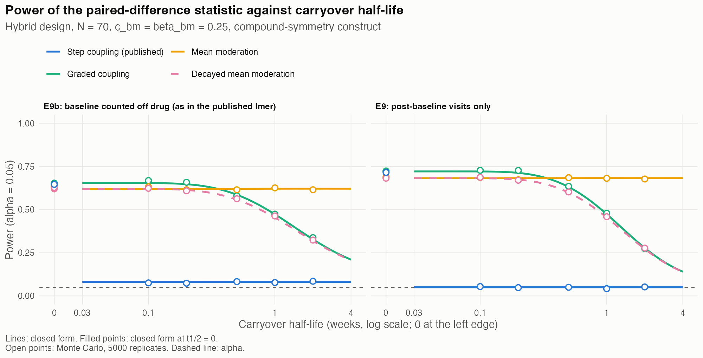
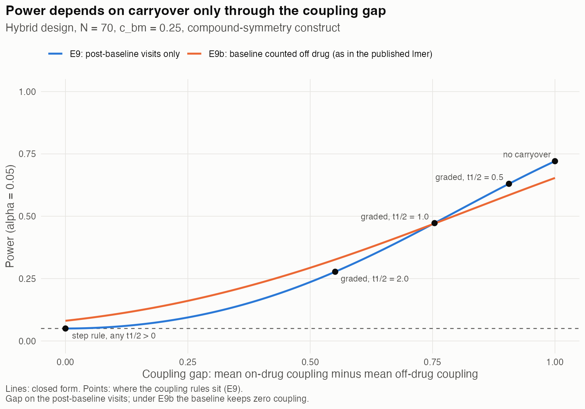
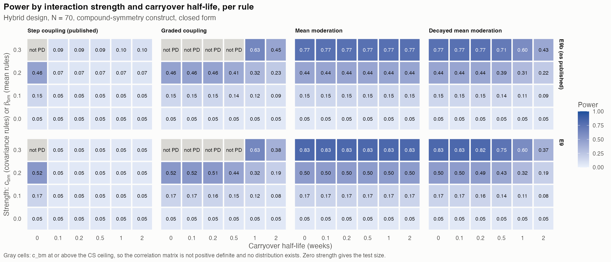
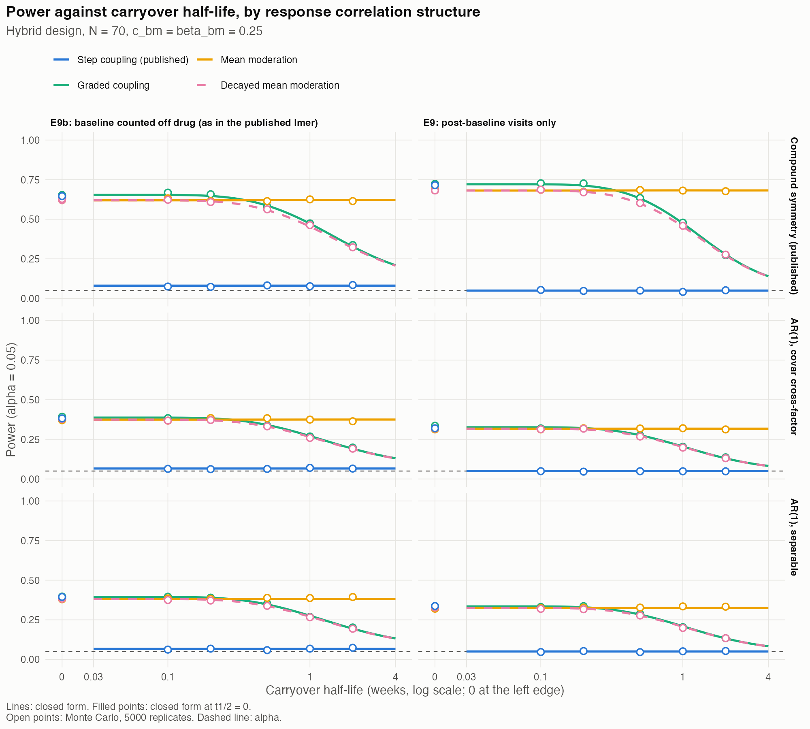
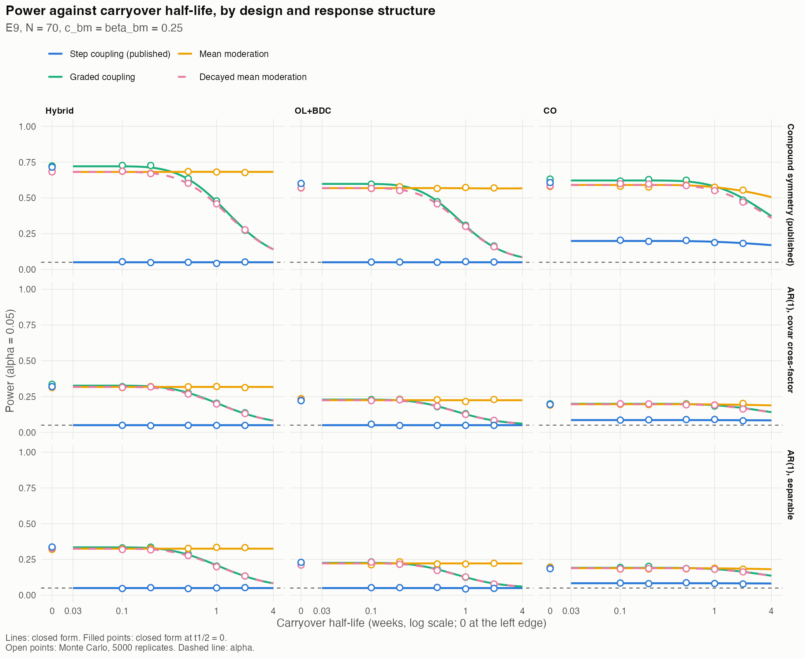

# Carryover Half-Life and the Power of the Biomarker-Treatment Interaction Test: Closed-Form Results for N-of-1 and Crossover Designs {.unlisted .unnumbered}
*2026-10-02 16:33 PDT*

**Author.** pmsimstats team

```{=latex}
\clearpage
\tableofcontents
\listoftables
\listoffigures
\clearpage
```

## Notation index and glossary

The notation follows the compendium's canonical table,
`analysis/report/NOTATION.md`. Symbols marked *canonical* carry the
meaning given there; symbols marked *local* are introduced in this
paper and chosen not to collide with any canonical symbol.

**Conventions** (canonical). $N$ is the total number of patients
across all randomization paths (70 throughout), never a per-path count.
The three response components are non-negative reductions in symptom
severity, so treatment effects and interaction slopes are negative and
interaction strengths positive. Carryover half-lives are in weeks.
$c_{bm}$ is the strength of the covariance-moderation rules (a
correlation) and $\beta_{bm}$ that of the mean-moderation rules (a
multiplier); they are matched at 0.25 unless stated otherwise (rule 2).

### Notation index

**Design and indices.**

| Symbol | Meaning | Status |
|----------|----------------------------------------|------|
| $i$ | patient | canonical |
| $t$, $s$ | visit; $t = 0$ is baseline, $t = 1, \ldots, 8$ the post-baseline visits | canonical |
| $w_t$ | calendar time of visit $t$, in weeks | local |
| $p$ | randomization path | local |
| $P$ | number of paths: 4 for Hybrid, 2 for OL+BDC and CO | canonical |
| $N$ | total number of patients, 70 | canonical |
| $n_p$ | patients in path $p$: 18, 18, 17, 17 (Hybrid); 35, 35 (OL+BDC, CO) | local |
| $q_p$ | share of patients in path $p$, $n_p/N$ | local |
| $n_{\text{on}}$, $n_{\text{off}}$ | on-drug and off-drug post-baseline visits of a path | local |
| $e_t$ | expectancy at visit $t$: 1 open-label, 0.5 blinded | local |

Table: Notation index: design and index symbols

**Outcome and response components.**

| Symbol | Meaning | Status |
|----------|----------------------------------------|------|
| $Y_t$ | symptom score, $Y_t = \mathrm{BL} - (TV_t + PB_t + BR_t)$, with $Y_0 = \mathrm{BL}$ | canonical |
| $\mathrm{BL}$ | baseline level | canonical |
| $TV_t$, $PB_t$, $BR_t$ | time-variant, placebo-belief and biologic-response components | canonical |
| $S_t$ | sum of the components, $TV_t + PB_t + BR_t$ | local |
| $\sigma_{TV}$, $\sigma_{PB,t}$, $\sigma_{BR}$ | component standard deviations: 10, $10e_t$, 8 | canonical ($\sigma_{BR}$) |
| $\varepsilon_i$ | residual of the E9 regression | canonical |

Table: Notation index: outcome and response component symbols

**Treatment exposure and carryover.**

| Symbol | Meaning | Status |
|----------|----------------------------------------|------|
| $D_t$ | binary drug state: 1 on drug, 0 off drug | canonical |
| $t_{sd}$ | time since discontinuation | canonical |
| $t_{1/2}$ | carryover half-life, in weeks | canonical |
| $\phi_t$ | anchored decay factor, $2^{-t_{sd}/t_{1/2}}$ off drug; 0 before first exposure or when $t_{1/2} = 0$ | local |
| $\mu_{BR,t}$ | mean drug response at visit $t$ | local |

Table: Notation index: treatment exposure and carryover symbols

**Biomarker and interaction strength.**

| Symbol | Meaning | Status |
|----------|----------------------------------------|------|
| $B$ | biomarker | canonical |
| $\mu_{bm}$, $\sigma_{bm}$ | biomarker mean and standard deviation (124.33, 15.36) | canonical ($\sigma_{bm}$) |
| $b$ | standardized biomarker, $(B - \mu_{bm})/\sigma_{bm}$ | canonical |
| $c_{bm}$ | covariance-moderation strength: on-drug correlation of $B$ with $BR_t$ | canonical |
| $\beta_{bm}$ | mean-moderation strength: the shift of $BR_t$ is $\beta_{bm}\sigma_{BR}b\,h_t$ | canonical |
| $g_t$ | coupling: the fraction of $c_{bm}$ present in $\mathrm{Cor}(B, BR_t)$ | local |
| $g_p$ | the coupling vector $(g_1, \ldots, g_8)$ of path $p$ | local |
| $h_t$ | moderation profile: the fraction of the full mean shift present at visit $t$ | local |
| $\bar g_{\text{off}}$, $\bar h_{\text{off}}$ | mean coupling or moderation over a path's off-drug visits | local |
| $\bar g_{\text{on}} - \bar g_{\text{off}}$ | coupling gap | local |
| $\bar\phi_{\text{off}}$ | mean of $\phi_t$ over the off-drug visits | local |
| $c_{bm}^{\ast}$ | ceiling: the largest $c_{bm}$ for which the correlation matrix is positive definite | local |

Table: Notation index: biomarker and interaction strength symbols

**Correlation structure.**

| Symbol | Meaning | Status |
|----------|----------------------------------------|------|
| $\rho$ | within-factor correlation, 0.8: between any two visits under CS, per week of separation under AR(1) | canonical |
| $c_1$, $c_\times$ | cross-factor correlation at the same visit (0.2) and at different visits (0.1) | local |
| $A$ | AR(1) time kernel, $A_{ts} = \rho^{\lvert w_t - w_s\rvert}$ | local |
| $I$, $J$, $I_3$, $J_3$ | identity and all-ones matrices: the occasion and person-level time kernels, and their $3 \times 3$ factor forms | local |
| $K$ | separable factor matrix, $(1 - c_1)I_3 + c_1J_3$ | local |
| $K_a$, $K_b$ | factor matrices of the `covar` decomposition | local |
| $K_o$, $K_p$ | factor matrices of the CS decomposition (occasion and person level) | local |
| $K^{(k)}$, $T^{(k)}$ | factor and time parts of term $k$ of a decomposition | local |
| $s_t$ | vector of factor standard deviations at visit $t$ | local |

Table: Notation index: correlation structure symbols

**The statistic and its moments.**

| Symbol | Meaning | Status |
|----------|----------------------------------------|------|
| $a_t$ | contrast weight: $1/n_{\text{on}}$ on drug, $-1/n_{\text{off}}$ off drug | local |
| $\Delta_i$ | patient $i$'s on-minus-off contrast, $\sum_t a_t Y_{it}$ | local |
| $\beta_0$ | intercept of the E9 regression | local |
| $\beta_{bm:D}$ | the interaction slope: the population slope of $\Delta$ on $B$, the estimand of E9 | canonical |
| $\hat\beta_{bm:D}$ | its E9 estimate | canonical |
| $\beta_{bm:D,p}$ | the slope in path $p$ | local |
| $\bar\beta_{bm:D}$ | the patient-weighted mean slope over paths | local |
| $\beta_{bm:D}^{\text{E9}}$, $\beta_{bm:D}^{\text{E9b}}$ | the slope under E9 and E9b | local |
| $\mu$, $\mu_p$ | expected contrast, overall and in path $p$ | local |
| $\tau^2$, $\tau_p^2$ | residual variance of $\Delta$ given $B$, overall and in path $p$ | local |
| $\rho_{\Delta B}$ | correlation between contrast and biomarker | local |
| $m_1$, $m_2$, $m_e$, $m_{ee}$, $m_{2e}$ | weight sums of the CS variance formula: $\sum a_t$, $\sum a_t^2$, $\sum a_te_t$, $\sum a_t^2e_t^2$, $\sum a_t^2e_t$ | local |
| $\mathrm{SS}_{bm}$ | biomarker sum of squares, $\sum_i (B_i - \bar B)^2$ | local |
| $\sigma^2_{\text{res}}$ | pooled residual variance including the path-mean term | local |
| $\Lambda$ | noncentrality of the $t$-statistic | local |
| $\alpha$ | significance level, 0.05 | canonical |
| $z$ | Monte Carlo deviation: simulated minus closed-form power, in binomial standard errors (Section 6) | local |

Table: Notation index: symbols for the statistic and its moments

### Glossary

**Analyses.**

- **E9 (paired-difference specification).** Compendium analysis
  specification E9 (`analysis/report/compendium-mathematics.tex`): each
  patient's on-drug mean minus off-drug mean, regressed on the
  biomarker by ordinary least squares over all patients; the test is on
  the slope.
- **E9b.** E9 with the baseline visit counted as one more off-drug
  observation, as the published analysis codes it (local).
- **Stratified E9.** E9 with path-specific intercepts, which removes
  between-path differences from the residual (local; Section 5.7).
- **E1.** Binary on-drug indicator with carryover ignored (canonical);
  the published analysis is an E1-type mixed model.
- **Published analysis.** The `lme_analysis()` model of Hendrickson et
  al. (2020), `lmer(Sx ~ bm + Db + t + bm*Db + (1|ptID))`, with the
  baseline as a $t = 0$ row.
- **LME, corCAR1.** Linear mixed-effects model; continuous-time AR(1)
  residual correlation (canonical).
- **Path-mean term.** The between-path variance of the expected
  contrast, which E9's common intercept counts as noise (Section 4.4).
- **Period effect.** A difference between the paths' mean contrasts
  arising because they are on drug at different times (Section 5.7).

**Designs** (canonical).

- **OL.** Open-label; no off-drug visits, so E9 is not defined for it.
- **BDC.** Blinded discontinuation: a blinded switch to placebo after
  open-label response.
- **OL+BDC.** Open-label titration followed by blinded discontinuation.
- **CO.** Two-period crossover; one path receives placebo first.
- **Hybrid.** The Hendrickson et al. (2020) N-of-1 design: open-label
  titration, blinded discontinuation, then a brief crossover.
- **Randomization path.** One of a design's on/off sequences.

**Data-generating constructs.**

- **Covariance moderation.** The interaction encoded as a
  treatment-state-dependent biomarker correlation (canonical).
- **Mean moderation.** The interaction encoded as a biomarker-dependent
  shift of the mean drug response (canonical).
- **CS (compound symmetry).** Constant within-factor correlation between
  any two visits; the published construct.
- **AR(1).** Within-factor correlation decaying with visit separation.
- **`covar`.** The package's AR(1) construct, with cross-factor
  correlation $c_\times\rho^{\text{gap}}$ (configuration F of
  `docs/36`).
- **Separable.** Correlation that factors as a factor part times a time
  part, $K \otimes A$ (configuration C of `docs/36`).
- **`58b32a9`.** The commit of Hendrickson's code that defines the
  published construct.
- **Step rule.** The published coupling: $g_t = 1$ wherever the mean
  drug response is nonzero.
- **Graded coupling.** $g_t = 1$ on drug and $\phi_t$ off drug.
- **Decayed mean moderation.** Mean moderation with $h_t = 1$ on drug
  and $\phi_t$ off drug.
- **Positive definite (PD), repair.** A correlation matrix is PD when
  all its eigenvalues are positive. Above the ceiling it is not, no
  distribution exists, and the published code silently repairs the
  matrix (`docs/36`).
- **Configurations A-F.** The six constructs of `docs/36`,
  Appendix A.6.

**Results and inference.**

- **Closed form.** Exact or first-order analytic expressions for the
  moments and power of the statistic (Section 4), as opposed to
  simulation.
- **Monte Carlo (MC), MCSE.** Direct simulation of the statistic and its
  Monte Carlo standard error (canonical).
- **Noncentral $t$.** The distribution of the $t$-statistic under an
  interaction, whose tail probability gives power (Section 4.4).
- **Type I error, test size.** The rejection rate with no interaction;
  0.05 nominal.

## 1. Summary

This paper isolates problem 2 of `docs/36`, the collapse of power under
small carryover reported by Hendrickson et al. (2020) for the Hybrid
(N-of-1) design, and studies it analytically. The core setting is the
smallest case that still shows the problem: the Hybrid design,
$N = 70$, the published compound-symmetry (CS) correlation construct,
and the paired-difference interaction statistic (E9) of the
compendium. For that statistic every moment that matters has a closed
form. Sections 5.6 to 5.8 extend the framework to a fourth
data-generating rule, to the OL+BDC and crossover (CO) designs, and to
two AR(1) correlation structures, with the variance written in
factor-by-time (separable) form. The results:

1. **The half-life enters in one place only.** The variance of each
   patient's on-minus-off contrast $\Delta$ does not depend on the
   carryover half-life $t_{1/2}$ at all: carryover acts on the
   response means, which the contrast's intercept absorbs, and on the
   biomarker coupling. The slope of $\Delta$ on the biomarker is
   $$\beta_{bm:D} = -c_{bm}\,\frac{\sigma_{BR}}{\sigma_{bm}}\,(1 - \bar g_{\text{off}}),$$
   where $\bar g_{\text{off}}$ is the mean biomarker coupling over the
   patient's off-drug visits: the average fraction of the biomarker
   effect present in the biomarker's correlation with the drug response
   when the patient is off drug (defined in Section 2; derived in
   Section 4). Power is a strictly
   decreasing function of $\bar g_{\text{off}}$, so the entire effect
   of carryover on power runs through this one number (Section 5).
2. **Under the published coupling rule, power does not decline with
   the half-life; it switches off.** The published rule sets the
   coupling to its full value wherever any residual drug effect
   remains, so $\bar g_{\text{off}} = 1$ for every $t_{1/2} > 0$,
   however small. The slope is then exactly zero, and power equals
   the test size, for every positive half-life (Section 5.1). The
   published "precipitous decline" is a step at $t_{1/2} = 0$, not a
   decline. The residual power in the simulated published analysis
   (0.08-0.11 at
   $c_{bm} = 0.25$) comes from the published analysis counting the
   baseline visit as off drug, which leaves a slope of
   $1/(n_{\text{off}} + 1)$ of its no-carryover value; the closed form
   reproduces the published mean estimate to within 0.003.
3. **Under graded coupling, power declines monotonically, and the
   decline is provable.** With the coupling decaying as the drug
   effect does, $\bar g_{\text{off}}$ increases strictly with
   $t_{1/2}$, so the slope shrinks, the residual variance grows and
   power falls, strictly, for every $t_{1/2}$ (Section 5.2). The loss
   is negligible at the half-lives Hendrickson examined (power 0.721 at
   $t_{1/2} = 0.1$, the same as without carryover, and 0.712 at 0.2)
   and substantial only when carryover is long (0.473 at one week,
   0.278 at two). The
   published step rule is the $t_{1/2} \to \infty$ limit of graded
   coupling: the published construct behaves, whenever carryover is
   nonzero, as if it were infinitely long.
4. **Under mean moderation, power does not depend on the half-life**
   (Section 5.3).
5. **Decayed mean moderation behaves like graded coupling.** If the
   biomarker-dependent shift of the drug response fades off drug at the
   rate of the drug effect, the slope has the same form as under graded
   coupling and power declines monotonically, with no ceiling on the
   effect size (Section 5.6).
6. **The results carry over to other designs, with one structural
   difference.** OL+BDC behaves like Hybrid. In CO the placebo-first
   path's off-drug visits come before any exposure, keep zero coupling
   under every rule, and so keep their full contrast: under the step
   rule CO loses only the active-first path's slope, and its power
   falls to 0.20 rather than to the test size. In CO the E9
   statistic's common intercept also absorbs a large period effect,
   which costs E9 about 0.2 in power. The published mixed model, whose
   time term removes the period effect, does not lose it (Sections 5.7
   and 6).
7. **AR(1) structures cut power but do not change its shape.** Under
   the AR(1) `covar` and separable structures, power at strength 0.25
   is between a third (CO) and a half (Hybrid) of its
   CS value, with the same step,
   monotone decline and flat behavior across the rules. The
   factor-by-time decomposition of the contrast variance shows why:
   under CS the contrast cancels the large person-level term, under
   AR(1) widely spaced visits keep nearly the whole factor variance
   (Section 5.8).
8. **The closed form reproduces the simulations.** It agrees with a
   direct Monte Carlo of the statistic in 283 cells (three designs,
   three structures, four rules, effect sizes 0.1 to 0.3), and its
   baseline-inclusive variant reproduces the mean estimates of the
   published linear mixed-model (`lmer`) analysis in all three designs
   and its power in the Hybrid design (Section 6).

## 2. Setting

**Design.** The Hybrid design of Hendrickson et al. (2020): eight
post-baseline visits at weeks 4, 8, 9, 10, 11, 12, 16 and 20, with
expectancy 1 at the two open-label visits and 0.5 afterwards, and four
paths. $N = 70$ patients are allocated 18, 18, 17, 17 across the
paths, as in the published code. The time since discontinuation
$t_{sd}$ at each visit, from the published `buildtrialdesign()`
semantics (verified):

| Path | On drug (visits 1-8) | $t_{sd}$ (weeks) | $n_{\text{on}}$ | $n_{\text{off}}$ |
|---|---|---|---|---|
| 1 | 1 1 1 1 0 0 1 0 | 0 0 0 0 1 2 0 4 | 5 | 3 |
| 2 | 1 1 1 1 0 0 0 1 | 0 0 0 0 1 2 6 0 | 5 | 3 |
| 3 | 1 1 1 0 0 0 1 0 | 0 0 0 1 2 3 0 4 | 4 | 4 |
| 4 | 1 1 1 0 0 0 0 1 | 0 0 0 1 2 3 7 0 | 4 | 4 |

Table: Hybrid design paths: drug state, $t_{sd}$, and on- and off-drug visit counts

Every off-drug visit follows an exposure, so every off-drug visit has
$t_{sd} \ge 1$ week. This matters below.

**Data-generating process.** The published construct (commit
`58b32a9`, configuration A of `docs/36`): patient-level baseline
severity $\mathrm{BL}$, biomarker $B$, and three response factors
$TV_t$, $PB_t$, $BR_t$ at each visit, jointly normal; outcome
$Y_t = \mathrm{BL} - (TV_t + PB_t + BR_t)$, and $Y_0 = \mathrm{BL}$ at
baseline. Standard deviations $\sigma_{TV} = 10$,
$\sigma_{PB,t} = 10e_t$, $\sigma_{BR} = 8$, $\sigma_{bm} = 15.36$.
Correlations: within a factor, $\rho = 0.8$ between any two visits
(compound symmetry); between factors, $c_1 = 0.2$ at the same visit and
$c_\times = 0.1$ at different visits. $\mathrm{BL}$ is uncorrelated
with everything else. The biomarker is correlated with $BR_t$ only,

$$
\mathrm{Cor}(B, BR_t) = c_{bm}\, g_t ,
$$

**Coupling.** We call $g_t$ the *coupling* at visit $t$: the fraction
of the biomarker effect $c_{bm}$ that is present in the biomarker's
correlation with the drug response at that visit, with
$0 \le g_t \le 1$. The term is ours, not Hendrickson et al.'s;
`docs/36` writes the same quantity as the coupling vector $r$, with
$r_t = c_{bm}g_t$. In the covariance construct the biomarker does not
enter the outcome equation; it moderates the drug effect only through
this correlation, so a patient with a high biomarker tends to have a
larger drug response at the visits where the coupling is present. The
interaction the analysis is meant to detect is the difference between
on-drug and off-drug coupling: if the biomarker predicts the response
as strongly off drug as on drug, there is no biomarker-by-treatment
interaction to find. Both covariance rules below set $g_t = 1$ on drug;
they differ in the off-drug coupling, and that difference is the
subject of this paper. Under the two mean-moderation rules the
interaction is not carried by a correlation, $g_t = 0$ throughout, and
the corresponding quantity is the *moderation profile* $h_t$: the
fraction of the full biomarker-dependent shift of the drug response
present at visit $t$.

The interaction is encoded by one of four rules:

- **Step (published).** $g_t = \mathbf 1[\mu_{BR,t} \neq 0]$: full
  coupling wherever the mean drug response is nonzero, which off drug
  is the case whenever $t_{1/2} > 0$.
- **Graded.** $g_t = 1$ on drug and $g_t = \phi_t = 2^{-t_{sd}/t_{1/2}}$
  off drug: coupling decays with the drug effect (adjustment 2 of
  `docs/36`).
- **Mean moderation.** $g_t = 0$; instead the on-drug $BR_t$ is shifted
  by $\beta_{bm}\sigma_{BR} b$, $b$ the standardized biomarker (adjustment
  3 of `docs/36`): $h_t = 1$ on drug and 0 off drug.
- **Decayed mean moderation.** The same shift with $h_t = 1$ on drug and
  $h_t = \phi_t = 2^{-t_{sd}/t_{1/2}}$ off drug: the biomarker-dependent
  part of the drug response fades after discontinuation at the rate of
  the drug effect (`docs/38`, Section 4, gives the pharmacological
  argument for a proportional profile; this anchored form is the
  version directly comparable with graded coupling).

In every rule, an off-drug visit before any exposure ($t_{sd} = 0$, as
in the placebo-first crossover path) has coupling and moderation 0.

For example, path 1's off-drug visits fall 1, 2 and 4 weeks after
discontinuation. At $t_{1/2} = 0.5$ weeks their coupling is 1, 1 and 1
under the step rule, and 0.25, 0.06 and 0.004 under the graded rule.

Unless stated otherwise the interaction strength is 0.25: $c_{bm} = 0.25$
for the covariance rules and $\beta_{bm} = 0.25$ for the mean rules, the
matched value of canonical rule 2 (both give the slope $-0.1302$ without
carryover). Under CS the joint
distribution exists only for $c_{bm}$ below a ceiling, 0.256 in the
Hybrid design without carryover (`docs/36`, Section 6.5); 0.25 is the
largest round value feasible for every rule, design and structure at
every half-life, so no matrix is repaired anywhere in this paper. The
published value 0.3 is infeasible without carryover and 0.6 in most
cells; the published results there come from repaired matrices whose
coupling the formulas below would have to take from the repaired
matrix.

## 3. The statistic

The compendium's paired-difference specification E9
(`analysis/report/compendium-mathematics.tex`, Section "Analysis
specifications for carryover") is a two-stage estimator. For patient
$i$,

$$
\Delta_i = \bar Y_i^{\text{on}} - \bar Y_i^{\text{off}}
= \sum_t a_t Y_{it}, \qquad
a_t = \begin{cases} 1/n_{\text{on}} & \text{on drug} \\
-1/n_{\text{off}} & \text{off drug} \end{cases},
$$

followed by the ordinary least squares (OLS) regression
$\Delta_i = \beta_0 + \beta_{bm:D} B_i + \varepsilon_i$ over all $N$
patients and a $t$-test of the estimate $\hat\beta_{bm:D}$ with $N - 2$
degrees of freedom.

The slope $\beta_{bm:D}$ is the biomarker-by-treatment interaction (the
canonical estimand, here for the binary on/off contrast): the change in
a patient's on-minus-off outcome difference per unit of biomarker, in
outcome points per biomarker unit. Since $Y = \mathrm{BL} - (\ldots)$
is a symptom score that falls as patients improve, a biomarker that
predicts a larger drug response gives a negative slope. Below,
$\beta_{bm:D}$ denotes the slope in the population, which the E9
estimate targets; without carryover it equals
$-c_{bm}\sigma_{BR}/\sigma_{bm}$, the drug-response
gain in standard-deviation units per standard deviation of biomarker,
rescaled to the outcome and biomarker scales. It is the same quantity
the published mixed model estimates as the `bm:Db` coefficient.

Two variants are treated:

- **E9**, the specification as written, on the eight post-baseline
  visits.
- **E9b**, the same with the baseline visit counted as one more
  off-drug observation ($n_{\text{off}} + 1$ off-drug rows). This is
  how the published analysis codes it: `lme_analysis()` adds a
  baseline row with $t = 0$ and $D_b = 0$ before fitting
  `Sx ~ bm + Db + t + bm*Db + (1|ptID)`. E9b is not that mixed model,
  but Section 6 shows that its moments and power match the mixed
  model's closely in this setting, so it serves as a closed-form
  proxy for the published analysis.

In both variants the weights over all rows sum to zero, so
$\mathrm{BL}$, which enters every row including baseline, cancels:

$$
\Delta = -\sum_{t=1}^{8} a_t S_t, \qquad S_t = TV_t + PB_t + BR_t .
$$

For E9, $\sum_{t \ge 1} a_t = 0$. For E9b the post-baseline weights sum
to $1/(n_{\text{off}} + 1)$, the baseline row carrying the remaining
$-1/(n_{\text{off}} + 1)$ against an outcome of $\mathrm{BL}$ alone.

## 4. Closed-form moments

$\Delta$ and $B$ are jointly normal within a path, so the regression of
$\Delta$ on $B$ is exactly linear,

$$
E(\Delta \mid B) = \mu + \beta_{bm:D} (B - \mu_{bm}), \qquad
\mathrm{Var}(\Delta \mid B) = \tau^2 ,
$$

and three quantities per path determine everything: the variance of
$\Delta$, its covariance with $B$, and its mean.

### 4.1 The variance of the contrast

With $m_1 = \sum a_t$, $m_2 = \sum a_t^2$, $m_e = \sum a_t e_t$,
$m_{ee} = \sum a_t^2 e_t^2$ and $m_{2e} = \sum a_t^2 e_t$ (sums over the
eight post-baseline visits), expanding $\mathrm{Var}(a^\top S)$ over the
CS structure gives

$$
\begin{aligned}
\mathrm{Var}(\Delta) = {} & (\sigma_{TV}^2 + \sigma_{BR}^2)
  \big[\rho m_1^2 + (1 - \rho) m_2\big]
+ \sigma_{PB}^2 \big[\rho m_e^2 + (1 - \rho) m_{ee}\big] \\
& + 2\sigma_{TV}\sigma_{BR}\big[c_\times m_1^2 + (c_1 - c_\times) m_2\big]
+ 2(\sigma_{TV} + \sigma_{BR})\sigma_{PB}
  \big[c_\times m_1 m_e + (c_1 - c_\times) m_{2e}\big].
\end{aligned}
$$

For E9, $m_1 = 0$, and the person-level part of every factor (the
$\rho$ terms) cancels except where the placebo factor's
visit-dependent scale $e_t$ keeps $m_e$ away from zero. Evaluated at
the published values (verified, by hand for path 1 and by the script
for all paths):

| Variant | Paths 1, 2 | Paths 3, 4 |
|---|---|---|
| E9 | 44.13 | 45.03 |
| E9b | 51.04 | 51.77 |

Table: Contrast variance $\mathrm{Var}(\Delta)$ under E9 and E9b by path, CS construct

**Proposition 1.** *$\mathrm{Var}(\Delta)$ does not depend on
$t_{1/2}$.* The formula contains the response standard deviations and
correlations only; the half-life enters the published construct
through the response means ($\mu_{BR,t}$, with its recursive carryover)
and through the coupling $g_t$, and neither appears. The script
confirms the value is identical at every half-life to the last digit
(verified). The argument is not specific to CS: it holds for any
construct in which $t_{1/2}$ does not enter the response block, which
includes every configuration of `docs/36`.

Counting the baseline as off drug (E9b) increases the variance by
about 15%, because the baseline row adds $\mathrm{BL}$-free weight
that no longer cancels the person-level parts ($m_1 \neq 0$).

### 4.2 The slope

Only $BR_t$ is correlated with $B$, with covariance
$c_{bm} g_t \sigma_{bm} \sigma_{BR}$, so
$\mathrm{Cov}(\Delta, B) = -c_{bm}\sigma_{bm}\sigma_{BR}\sum_t a_t g_t$
and

$$
\beta_{bm:D} = -c_{bm}\frac{\sigma_{BR}}{\sigma_{bm}}\sum_{t=1}^{8} a_t g_t .
$$

On-drug visits have $g_t = 1$ and weights summing to 1. Writing
$\bar g_{\text{off}}$ for the mean coupling over the $n_{\text{off}}$
post-baseline off-drug visits, and recalling that the baseline has
$g_0 = 0$:

**Proposition 2.**

$$
\beta_{bm:D}^{\text{E9}} = -c_{bm}\frac{\sigma_{BR}}{\sigma_{bm}}\,
  \big(1 - \bar g_{\text{off}}\big), \qquad
\beta_{bm:D}^{\text{E9b}} = -c_{bm}\frac{\sigma_{BR}}{\sigma_{bm}}\,
  \Big(1 - \frac{n_{\text{off}}}{n_{\text{off}} + 1}\,\bar g_{\text{off}}\Big).
$$

Without carryover $\bar g_{\text{off}} = 0$ and both equal the
expected interaction slope $-c_{bm}\sigma_{BR}/\sigma_{bm} = -0.1302$.
Under the mean-moderation rules the shift $\beta_{bm}\sigma_{BR}b\,h_t$
contributes $-\beta_{bm}\sigma_{BR}b\sum_t a_t h_t$ to $\Delta$, so

$$
\beta_{bm:D} = -\beta_{bm}\frac{\sigma_{BR}}{\sigma_{bm}}\sum_t a_t h_t
= -\beta_{bm}\frac{\sigma_{BR}}{\sigma_{bm}}\,\big(1 - \bar h_{\text{off}}\big)
\quad \text{(E9)},
$$

with $\bar h_{\text{off}} = 0$ under mean moderation, so, at the
matched value $\beta_{bm} = c_{bm} = 0.25$,
$\beta_{bm:D} = -0.1302$ whatever the half-life, and
$\bar h_{\text{off}} = \bar\phi_{\text{off}}$ under decayed mean
moderation, the same form as graded coupling. In every rule the
off-drug average includes the zero coupling of any off-drug visit
before first exposure.

### 4.3 The residual variance and the correlation

For the covariance rules (step and graded), $B$ explains part of the
existing variance of $\Delta$, so

$$
\tau^2 = \mathrm{Var}(\Delta) - \beta_{bm:D}^2\sigma_{bm}^2 .
$$

Under mean moderation the shift adds variance rather than explaining
it, so $\mathrm{Var}(\Delta)$ grows by $\beta_{bm:D}^2\sigma_{bm}^2$ and
$\tau^2$ is the covariance-rule $\mathrm{Var}(\Delta)$ itself. This is
why, at the same slope, mean moderation has slightly less power than
the covariance rules without carryover (Section 5).

Power depends on these only through the correlation between the
contrast and the biomarker,

$$
\rho_{\Delta B} = \frac{\beta_{bm:D}\sigma_{bm}}{\sqrt{\mathrm{Var}(\Delta)}}
= -c_{bm}\,\frac{\sigma_{BR}\,(1 - \bar g_{\text{off}})}{\mathrm{SD}(\Delta)}
\quad \text{(E9, covariance rules)},
$$

0.30 in every path without carryover.

### 4.4 The pooled slope and its power

For a single path of $n$ patients, write
$\mathrm{SS}_{bm} = \sum_i (B_i - \bar B)^2$. Conditional on the biomarker values
the OLS slope is exactly normal,
$\hat\beta_{bm:D} \mid B \sim N(\beta_{bm:D}, \tau^2/\mathrm{SS}_{bm})$, and its $t$-statistic
is exactly noncentral $t$ with $n - 2$ degrees of freedom and
noncentrality $\beta_{bm:D}\sqrt{\mathrm{SS}_{bm}}/\tau$. Since
$\mathrm{SS}_{bm} \sim \sigma_{bm}^2\chi^2_{n-1}$, power is the noncentral-$t$ tail
probability averaged over that $\chi^2$ law, and
$\mathrm{Var}(\hat\beta_{bm:D}) = \tau^2 E(1/\mathrm{SS}_{bm}) =
\tau^2/\{\sigma_{bm}^2(n - 3)\}$. At $\mathrm{SS}_{bm} = \sigma_{bm}^2(n-1)$ the
noncentrality is

$$
\Lambda = \sqrt{n - 1}\;\frac{\rho_{\Delta B}}{\sqrt{1 - \rho_{\Delta B}^2}} ,
$$

so power is governed by the contrast-biomarker correlation alone.

E9 pools the four paths with a common intercept. With
$q_p = n_p/N$ and $\mu_p = E(\Delta)$ in path $p$, the pooled slope
has mean $\bar\beta_{bm:D} = \sum_p q_p\beta_{bm:D,p}$, and the differences
between paths act as additional residual variance,

$$
\sigma^2_{\text{res}} = \sum_p q_p\big[\tau_p^2 + (\mu_p - \bar\mu)^2
  + \sigma_{bm}^2(\beta_{bm:D,p} - \bar\beta_{bm:D})^2\big],
$$

so that the $t$-statistic is, to first order in the path differences,
noncentral $t$ with $N - 2$ degrees of freedom and noncentrality
$\bar\beta_{bm:D}\sqrt{\mathrm{SS}_{bm}}/\sigma_{\text{res}}$, $\mathrm{SS}_{bm} \sim
\sigma_{bm}^2\chi^2_{N-1}$, and

$$
\mathrm{Var}(\hat\beta_{bm:D}) \approx
\frac{\sum_p q_p\big[\tau_p^2 + (\mu_p - \bar\mu)^2\big]}{(N - 3)\,\sigma_{bm}^2}
+ \frac{2}{N}\sum_p q_p(\beta_{bm:D,p} - \bar\beta_{bm:D})^2 .
$$

Power is computed by averaging the noncentral-$t$ tail probability over
400 quantiles of $\chi^2_{N-1}$. A first version of the calculation used
$N$ in place of $N - 3$ and ignored the variation of $\mathrm{SS}_{bm}$; it
overstated power by about 0.01-0.02, which the direct simulation of
Section 6 detected. In the Hybrid and OL+BDC designs the path-mean term
is small: in Hybrid at most 0.30 against residual variances of 41-49,
under 0.7% of the total, decreasing with $t_{1/2}$; in OL+BDC at most
0.6% (verified). In CO it is not small (Section 5.7).

## 5. The effect of the half-life

By Propositions 1 and 2, $t_{1/2}$ affects power only through
$\bar g_{\text{off}}$, and $|\rho_{\Delta B}|$, the noncentrality and
power are all strictly decreasing in $\bar g_{\text{off}}$ (or
$\bar h_{\text{off}}$ for the mean rules). The rules differ only in how
that average depends on $t_{1/2}$. Sections 5.1 to 5.5 treat the Hybrid
design under CS; Sections 5.6 to 5.8 extend the results.

Closed-form power and mean slope (verified):

| Rule | Variant | $t_{1/2}$ = 0 | 0.1 | 0.2 | 0.5 | 1 | 2 |
|---|---|---|---|---|---|---|---|
| Step (published) | E9 | 0.721 | 0.050 | 0.050 | 0.050 | 0.050 | 0.050 |
| | E9b | 0.654 | 0.081 | 0.081 | 0.081 | 0.081 | 0.081 |
| Graded | E9 | 0.721 | 0.721 | 0.712 | 0.631 | 0.473 | 0.278 |
| | E9b | 0.654 | 0.653 | 0.647 | 0.586 | 0.473 | 0.328 |
| Mean moderation | E9 | 0.681 | 0.681 | 0.682 | 0.682 | 0.682 | 0.682 |
| | E9b | 0.619 | 0.619 | 0.620 | 0.620 | 0.621 | 0.621 |

Table: Closed-form power by rule, variant, and $t_{1/2}$, Hybrid design under CS

| Rule | Variant | Mean slope, $t_{1/2}$ = 0 | 0.1 | 0.2 | 0.5 | 1 | 2 |
|---|---|---|---|---|---|---|---|
| Step (published) | E9 | -0.130 | 0 | 0 | 0 | 0 | 0 |
| | E9b | -0.130 | -0.029 | -0.029 | -0.029 | -0.029 | -0.029 |
| Graded | E9 | -0.130 | -0.130 | -0.129 | -0.118 | -0.098 | -0.072 |
| | E9b | -0.130 | -0.130 | -0.129 | -0.121 | -0.106 | -0.085 |
| Mean moderation | both | -0.130 | -0.130 | -0.130 | -0.130 | -0.130 | -0.130 |

Table: Closed-form mean slope by rule, variant, and $t_{1/2}$, Hybrid design under CS



*Figure 1. Closed-form power (lines; filled points at $t_{1/2} = 0$)
against carryover half-life on a logarithmic axis, with direct Monte
Carlo estimates (open points), for the four rules (decayed mean
moderation dashed; Section 5.6). Hybrid design, $N = 70$,
$c_{bm} = \beta_{bm} = 0.25$, CS construct.*

### 5.1 Step coupling: a switch, not a decline

Under the published rule $g_t = \mathbf 1[\mu_{BR,t} \neq 0]$. With
$t_{1/2} > 0$ the off-drug mean is
$\mu_{BR,t} = \mu_{BR,t-1}2^{-t_{sd}/t_{1/2}} > 0$ at every off-drug
visit, because every off-drug visit in the Hybrid design follows an
exposure. Hence $\bar g_{\text{off}} = 1$ for every $t_{1/2} > 0$, and
by Proposition 2

$$
\beta_{bm:D}^{\text{E9}} = 0, \qquad
\beta_{bm:D}^{\text{E9b}} = -c_{bm}\frac{\sigma_{BR}}{\sigma_{bm}}\cdot
  \frac{1}{n_{\text{off}} + 1}
  \quad \text{for all } t_{1/2} > 0 .
$$

Power is therefore a step function of the half-life: its no-carryover
value at $t_{1/2} = 0$, and a constant at every positive half-life,
whether 0.01 weeks or 10. For E9 that constant is the nominal size,
0.050, because the slope is exactly zero; for E9b it is 0.081, carried
by the baseline row alone, which is the only observation whose coupling
stays at zero. The magnitude of the half-life plays no role. What the
published figure shows as sensitivity to small carryover is the
coupling rule redefining the estimand the moment any carryover is
present: with constant coupling the biomarker moderates on-drug and
off-drug response equally, and there is no interaction left to
detect.

One numerical footnote. Below about 0.012 weeks the recursive
off-drug mean at the latest off-drug visits underflows to exactly zero
in double precision (it is about $2^{-1300}$ at the last off-drug visit
of path 4 when $t_{1/2} = 0.01$), so the step rule, as coded both here
and in the published code, switches those visits' coupling off. Figure
1 therefore starts at 0.02 weeks. This is a floating-point effect, not
a property of the model.

The residual published power is explained exactly. E9b predicts mean
slopes of $-0.1302/4 = -0.0325$ in paths 1 and 2 and
$-0.1302/5 = -0.0260$ in paths 3 and 4, pooled $-0.029$; the published
analysis, simulated with the published construct, gives $-0.026$ to
$-0.032$ (Section 6).

### 5.2 Graded coupling: a provable monotone decline

Under graded coupling,

$$
\bar g_{\text{off}}(t_{1/2}) = \frac{1}{n_{\text{off}}}
  \sum_{t\,\text{off}} 2^{-t_{sd,t}/t_{1/2}}, \qquad
\frac{d\bar g_{\text{off}}}{dt_{1/2}} = \frac{\ln 2}{n_{\text{off}}\,t_{1/2}^2}
  \sum_{t\,\text{off}} t_{sd,t}\,2^{-t_{sd,t}/t_{1/2}} > 0 ,
$$

since every off-drug visit has $t_{sd,t} \ge 1$.

**Proposition 3.** *Under graded coupling, in every path, $|\beta_{bm:D,p}|$
is strictly decreasing and $\tau_p^2$ strictly increasing in
$t_{1/2}$; hence the noncentrality, and the power of the path-stratified
test, are strictly decreasing in $t_{1/2}$ on $(0, \infty)$.* With
$\bar g_{\text{off}}$ strictly increasing, Proposition 2 gives the
slope, Section 4.3 gives $\tau_p^2 = \mathrm{Var}(\Delta) -
\beta_{bm:D,p}^2\sigma_{bm}^2$ with $\mathrm{Var}(\Delta)$ fixed
(Proposition 1), and the noncentral $t$ tail probability is increasing
in $|\Lambda|$. For the pooled E9 statistic as specified, with its common
intercept, the path-mean term of Section 4.4 also moves with
$t_{1/2}$; it is under 0.7% of the variance and decreases with
$t_{1/2}$, and power is non-increasing at every step of a 120-point grid
from 0.02 to 4 weeks for both E9 and E9b (verified), with steps too
small to resolve only at the shortest half-lives, where the loss is
$O(2^{-1/t_{1/2}})$.

The limits make the relation to the published rule precise:

- **$t_{1/2} \to 0^+$.** $\bar g_{\text{off}} \le 2^{-1/t_{1/2}}$, so the
  loss vanishes faster than any power of $t_{1/2}$: at $t_{1/2} = 0.1$
  week, $\bar g_{\text{off}} \le 2^{-10} \approx 0.001$ and power is
  unchanged to within 0.001. Power is continuous at zero.
- **$t_{1/2} \to \infty$.** $\bar g_{\text{off}} \to 1$, so graded
  coupling converges to the step rule. The published construct is the
  infinite-half-life limit of graded coupling, applied at every
  positive half-life.

Two features are worth noting. The decline is slow at first and
faster later because $\bar g_{\text{off}}$ is a sum of
$2^{-t_{sd}/t_{1/2}}$ terms, each negligible until $t_{1/2}$ is a
substantial fraction of $t_{sd}$, which is at least one week here. And
E9 and E9b cross: E9 has more power while carryover is short, because
its variance is lower; E9b has more beyond about one week, because its
baseline row keeps zero coupling however long the carryover and so
retains part of the slope.

### 5.3 Mean moderation: no dependence

Under mean moderation the interaction is a shift of the on-drug mean
only, so $\beta_{bm:D} = -\beta_{bm}\sigma_{BR}/\sigma_{bm}$ and $\tau^2$ are both
free of $t_{1/2}$, and power is constant (0.681-0.682 for E9). The
recursive carryover of the mean response off drug changes $\mu_p$ but
not $\beta_{bm:D,p}$ or $\tau_p^2$; it enters only through the negligible
path-mean term.

### 5.4 Power as a function of the coupling gap

Sections 5.1 to 5.3 are three special cases of one relation. With
on-drug coupling 1, the slope is proportional to the *coupling gap*
$\bar g_{\text{on}} - \bar g_{\text{off}}$, and power depends on the
coupling profile only through it: neither which off-drug visits are
coupled nor how the coupling is spread across them matters under E9,
which weights every off-drug visit equally. Holding the response
structure fixed and setting the off-drug coupling to $1 - \text{gap}$
at every off-drug visit gives power as a function of the gap alone
(closed form, verified):

| Coupling gap | 0 | 0.25 | 0.5 | 0.75 | 1 |
|---|---|---|---|---|---|
| Power, E9 | 0.050 | 0.094 | 0.236 | 0.468 | 0.721 |
| Power, E9b | 0.081 | 0.161 | 0.294 | 0.468 | 0.654 |

Table: Closed-form E9 and E9b power as a function of the coupling gap

The coupling rules are points on this curve. Without carryover the gap
is 1. Under graded coupling it is 0.991 at $t_{1/2} = 0.2$, 0.906 at
0.5, 0.754 at 1 and 0.551 at 2 weeks (patient-weighted over paths).
Under the published step rule it is 0 at every positive half-life.



*Figure 2. Closed-form power against the coupling gap, the mean
on-drug minus mean off-drug coupling over the post-baseline visits,
with the positions of the coupling rules marked (E9). Under E9b the
baseline row keeps zero coupling, so its power does not fall to the
test size at gap 0. Hybrid design, $N = 70$, $c_{bm} = 0.25$.*

Three things follow. First, power falls steeply with the gap: the
noncentrality is proportional to it, so the sample size needed for a
given power scales roughly as $1/\text{gap}^2$, and halving the gap
calls for about four times as many patients. Second, the curve is
steepest near gap 1 and flattest near 0: the first 0.1 of gap lost
costs 0.097 of power (0.721 to 0.624), the last 0.1 only 0.007 (0.057
to 0.050). Short carryover nevertheless costs almost nothing under
graded coupling, because the gap itself barely moves (0.991 at
$t_{1/2} = 0.2$), not because the curve is flat there. Third, the
published step rule sits at
the bottom of the curve for every positive half-life. The difference
between the published result and a smooth decline is the difference
between jumping from gap 1 to gap 0 and moving gradually along the
curve. The curve is computed for the covariance construct; under mean
moderation the gap is always 1 and the residual variance slightly
larger (Section 4.3).

### 5.5 Power by effect size and half-life

Figure 3 extends the results from an interaction strength of 0.25 to a
grid of effect sizes, $c_{bm}$ (or $\beta_{bm}$ for the mean rules)
$\in \{0, 0.1, 0.2, 0.3\}$ against
$t_{1/2} \in \{0, 0.1, 0.2, 0.5, 1, 2\}$ weeks, one panel per rule
(including decayed mean moderation, Section 5.6), in the layout of
Hendrickson et al.'s Figure 4B. Each cell is the closed form of
Section 4; every feasible cell at strengths 0.1, 0.2 and 0.3 was also
simulated, and agrees (Section 6). Cells where $c_{bm}$ is at or above the
CS ceiling are not evaluated: there the correlation matrix is not
positive definite, no joint distribution exists, and the formulas
would return a number without meaning. The ceiling depends on the rule
and the half-life (verified):

| Rule | $t_{1/2}$ = 0 | 0.1 | 0.2 | 0.5 | 1 | 2 |
|---|---|---|---|---|---|---|
| Step (published) | 0.256 | 0.893 | 0.893 | 0.893 | 0.893 | 0.893 |
| Graded | 0.256 | 0.256 | 0.257 | 0.274 | 0.307 | 0.369 |
| Mean moderation, decayed or not | none | none | none | none | none | none |

Table: CS ceiling $c_{bm}^{\ast}$ by rule and $t_{1/2}$, Hybrid design



*Figure 3. Closed-form power by interaction strength ($c_{bm}$ for the
covariance rules, $\beta_{bm}$ for the mean rules) and carryover
half-life, for each of the four rules (columns) and each variant of the
statistic (rows). Gray cells lie at or above the CS ceiling. Hybrid
design, $N = 70$.*

The figure shows the three behaviors of Section 5 at every effect size:

- **Step rule: a wall at $t_{1/2} = 0$.** Every column after the first
  is at the test size for E9 (0.05) and barely above it for E9b
  (0.05-0.10), however large $c_{bm}$. The rule's ceiling jumps to
  0.893 as soon as $t_{1/2} > 0$, because constant coupling costs
  almost nothing (`docs/36`, Section 6.5), so $c_{bm} = 0.3$ is
  feasible there but carries no signal. E9b at $c_{bm} = 0.3$ gives
  0.09-0.10 at every positive half-life, close to the 0.12 and 0.10
  that the published results report for the Hybrid design at
  $N = 70$, $c_{bm} = 0.3$, $t_{1/2} = 0.1$ and 0.2 (`docs/36`,
  Section 5.1); those published cells were not repaired, since 0.3 is
  below the 0.893 ceiling.
- **Graded rule: a gradual decline, and a rising ceiling.** At each
  feasible effect size power falls smoothly with the half-life. The
  ceiling rises with the half-life (0.256 to 0.369), because smoother
  coupling pays a smaller switch cost, so $c_{bm} = 0.3$ becomes
  feasible from $t_{1/2} = 1$ week. The result that power at
  $c_{bm} = 0.3$, $t_{1/2} = 1$ (0.63) exceeds power at $c_{bm} = 0.2$
  without carryover (0.52 for E9) is a comparison across effect sizes,
  not a gain from carryover.
- **Mean moderation: flat in the half-life.** Each row is constant,
  and every cell is feasible, including $\beta_{bm} = 0.3$ (0.83 for E9).

In every rule, power at zero interaction strength is the test size,
0.05, as it must be.

### 5.6 Decayed mean moderation

Under decayed mean moderation the slope is that of graded coupling
(Section 4.2): the per-path slopes are identical, path by path and
half-life by half-life (verified). The residual variance is not:
under mean moderation the biomarker-dependent shift adds variance
instead of explaining part of the existing variance (Section 4.3), so
at every half-life power is a little lower than under graded coupling
(Hybrid, CS, E9, closed form, verified):

| Rule | $t_{1/2}$ = 0 | 0.1 | 0.2 | 0.5 | 1 | 2 |
|---|---|---|---|---|---|---|
| Graded coupling | 0.721 | 0.721 | 0.712 | 0.631 | 0.473 | 0.278 |
| Decayed mean moderation | 0.681 | 0.681 | 0.674 | 0.598 | 0.454 | 0.271 |
| Mean moderation | 0.681 | 0.681 | 0.682 | 0.682 | 0.682 | 0.682 |

Table: E9 power under graded coupling, decayed and plain mean moderation by $t_{1/2}$

The decline is strictly monotone for the same reason as under graded
coupling (Proposition 3 applies with $h_t$ in place of $g_t$), and it is
verified on the half-life grid in every design and structure of this
paper. Decayed mean moderation has no ceiling, so its decline can be
traced at effect sizes where the covariance rules cannot be simulated:
at $\beta_{bm} = 0.3$, E9 power is 0.83, 0.83, 0.82, 0.75, 0.60 and 0.37
across the half-lives (Figure 3).

### 5.7 Other designs: OL+BDC and crossover

The framework needs no change for other designs: each path has its own
contrast weights $a_t$ and its own coupling pattern, and pooling is as
in Section 4.4. The two other published designs, with $N = 70$
allocated 35 and 35 (verified):

| Design | Path | On drug (visits 1-8) | $t_{sd}$ (weeks) |
|---|---|---|---|
| OL+BDC (weeks 4, 8, 12, 16, 17, 18, 19, 20) | 1 | 1 1 1 1 1 1 0 0 | 0 0 0 0 0 0 1 2 |
| | 2 | 1 1 1 1 1 0 0 0 | 0 0 0 0 0 1 2 3 |
| CO (every 2.5 weeks) | 1 | 1 1 1 1 0 0 0 0 | 0 0 0 0 2.5 5 7.5 10 |
| | 2 | 0 0 0 0 1 1 1 1 | 0 0 0 0 0 0 0 0 |

Table: OL+BDC and CO paths: visit weeks, drug state, and $t_{sd}$

**OL+BDC** has the structure of Hybrid: every off-drug visit follows an
exposure, one to three weeks after it. Its results are those of
Sections 5.1 to 5.5 in every respect (CS, E9, closed form, verified):
the step rule falls to the test size at every positive half-life, and
graded coupling declines monotonically (0.598, 0.597, 0.586, 0.477,
0.305, 0.156), faster than in Hybrid because its off-drug visits come
sooner after discontinuation.

**CO** differs in one structural respect: path 2 receives placebo
first, so its four off-drug visits precede any exposure and have
$t_{sd} = 0$. Their coupling and moderation are 0 under every rule,
whatever the half-life. Path 2 therefore keeps the full slope
$-0.1302$ under every rule, and the half-life acts only on path 1. Two
consequences follow.

- **Under the step rule CO keeps half its slope.** Path 1 loses its
  slope entirely; path 2 keeps it. The pooled E9 slope is $-0.065$ and
  E9b's is $-0.078$ at every positive half-life (path 1 keeps
  $1/(n_{\text{off}} + 1) = 1/5$ through the baseline row). The
  simulated published analysis gives $-0.075$ to $-0.082$ (Section 6).
  This is why the published crossover results lose less power than the
  N-of-1 results: at $N = 70$, $c_{bm} = 0.3$, from 0.85 to 0.44 and
  0.46, against 0.74 to 0.12 and 0.10 for Hybrid (`docs/36`, Section
  5.1).
- **Under graded coupling CO is robust to short carryover**, because
  path 1's off-drug visits are 2.5 to 10 weeks after discontinuation:
  power is 0.622 at every half-life up to 0.2 weeks and 0.581 at one
  week.

**The period effect in CO.** E9's common intercept assumes that the
paths share the same mean contrast. In CO they do not: path 1 is on
drug in the first half of the trial and path 2 in the second, and the
time-related and expectancy factors trend over the trial, so the mean
contrasts differ (CS, mean moderation: $-2.3$ in path 1 against $-11.1$
in path 2 without carryover). The path-mean term of Section 4.4 is
then 19.5 against a residual variance of 35.9, 54% of it, and it grows
with the half-life (to 25.5 at two weeks) because carryover narrows
path 1's contrast (verified). This term, not the interaction, is why
E9 power under mean moderation falls in CO (0.590 to 0.548 over two
weeks), and it is the main source of E9's inefficiency there relative
to a mixed model with a time term. Setting the term to zero, as an
analysis with path-specific intercepts would, gives (closed form, not
simulated):

| CO, CS, E9 | $t_{1/2}$ = 0 | 0.1 | 1 | 2 |
|---|---|---|---|---|
| Step, as specified | 0.622 | 0.199 | 0.193 | 0.184 |
| Step, path term removed | 0.817 | 0.283 | 0.283 | 0.283 |
| Graded, as specified | 0.622 | 0.622 | 0.581 | 0.497 |
| Graded, path term removed | 0.817 | 0.817 | 0.794 | 0.737 |
| Mean moderation, as specified | 0.590 | 0.590 | 0.575 | 0.548 |
| Mean moderation, path term removed | 0.771 | 0.771 | 0.771 | 0.771 |

Table: CO design E9 power by rule and $t_{1/2}$, with and without the path term

With the period effect removed, the three behaviors are exactly those
of the Hybrid design. In Hybrid and OL+BDC removing the term changes
power by at most 0.003.

**The period-effect loss belongs to E9, not to the crossover.** The
published mixed model does not suffer it. Its linear time term is
estimated within patients, and it absorbs most of the time trend
that, in E9, enters the two sequences' contrasts with opposite signs.
A Monte Carlo of the published `lmer` analysis (Section 6, 1000
replicates per cell, verified) gives power of 0.740 under mean
moderation without carryover for the 35/35 crossover, against 0.582
for E9 on the same replicates, and 0.736 to 0.770 when all 70
patients follow one sequence. The mixed crossover is thus about as
powerful as either sequence alone under `lmer`, whereas under E9 it
loses about 0.2 to the period effect. Adding a fixed path effect to
the `lmer` model changes its power by at most 0.001 in any cell. A
between-patient intercept shift is already covered by the random
intercept, and it does not act on the within-patient contrast. The
E9 analogue of the time term is a path-specific intercept in the
second-stage regression, which is the "path term removed" row above.
The CO rows of this section therefore describe E9 without that
adjustment, not the operating characteristics of the crossover
design under a time-adjusted analysis.

### 5.8 AR(1) correlation structures and the factor-by-time decomposition

The framework applies to any response correlation structure, because
the slope (Proposition 2) does not depend on it and the variance
(Proposition 1) does not depend on the half-life under any of them.
Two AR(1) structures from `docs/36` were evaluated: `covar` (AR(1)
within a factor, cross-factor correlation $c_\times\rho^{\text{gap}}$,
configuration F) and the separable form (cross-factor
$c_1\rho^{\text{gap}}$, configuration C), with $\rho = 0.8$ per week of
visit separation.

**Factorization.** Writing $s_t = (\sigma_{TV}, \sigma_{PB,t},
\sigma_{BR})$ for the factor standard deviations at visit $t$, each
structure's response correlation is a sum of factor-by-time Kronecker
terms (`docs/36`, Appendix A.7), and the contrast variance factors
accordingly:

$$
\mathrm{Var}(\Delta) = \sum_{k} \sum_{t,s} a_t a_s\, T^{(k)}_{ts}\,
  \big(s_t^\top K^{(k)} s_s\big),
$$

| Structure | Terms $K^{(k)} \otimes T^{(k)}$ |
|---|---|
| Separable AR(1) | $K \otimes A$, $K = (1 - c_1)I_3 + c_1J_3$ |
| AR(1) `covar` | $K_a \otimes A + K_b \otimes I$, $K_a = (1 - c_\times)I_3 + c_\times J_3$, $K_b = (c_1 - c_\times)(J_3 - I_3)$ |
| CS (published) | $K_o \otimes I + K_p \otimes J$, $K_o = (1 - \rho)I_3 + (c_1 - c_\times)(J_3 - I_3)$, $K_p = \rho I_3 + c_\times(J_3 - I_3)$ |

Table: Factor-by-time Kronecker terms of the three correlation structures

with $A_{ts} = \rho^{|w_t - w_s|}$ the AR(1) time kernel, $I$ the
occasion kernel and $J$ the all-ones (person-level) kernel. When the
placebo scale $e_t$ is constant over the contrast, as in CO, the
separable variance is a single product,
$\mathrm{Var}(\Delta) = (s^\top K s)(a^\top A a)$. The separable
ceiling factors as well,
$c_{bm}^{\ast} = ([K^{-1}]_{33}\max_p g_p^\top A^{-1}g_p)^{-1/2}$. The
factored variance agrees with the full-matrix value to $10^{-13}$ in
all 48 design-structure-statistic-path cases, and the factored ceiling
with the direct ceiling to $10^{-16}$ in all 36 cases (verified).

**Why AR(1) costs power.** The decomposition makes the comparison
transparent (E9 contrast variance, mean over paths, verified):

| Design | CS | AR(1) `covar` | Separable AR(1) |
|---|---|---|---|
| Hybrid | 44.6 | 121.5 | 117.9 |
| OL+BDC | 58.4 | 186.0 | 188.3 |
| CO | 35.9 | 201.7 | 212.9 |

Table: Mean E9 contrast variance by design under CS and two AR(1) structures

Under CS the person-level term $K_p \otimes J$ is constant across
visits, so a contrast whose weights sum to zero cancels it, leaving only
the occasion-level term, whose factor variances are $1 - \rho = 0.2$.
Under AR(1) there is no constant component to cancel: the correlation
between visits decays with their separation (0.8 at one week, 0.57 at
the 2.5-week CO spacing, 0.33 at five weeks), so a contrast between
visits weeks apart retains most of each factor's variance. The contrast
variance is 2.6 times larger in Hybrid and up to 5.9 times larger in
CO, and since the slope is
the same under every structure, the comparison is at an identical
interaction and only the noise differs. Power at $c_{bm} = \beta_{bm} = 0.25$ falls
accordingly (E9, closed form, verified):

| Design | Structure | Step, 0 / any $t_{1/2} > 0$ | Graded, $t_{1/2}$ = 0 / 0.5 / 1 / 2 | Mean moderation |
|---|---|---|---|---|
| Hybrid | CS | 0.721 / 0.050 | 0.721 / 0.631 / 0.473 / 0.278 | 0.681 |
| Hybrid | AR(1) `covar` | 0.326 / 0.050 | 0.326 / 0.276 / 0.205 / 0.130 | 0.317 |
| Hybrid | Separable | 0.335 / 0.050 | 0.335 / 0.283 / 0.210 / 0.133 | 0.325 |
| OL+BDC | CS | 0.598 / 0.050 | 0.598 / 0.477 / 0.305 / 0.156 | 0.568 |
| OL+BDC | AR(1) `covar` | 0.229 / 0.050 | 0.229 / 0.183 / 0.127 / 0.082 | 0.225 |
| OL+BDC | Separable | 0.226 / 0.050 | 0.226 / 0.181 / 0.126 / 0.082 | 0.222 |
| CO | CS | 0.622 / 0.199 | 0.622 / 0.615 / 0.581 / 0.497 | 0.590-0.548 |
| CO | AR(1) `covar` | 0.199 / 0.086 | 0.199 / 0.198 / 0.190 / 0.170 | 0.196-0.192 |
| CO | Separable | 0.192 / 0.084 | 0.192 / 0.190 / 0.183 / 0.164 | 0.189-0.186 |

Table: E9 closed-form power by design, structure, and rule at strength 0.25

The shape of the dependence on the half-life is the same under every
structure: a switch under the step rule, a monotone decline under
graded coupling and decayed mean moderation, and no dependence under
mean moderation except through CO's period effect. Separability changes
power little relative to `covar` (at most 0.009 in this table); its
effect is on feasibility. The ceilings (verified):

| Design | Structure | Step, 0 / $t_{1/2} > 0$ | Graded, $t_{1/2}$ = 0 / 1 / 2 |
|---|---|---|---|
| Hybrid | CS | 0.256 / 0.893 | 0.256 / 0.307 / 0.369 |
| Hybrid | AR(1) `covar` | 0.291 / 0.595 | 0.291 / 0.486 / 0.559 |
| Hybrid | Separable | 0.440 / 0.588 | 0.440 / 0.544 / 0.581 |
| OL+BDC | CS | 0.262 / 0.893 | 0.262 / 0.348 / 0.469 |
| OL+BDC | AR(1) `covar` | 0.303 / 0.594 | 0.303 / 0.517 / 0.592 |
| OL+BDC | Separable | 0.468 / 0.588 | 0.468 / 0.578 / 0.609 |
| CO | CS | 0.256 / 0.256 | 0.256 / 0.256 / 0.256 |
| CO | AR(1) `covar` | 0.627 / 0.576 | 0.627 / 0.627 / 0.627 |
| CO | Separable | 0.637 / 0.567 | 0.637 / 0.637 / 0.637 |

Table: Positive-definiteness ceilings by design, structure, rule, and $t_{1/2}$

In CO under CS the ceiling does not move with the half-life, because
the placebo-first path's off-drug visits keep zero coupling and
preserve the contrast that sets it.



*Figure 4. Closed-form power (lines) and Monte Carlo estimates (open
points) against carryover half-life for the three response
correlation structures, Hybrid design, $N = 70$,
$c_{bm} = \beta_{bm} = 0.25$.*



*Figure 5. E9 power against carryover half-life by design (columns) and
response structure (rows), $N = 70$, $c_{bm} = \beta_{bm} = 0.25$. The CO step-rule
curve stays above the test size because the placebo-first path keeps
its contrast.*

## 6. Validation

**Direct Monte Carlo.** The statistic was simulated directly from the
published construct for each rule at $t_{1/2} \in \{0, 0.1, 0.2, 0.5,
1, 2\}$.

Each cell used 5000 simulated trials of 70 patients, drawn from the
full joint distribution (not from the formulas), giving Monte Carlo
standard errors of about 0.007 on power, 0.0007 on the mean slope and
0.0005 on its SD. E9 (verified):

| Rule | $t_{1/2}$ | Mean, closed | Mean, MC | SD, closed | SD, MC | Power, closed | Power, MC |
|---|---|---|---|---|---|---|---|
| Step | 0 | -0.1302 | -0.1299 | 0.0507 | 0.0508 | 0.721 | 0.715 |
| Step | 0.1 | 0 | 0.0010 | 0.0531 | 0.0536 | 0.050 | 0.054 |
| Step | 0.5 | 0 | -0.0010 | 0.0531 | 0.0525 | 0.050 | 0.050 |
| Step | 2 | 0 | -0.0008 | 0.0531 | 0.0533 | 0.050 | 0.052 |
| Graded | 0 | -0.1302 | -0.1301 | 0.0507 | 0.0498 | 0.721 | 0.723 |
| Graded | 0.2 | -0.1290 | -0.1296 | 0.0508 | 0.0496 | 0.712 | 0.726 |
| Graded | 0.5 | -0.1180 | -0.1190 | 0.0511 | 0.0516 | 0.631 | 0.634 |
| Graded | 1 | -0.0982 | -0.0977 | 0.0517 | 0.0510 | 0.473 | 0.479 |
| Graded | 2 | -0.0717 | -0.0724 | 0.0524 | 0.0516 | 0.278 | 0.273 |
| Mean moderation | 0 | -0.1302 | -0.1307 | 0.0531 | 0.0521 | 0.681 | 0.688 |
| Mean moderation | 1 | -0.1302 | -0.1314 | 0.0531 | 0.0538 | 0.682 | 0.681 |
| Mean moderation | 2 | -0.1302 | -0.1284 | 0.0531 | 0.0529 | 0.682 | 0.677 |

Table: Closed-form versus Monte Carlo mean, SD, and power of E9, Hybrid design

The full validation covers 283 cells, each simulated with 5000 trials
and analyzed with both statistics, 566 cell-variants in all (full
table in `e9-closed-form-vs-mc.csv`; verified):

| Block | Cell-variants | Largest $|z|$ | Mean $z$ | Beyond 2 SE | Largest mean difference |
|---|---|---|---|---|---|
| Hybrid, CS, strength 0.25, four rules | 48 | 2.66 | 0.21 | 4 | 0.0017 |
| Hybrid, CS, strengths 0.1, 0.2, 0.3 (Figure 3) | 134 | 2.45 | -0.21 | 2 | 0.0018 |
| Hybrid, AR(1) structures | 96 | 2.18 | -0.01 | 2 | 0.0027 |
| OL+BDC, three structures | 144 | 2.83 | 0.05 | 5 | 0.0038 |
| CO, three structures | 144 | 2.63 | -0.09 | 4 | 0.0044 |

Table: Summary of closed-form versus Monte Carlo agreement by validation block

Here $z$ is the difference between simulated and closed-form power in
binomial standard errors. Seventeen of 566 cell-variants (3.0%) lie
beyond 2 standard errors, against about 5% expected by chance, with
deviations of both signs. The heatmap rows of Figure 3 include cells
close to the ceiling (graded coupling at $c_{bm} = 0.3$ and
$t_{1/2} = 1$, ceiling 0.307), where any approximation error would be
largest; there the deviations are under 0.6 standard errors. The
qualitative results of Section 5, the exact zero slope under the step
rule, the floor at the test size, the CO floor of Section 5.7 and the
monotone declines, are reproduced without exception.

**Against the published mixed-model analysis.** `docs/36` simulated
the published construct (configuration A, step rule) and mean
moderation (configuration D) with the published `lmer` analysis, 500
replicates per cell, at $c_{bm} = \beta_{bm} = 0.25$. E9b reproduces it
(verified):

| Rule | $t_{1/2}$ | `lmer` mean | E9b mean | `lmer` SD | E9b SD | `lmer` power | E9b power |
|---|---|---|---|---|---|---|---|
| Step | 0 | -0.126 | -0.130 | 0.055 | 0.055 | 0.632 | 0.654 |
| Step | 0.1 | -0.028 | -0.029 | 0.055 | 0.057 | 0.080 | 0.081 |
| Step | 0.2 | -0.026 | -0.029 | 0.058 | 0.057 | 0.096 | 0.081 |
| Step | 0.5 | -0.029 | -0.029 | 0.058 | 0.057 | 0.108 | 0.081 |
| Step | 1 | -0.032 | -0.029 | 0.059 | 0.057 | 0.108 | 0.081 |
| Mean moderation | 0 | -0.131 | -0.130 | 0.059 | 0.057 | 0.628 | 0.619 |
| Mean moderation | 0.1 | -0.132 | -0.130 | 0.058 | 0.057 | 0.672 | 0.619 |
| Mean moderation | 0.2 | -0.127 | -0.130 | 0.058 | 0.057 | 0.636 | 0.620 |
| Mean moderation | 0.5 | -0.131 | -0.130 | 0.059 | 0.057 | 0.646 | 0.620 |
| Mean moderation | 1 | -0.129 | -0.130 | 0.058 | 0.057 | 0.652 | 0.621 |

Table: Published lmer analysis versus E9b mean, SD, and power by rule and $t_{1/2}$

The Monte Carlo standard error of the `lmer` power is about 0.02 and
of its mean estimate about 0.0026. The mean estimates agree to within
0.003 and the standard deviations to within 0.002. Power agrees to
within 0.03 in nine of the ten cells; the exception is mean moderation
at $t_{1/2} = 0.1$ (0.672 against 0.619, about 2.6 Monte Carlo standard
errors of the `lmer` estimate). Under mean moderation the mixed model
is ahead in every cell (0.63-0.67 against 0.62), plausibly because it
weights the visits by their covariance where E9b uses a simple on-off
contrast; this was not tested separately. The structure of the
published curve, a level of about 0.63 without carryover and a flat
floor near 0.08-0.11 at every positive half-life, is exactly the
structure Section 5.1 derives.

In the other two designs (`e9-vs-lmer.csv`, verified), E9b reproduces
the `lmer` mean estimates in every cell, including the partial floors
of the step rule: $-0.078$ against $-0.075$ to $-0.082$ in CO, and
$-0.038$ against $-0.034$ to $-0.040$ in OL+BDC. Its power is lower
than the mixed model's, for two different reasons. In CO the mixed
model is more efficient: its estimates vary less (SD 0.048-0.053
against 0.058), because its time term absorbs the period effect of
Section 5.7 (verified by the single-path comparison below). In OL+BDC the SDs agree (0.063-0.070
against 0.065-0.067), yet `lmer` power is higher (0.56-0.63 against
0.49 under mean moderation, 0.12-0.13 against 0.087 under the step
rule with carryover). That pattern, equal variability with more
rejections, points to an anticonservative mixed-model test, and it is
consistent with the elevated Type I error of the published analysis in
OL+BDC under compound symmetry, 0.06-0.11, that `docs/36` (Section 6.8)
reports but does not explain (inferred; not tested here). The closed
form is therefore a proxy for the published analysis's mean behavior
in every design, and for its power in the Hybrid design.

**One path against the published allocation.** The published code
does not randomize patients to paths. It assigns them in fixed numbers
($N \bmod P$ extra patients to the first paths; Hybrid 18, 18, 17,
17; CO 35, 35), and the closed form uses the same allocation. To test
whether the mixture of paths matters, every design-rule cell was
simulated both with that allocation and with all 70 patients on a
single path. Each cell used 1000 replicates from the published
construct (CS) at strength 0.25. Each replicate was analyzed with the
published `lmer` model, with the same model plus a fixed path effect,
and with E9 computed from the data (script `06-single-path-lme.R`;
0 failed fits in 72,000; verified). The "one path" columns give the
range over the paths (four in Hybrid, two in CO). "Mean" is mean
moderation and "Closed" the E9 closed form.

Hybrid:

| Rule | $t_{1/2}$ | `lmer` mix | `lmer` one path | E9 MC mix | E9 MC one path | Closed mix | Closed one path |
|------|---|-----|-----------|-----|-----------|-----|-----------|
| Step | 0 | 0.677 | 0.659-0.681 | 0.722 | 0.695-0.734 | 0.721 | 0.717-0.726 |
| Step | 1 | 0.097 | 0.079-0.095 | 0.054 | 0.049-0.068 | 0.050 | 0.050-0.050 |
| Step | 2 | 0.083 | 0.071-0.102 | 0.058 | 0.043-0.055 | 0.050 | 0.050-0.050 |
| Graded | 0 | 0.682 | 0.644-0.673 | 0.742 | 0.697-0.748 | 0.721 | 0.717-0.726 |
| Graded | 1 | 0.485 | 0.456-0.476 | 0.476 | 0.450-0.490 | 0.473 | 0.451-0.496 |
| Graded | 2 | 0.324 | 0.286-0.360 | 0.265 | 0.238-0.331 | 0.278 | 0.250-0.307 |
| Mean | 0 | 0.642 | 0.636-0.668 | 0.679 | 0.678-0.706 | 0.681 | 0.678-0.686 |
| Mean | 1 | 0.635 | 0.630-0.656 | 0.686 | 0.664-0.688 | 0.682 | 0.678-0.686 |
| Mean | 2 | 0.628 | 0.610-0.632 | 0.681 | 0.676-0.701 | 0.682 | 0.678-0.686 |

Table: Hybrid design power under mixed allocation and single paths, lmer and E9

CO:

| Rule | $t_{1/2}$ | `lmer` mix | `lmer` one path | E9 MC mix | E9 MC one path | Closed mix | Closed one path |
|------|---|-----|-----------|-----|-----------|-----|-----------|
| Step | 0 | 0.742 | 0.747-0.792 | 0.621 | 0.814-0.817 | 0.622 | 0.817-0.817 |
| Step | 1 | 0.343 | 0.059-0.762 | 0.197 | 0.046-0.811 | 0.193 | 0.050-0.817 |
| Step | 2 | 0.370 | 0.056-0.799 | 0.181 | 0.061-0.839 | 0.184 | 0.050-0.817 |
| Graded | 0 | 0.746 | 0.729-0.792 | 0.611 | 0.804-0.832 | 0.622 | 0.817-0.817 |
| Graded | 1 | 0.716 | 0.708-0.787 | 0.586 | 0.770-0.816 | 0.581 | 0.769-0.817 |
| Graded | 2 | 0.678 | 0.572-0.806 | 0.464 | 0.672-0.830 | 0.497 | 0.644-0.817 |
| Mean | 0 | 0.740 | 0.736-0.770 | 0.582 | 0.766-0.769 | 0.590 | 0.771-0.771 |
| Mean | 1 | 0.737 | 0.725-0.778 | 0.558 | 0.780-0.792 | 0.575 | 0.771-0.771 |
| Mean | 2 | 0.723 | 0.691-0.758 | 0.534 | 0.764-0.769 | 0.548 | 0.771-0.771 |

Table: CO design power under mixed allocation and single paths, lmer and E9

The Monte Carlo standard error of each simulated power is at most
0.016. Four results follow.

- **The closed form holds on single paths.** Across the 72 cells
  (18 rows of mixed allocation, 54 of single paths), simulated E9
  power lies within 2.61 standard errors of the closed form, with 2
  of 72 beyond 2.
- **In Hybrid, the mixture of paths does not affect power.** Under
  `lmer` the mixed allocation lies within 0.038 of every single path
  and within 0.018 of their mean. This is about one Monte Carlo
  standard error, and the sign varies. Which path is used matters
  slightly more than whether paths are mixed. Under graded coupling
  at $t_{1/2} = 2$ the single paths range from 0.286 (path 1,
  discontinued at week 10, drug-first crossover) to 0.360 (path 4,
  discontinued at week 9, placebo-first crossover), the ordering the
  closed form gives.
- **In CO, the E9 loss under mixing is the period effect, and `lmer`
  does not show it.** Wherever neither sequence sits at the step
  floor, mixed E9 power is 0.18 to 0.23 below the weaker sequence
  alone; mixed `lmer` power is not (Section 5.7). Under carryover the mixed
  `lmer` power lies between the two sequences' values, because the
  placebo-first sequence has no visit after a discontinuation and
  keeps its full power (0.76 to 0.81) under every rule.
- **A fixed path effect adds nothing to `lmer`.** With the path term,
  power changes by at most 0.001 in any mixed cell.

These results concern interaction power in a data-generating process
in which the biomarker is associated only with the drug response.
There the path randomization protects nothing the test depends on. A
biomarker associated with the natural course or the placebo response
would confound a single-path `bm:Db` estimate with a biomarker-by-time
effect. Path randomization guards against that, and it is required in
any case to identify the treatment main effect separately from time
and expectancy. The comparison here does not cover either role.

## 7. Discussion

**What problem 2 is.** In the simplest setting that shows it, the
power collapse has a complete analytic account. Carryover does not
degrade the information in the data: the variance of the contrast is
fixed, and the half-life enters only through the biomarker coupling at
off-drug visits. The published rule makes that coupling an indicator
of whether any drug effect remains, so the interaction the simulation
encodes vanishes at the first instant of carryover. The analysis then
correctly finds nothing to detect. The problem is in the data-generating
rule, not in the trial design or the analysis.

**What a decline should look like.** If the biomarker's association
with the drug response fades as the drug effect fades, power falls
monotonically and smoothly with the half-life, by Proposition 3,
starting from no loss at all for half-lives short relative to the
off-drug intervals. At the published half-lives (0.1 and 0.2 weeks,
against off-drug intervals of at least one week) the loss is under
0.01. This is the behavior the published discussion appears to have
expected, and it is what the corrected coupling of `docs/36` produces
in the full simulation. The change to the published code is a
replacement of eight lines (Appendix A); run on the published pipeline,
it restores power at $t_{1/2} = 0.1$ from 0.126 to 0.638.

**One number to watch.** Because power depends on carryover only
through $\bar g_{\text{off}}$, a design can be judged by how much
coupling it leaves at its off-drug visits: off-drug visits soon after
discontinuation (small $t_{sd}$) are the ones that lose their contrast
first as carryover lengthens. In the Hybrid design these are the first
blinded-discontinuation visits, one week after stopping.

**Covariance and mean moderation.** With the same slope, the covariance
rules give slightly more power than mean moderation without carryover
(0.721 against 0.681 for E9), because under covariance moderation the
biomarker explains part of the variance the contrast already has,
whereas under mean moderation it adds variance on top of it. The same
holds between graded coupling and decayed mean moderation, which share
a slope at every half-life.

**Design and structure.** The design determines whether carryover can
remove the contrast at all: a design with off-drug observations before
any exposure, like the placebo-first crossover path, keeps them free of
carryover under every rule. The correlation structure determines how
much noise the contrast carries, not how the half-life acts on it:
under AR(1) the same interaction is detected with a third to a half of
the power, but the step, the monotone decline and the flat profile appear
exactly as under CS.

## 8. Limitations

- **Three structures, three designs.** The results cover CS and two
  AR(1) structures, and the Hybrid, OL+BDC and CO designs; the OL
  design has no off-drug observation and E9 is not defined for it.
  Proposition 1 holds for any construct whose response block does not
  depend on $t_{1/2}$.
- **One sample size.** $N = 70$ throughout, and $c_{bm} = \beta_{bm} = 0.25$ except
  in Figure 3. The structure of the results does not depend on these
  choices; the numbers do.
- **Below the ceiling only.** The formulas assume the joint distribution
  exists. At the published $c_{bm} = 0.3$ without carryover, and at 0.6
  in most cells, it does not; the published results there use repaired
  matrices, whose couplings differ from $c_{bm}g_t$.
- **E9 is not the published mixed model.** E9b reproduces the mixed
  model's mean estimates in all three designs and its power in Hybrid;
  in CO it is less efficient, and in OL+BDC the mixed model's test
  appears anticonservative (Section 6). The closed form is exact for
  the paired-difference statistic, not for `lmer`.
- **The CO period effect.** E9's common intercept absorbs the period
  effect of the crossover poorly, so the E9 power figures for CO
  understate what a time-adjusted analysis achieves (Section 6). The
  path-stratified figures of Section 5.7 are closed form. Only their
  single-path counterparts were simulated; these coincide with them
  without carryover and under mean moderation.
- **Large-sample pooling.** The pooled-slope variance is first order in
  $1/N$ and power uses a normal approximation to the slope; the
  single-path results are exact.
- **Binary on/off contrast.** E9 contrasts on-drug against off-drug
  means. A contrast weighted by the expected exposure (the compendium's
  $D_{bc}$) would change the weights $a_t$ and is not treated.

## 9. Reproducibility

```bash
Rscript analysis/scripts/quick-sim/carryover-closed-form/01-e9-closed-form.R \
  --mc-reps 5000 --cores 6
```

Run from the repository root. The script reads the published construct
from `analysis/scripts/quick-sim/hendrickson-problems/04-power-simulation.R`
(which reproduces the matrices of the `58b32a9` code exactly; `docs/36`,
Section 6.5) and the `lmer` results from
`analysis/data/quick-sim/hendrickson-problems/power-sim/power-summary-reps500.csv`.
It writes the per-path moments, the closed-form curves for all designs,
structures and rules, the ceilings, the factorization check, the power
heatmap and both validation tables to
`analysis/data/quick-sim/carryover-closed-form/`, and Figures 1 to 5 to
`docs/figures/37-fig*.png`. Each Monte Carlo cell is cached under
`mc-cells-reps5000/`, so a rerun simulates only missing cells.

The single-path comparison of Section 6:

```bash
Rscript analysis/scripts/quick-sim/carryover-closed-form/06-single-path-lme.R \
  --reps 1000 --cores 8
```

It reuses the construct of `04-power-simulation.R` and the closed-form
functions of `01-e9-closed-form.R`. It writes
`analysis/data/quick-sim/carryover-closed-form/single-path-lme/summary-reps1000.csv`,
with each cell cached under `cells-reps1000/` (about 36 minutes on
8 cores).

The check of the code change in Appendix A:

```bash
bash analysis/scripts/quick-sim/hendrickson-problems/00-fetch-58b32a9.sh
Rscript analysis/scripts/quick-sim/hendrickson-problems/14-graded-patch-58b32a9.R \
  --reps 500 --cores 8
```

The first script caches the `58b32a9` sources and published results.
The second writes the patched file to
`analysis/data/quick-sim/hendrickson-problems/graded-patch/generateData-graded.R`
and the results to `graded-patch-reps500.csv` in the same directory.

## 10. References

1. Hendrickson RC, Thomas RG, Schork NJ, Raskind MA. Optimizing
   aggregated N-of-1 trial designs for predictive biomarker validation:
   statistical methods and theoretical findings. *Frontiers in Digital
   Health* 2020; 2:13. Code: `github.com/rchendrickson/pmsimstats`,
   commit `58b32a9`.
2. pmsimstats team. *Compendium mathematics*,
   `analysis/report/compendium-mathematics.tex` (specification E9;
   Paper 08's closed-form RM-ANOVA power result).
3. pmsimstats team. *Positive definiteness and carryover sensitivity in
   the Hendrickson et al. (2020) simulation framework*,
   `docs/36-hendrickson-pd-and-carryover.md`.

## Appendix A. The change in the published code

This appendix is addressed to the authors of the `58b32a9` code. It
shows the lines that produce the step rule, a drop-in replacement that
produces graded coupling, and a check of the replacement run on the
published code itself.

**The published lines.** In `R/generateData.R` (lines 131 to 138),
the biomarker is correlated with the drug response at every visit whose
drug-response mean is nonzero:

```r
  # correlation with biomarker
  for(p in 1:nP){
    n1<-paste(trialdesign$timeptname[p],"br",sep=".")
    if(means[which(n1==labels)]!=0){
      correlations[n1,'bm']<-modelparam$c.bm
      correlations['bm',n1]<-modelparam$c.bm
    }
  }
```

Without carryover, the drug-response mean is zero at every off-drug
visit, so the test separates on-drug from off-drug visits. With any
carryover ($t_{1/2} > 0$), the mean at an off-drug visit after exposure
is small but positive, the test succeeds, and the visit receives the
full coupling $c_{bm}$. This is the step rule $g_t = \mathbf{1}\{\phi_t
> 0\}$ of Section 5.1, which removes the on-off contrast in the
biomarker coupling.

**The replacement.** The block is replaced with one that couples in
proportion to the drug effect that remains, in the style of the
surrounding code:

```r
  # correlation with biomarker: full on drug, decaying with the drug
  # effect off drug (graded coupling), zero before first exposure
  for(p in 1:nP){
    n1<-paste(trialdesign$timeptname[p],"br",sep=".")
    if(d[p]$tod>0){
      g<-1
    }else if(d[p]$tsd>0 && modelparam$carryover_t1half>0){
      g<-(1/2)^(d[p]$tsd/modelparam$carryover_t1half)
    }else{
      g<-0
    }
    correlations[n1,'bm']<-modelparam$c.bm*g
    correlations['bm',n1]<-modelparam$c.bm*g
  }
```

The weight is $g_t = \phi_t = 2^{-t_{sd}/t_{1/2}}$, the same decay the
code already applies to the drug-response mean, so the coupling fades
with the drug effect. By Proposition 3, power then declines smoothly and
monotonically with the half-life instead of collapsing at its first
positive value. No other line changes.

**Check on the published code.** The published `generateData()` was
loaded twice, once as published and once with only this block replaced.
Both versions fed the published `generateSimulatedResults()` and
`lme_analysis()` (the `lmer` model of Section 6, `useDE = FALSE`),
with the published Hybrid design, published parameters for $N = 70$,
$c_{bm} = 0.25$, no censoring, 500 replicates per cell, and the same
seed for both versions at each half-life (verified,
`14-graded-patch-58b32a9.R`):

| $t_{1/2}$ | Published mean | Graded mean | Published power | Graded power |
|---|---|---|---|---|
| 0 | -0.131 | -0.131 | 0.668 | 0.668 |
| 0.1 | -0.028 | -0.129 | 0.126 | 0.638 |
| 0.2 | -0.029 | -0.131 | 0.092 | 0.656 |
| 1 | -0.033 | -0.107 | 0.094 | 0.462 |

Table: Published versus graded-patch 58b32a9 code: mean estimate and power by $t_{1/2}$

The Monte Carlo standard error of power is at most 0.022. The two
versions coincide without carryover, as they must: the replacement
gives $g_t = 1$ on drug and $g_t = 0$ off drug when $t_{1/2} = 0$, and
the shared seed gives identical data. At the published half-lives of
0.1 and 0.2 weeks, the published code loses about four-fifths of the
interaction and most of the power. The graded version keeps the full
interaction, with power within 0.03 of the no-carryover value, as
Section 5.2 predicts for half-lives short against off-drug intervals
of at least one week. At $t_{1/2} = 1$ week the graded version shows
the decline that a fading drug effect should produce. No matrix was
repaired in any cell of either version, because $c_{bm} = 0.25$ is below
the ceiling.

The published-code figures at $t_{1/2} = 0.1$ and 0.2 (power 0.126 and
0.092) can be set against the reconstruction of Section 6 (0.080 and
0.096), an independent run with different seeds. At 0.2 they agree; at
0.1 the difference of 0.046 is about 2.4 combined Monte Carlo standard
errors, larger than expected but within the spread of the five step
cells of Section 6 (0.080 to 0.108). The mean estimates agree to within
0.001.

**What the change does not fix.**

- **Problem 1 is unchanged.** The replacement removes the power
  collapse (problem 2 of `docs/36`), not the positive-definiteness
  ceiling (problem 1). Under the published
  compound-symmetry construct the joint distribution exists only for
  $c_{bm}$ below 0.256 without carryover (Section 2), and the published
  values of 0.3 and above still produce matrices that
  `make.positive.definite()` repairs silently. With graded coupling, the
  ceiling rises only slightly with the half-life (Section 5.5). A
  corrected simulation should keep $c_{bm}$ below the ceiling, or
  combine graded coupling with an AR(1) or separable response structure
  (`docs/36`). In either case it should stop with an error when the
  matrix is not positive definite, instead of repairing it.
- **Visits before first exposure.** The final branch sets $g_t = 0$
  at off-drug visits that precede any exposure (the placebo-first
  crossover path; the baseline). These visits carry no drug effect and
  must carry no coupling. A rule written as "coupling equals the decay
  weight", with the weight defined as 1 at $t_{sd} = 0$, would give
  them full coupling. Paper 02's continuous drug indicator has exactly
  this defect at pre-exposure visits.
- **The carryover recursion on the mean.** Lines 85 to 89 of the same
  file add to the drug-response mean at each off-drug visit the
  previous visit's mean decayed by the total time since discontinuation.
  At the second and later off-drug visits, the previous mean has already
  been decayed, so the decay compounds (inspected). This affects the
  means, not the coupling, and is a separate defect. It is unlikely to
  alter the result above, because the interaction is carried by the
  coupling and the time term absorbs most of the mean (inferred; not
  tested separately).

**The maintained version.** The package's `buildSigma()` in
`R/generateData.R` (lines 343 to 355) implements the same rule:
`c.bm` on drug, `c.bm * exp(-lambda_cor * tsd)` off drug after
exposure with $\lambda = \ln 2 / t_{1/2}$, and zero before exposure.
It also accepts the AR(1) cross-factor structures of Section 5.8.
