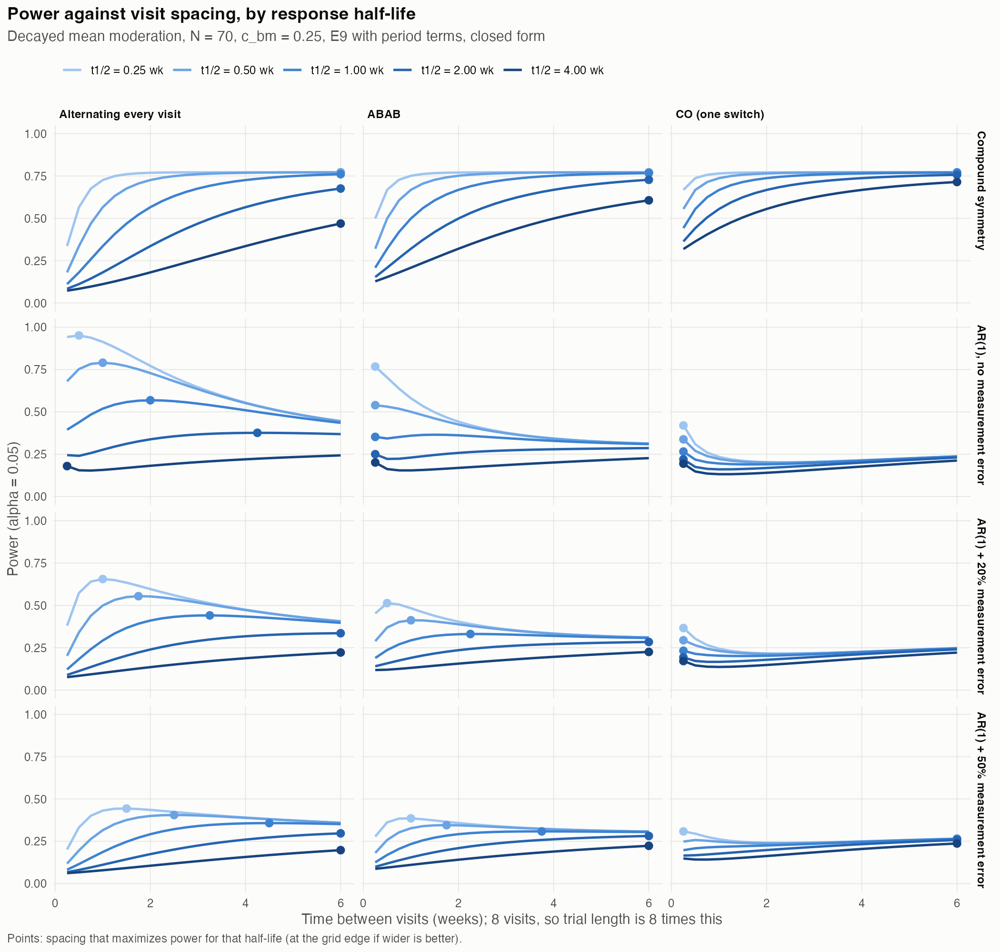
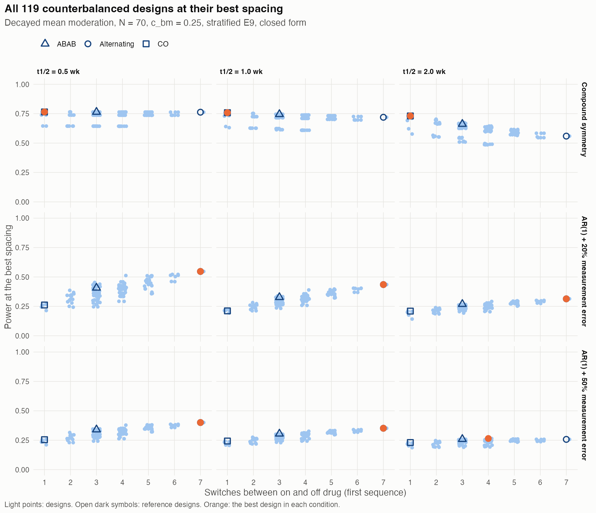

# Designing N-of-1 Trials for a Biomarker-Treatment Interaction: What Drives Power, and How to Choose a Design {.unlisted .unnumbered}
*2026-10-02 18:12 PDT*

**Author.** pmsimstats team

```{=latex}
\clearpage
\tableofcontents
\listoftables
\listoffigures
\clearpage
```

## 1. Summary

`docs/37` derived closed-form moments and power for the
paired-difference interaction statistic (E9) in N-of-1 and crossover
designs. This paper uses those expressions to ask which design
characteristics determine power, and to search the design space for the
best design. Without carryover the interaction slope is the same in
every design, so a design affects power only through the noise of each
patient's on-minus-off contrast and, under carryover, through how much
of the biomarker's moderation survives at the off-drug visits. Every
result below follows from that, and every number is a closed-form
evaluation except where Monte Carlo is stated.

1. **What matters depends on how within-patient correlation behaves.**
   Under compound symmetry (CS), the published construct, correlation
   does not decay with time, so the arrangement of on and off visits is
   irrelevant: only the balance of on and off visits and the blinding
   matter. Under AR(1) correlation, the contrast cancels noise only
   between visits that are close in time, so interleaving on and off
   visits closely dominates (Sections 3 and 4).
2. **The Hybrid design's advantage is interleaving, and its open-label
   lead-in costs power.** Under CS, Hybrid is not the most powerful
   design: blinded balanced designs, including the crossover, match or
   beat it, and running the Hybrid schedule blinded raises its power
   from 0.72 to 0.80. Under AR(1), Hybrid beats the crossover because
   its blinded-discontinuation visits sit next to on-drug visits and it
   switches three or four times; designs that alternate more often do
   better still (Section 3).
3. **More on-off switches help only under AR(1), and carryover limits
   them.** Under CS more switches never help and, with carryover,
   hurt: at a two-week response half-life the best one-switch design
   has power 0.731 and the best seven-switch design 0.559. Under AR(1)
   with 20% measurement error, the best seven-switch design has 0.435
   at a one-week half-life against 0.221 for one switch (Section 4).
4. **There is an optimal time between visits under AR(1), roughly two to
   six response half-lives.** Under CS wider spacing is always better,
   up to a plateau reached when off-drug visits fall about two to five
   response half-lives after discontinuation, depending on the design.
   Under AR(1) the optimum is
   interior: close spacing cancels shared noise, wide spacing lets
   carryover wash out. For an alternating design it is about twice the
   half-life without measurement error and four to six times it when
   half the noise is measurement error (Section 5).
5. **The exhaustive search confirms the principles.** Over all 119
   counterbalanced two-sequence designs with eight blinded visits, seven
   spacings, three correlation structures and three response
   half-lives, the best design is the crossover at the widest spacing
   under CS and the alternating design at two to four weeks under AR(1).
   A near-alternating design at four-week spacing never falls below 78%
   of the best attainable power in any of the nine conditions
   (Section 6).
6. **Open-label visits cost power when they replace blinded ones.**
   Each open-label lead-in visit that takes the place of a blinded
   visit lowers power, under every structure. Whether the open-label
   visits should enter the on/off contrast depends on the correlation
   structure (Section 7).
7. **The closed form is confirmed by simulation.** Direct Monte Carlo of
   41 designs, including the best design in every condition, agrees with
   the closed form within two standard errors in every case, and the
   further 48 design-conditions of the block comparison agree to within
   three (Sections 8 and 9).

## 2. Framework

**Criterion.** For a design with contrast weights $a_t$ ($1/n_{\text{on}}$
on drug, $-1/n_{\text{off}}$ off drug), `docs/37` shows that power is
governed by the per-patient squared correlation between the contrast and
the biomarker,

$$
\rho^2 = \frac{(\gamma\sigma_B)^2}{\mathrm{Var}(\Delta)}, \qquad
\gamma = -c_{bm}\frac{\sigma_{BR}}{\sigma_B}\big(1 - \bar h_{\text{off}}\big),
\qquad \mathrm{Var}(\Delta) = a^\top C a ,
$$

where $\bar h_{\text{off}}$ is the average share of the biomarker's
moderation still present at the off-drug visits and $C$ the response
covariance. The interaction itself, $c_{bm}\sigma_{BR}/\sigma_B$, does not
depend on the design. A design therefore matters through two quantities
only: the noise $a^\top C a$ of the contrast, and the surviving
moderation $\bar h_{\text{off}}$. The *information* reported below is the
patient-weighted $\rho^2$.

**Data-generating rule.** Decayed mean moderation (`docs/37`,
Section 5.6): the biomarker shifts the drug response by
$c_{bm}\sigma_{BR}z\,h_t$, with $h_t = 1$ on drug and $2^{-t_{sd}/t_{1/2}}$
off drug, $t_{sd}$ the time since discontinuation and $t_{1/2}$ the
response half-life (`docs/38`). It has the same slope as graded coupling
but no ceiling on $c_{bm}$, so the comparison of designs is not distorted
by which effect sizes each design can represent. Under the covariance
constructs, high-information designs have lower ceilings (`docs/37`,
Section 5.8), an artifact this choice avoids.

**Correlation structures.** Three, from `docs/37` Section 5.8 and an
extension of it:

- **CS**, the published construct: correlation 0.8 between any two
  visits of a factor.
- **AR(1) with measurement error**: the separable form $K \otimes A'$
  with time kernel
  $A'_{ts} = (1 - \nu)\rho^{|w_t - w_s|} + \nu\,\mathbf 1[t = s]$,
  $\rho = 0.8$ per week of separation, and a share $\nu$ of each
  factor's variance that is white measurement error, $\nu = 0.2$ or
  $0.5$.

The measurement-error share matters. Pure AR(1) has none, so visits
placed very close together become nearly perfectly correlated, the
contrast's noise vanishes, and the most powerful design would place
visits as close together as possible for reasons that are not
pharmacological. Symptom ratings carry measurement error, which sets a
floor on the noise of any contrast; CS has an equivalent floor in its
occasion-level term.

**Designs and analysis.** Eight post-baseline visits, $N = 70$, two
counterbalanced sequences of 35 patients (an on/off pattern and its
complement), blinded (expectancy 0.5) except where Section 7 adds an
open-label lead-in, $c_{bm} = 0.25$. The analysis is E9 with
sequence-specific intercepts, so that sequence and period differences,
which E9's common intercept counts as noise (`docs/37`, Section 5.7), do
not enter. Response half-lives of 0.5, 1 and 2 weeks.

## 3. What drives the noise of the contrast

**Under CS,** expanding $a^\top C a$ (`docs/37`, Section 4.1) shows four
contributions. For E9 the weights sum to zero and the person-level
component cancels, leaving (per path, verified):

| Design | Path | On / off visits | Balance term | Expectancy confound | Total $\mathrm{Var}(\Delta)$ |
|---|---|---|---|---|---|
| Hybrid (published) | 1, 2 | 5 / 3 | 17.5 | 3.2 | 44.1 |
| | 3, 4 | 4 / 4 | 16.4 | 5.0 | 45.0 |
| Hybrid schedule, blinded | 1, 2 | 5 / 3 | 17.5 | 0 | 38.3 |
| | 3, 4 | 4 / 4 | 16.4 | 0 | 35.9 |
| OL+BDC | 1 | 6 / 2 | 21.9 | 8.9 | 60.4 |
| | 2 | 5 / 3 | 17.5 | 12.8 | 56.4 |
| CO, ABAB, alternating (blinded, 4 / 4) | all | 4 / 4 | 16.4 | 0 | 35.9 |
| CO with an open-label first period | both | 4 / 4 | 16.4 | 20.0 | 64.2 |

Table: Components of the contrast variance $\mathrm{Var}(\Delta)$ under CS by design and path

- **Balance.** The balance term is proportional to
  $1/n_{\text{on}} + 1/n_{\text{off}}$, smallest at four and four; five
  and three costs 7%, six and two 33%.
- **Expectancy confounding.** Open-label visits are always on drug, so
  they make the on/off contrast partly an open-label against blinded
  contrast ($\sum_t a_t e_t \neq 0$). The person-level part of the
  expectancy factor then no longer cancels and enters the contrast,
  together with that factor's doubled standard deviation at open-label
  visits.
- **Arrangement does not matter.** Every blinded four-and-four design
  has the same variance, 35.9, however its on and off visits are
  ordered.

So under CS the Hybrid design's open-label lead-in costs power: blinded,
the same schedule has power 0.80 instead of 0.72 (E9), and giving the
crossover an open-label first period lowers its power from 0.82 to 0.56.

**Under AR(1),** with constant expectancy the separable variance is a
product, $\mathrm{Var}(\Delta) = (s^\top K s)(a^\top A a)$, and the time
part $a^\top A a$ is where designs differ. It is small when every
on-drug visit has an off-drug visit close to it (per path, no
measurement error, verified):

| Design | Switches | $a^\top A a$ | $\mathrm{Var}(\Delta)$ |
|---|---|---|---|
| CO | 1-2 | 0.828 | 212.8 |
| OL+BDC | 2 | 0.649-0.664 | 183.9-192.7 |
| Hybrid | 3-4 | 0.361-0.449 | 107.3-126.8 |
| ABAB, every 2.5 weeks | 3-4 | 0.352 | 90.6 |
| ABAB at the Hybrid visit times | 3-4 | 0.299 | 76.7 |
| Alternating every visit, every 2.5 weeks | 7-8 | 0.165 | 42.3 |

Table: Time part $a^\top A a$ and $\mathrm{Var}(\Delta)$ under AR(1) by design

This is the Hybrid design's real advantage over the crossover and
OL+BDC designs: its weekly blinded-discontinuation visits sit next to
on-drug visits, and it switches three or four times rather than once or
twice. The same idea taken further, an alternating design, has a
quarter of the crossover's contrast noise.

## 4. More on-off switches

From the exhaustive search of Section 6, the best power attainable with
a given number of switches in the first sequence, at the best spacing
(verified):

| Structure | $t_{1/2}$ | 1 switch | 2 | 3 | 4 | 5 | 6 | 7 |
|---|---|---|---|---|---|---|---|---|
| CS | 0.5 | 0.765 | 0.765 | 0.764 | 0.764 | 0.763 | 0.763 | 0.763 |
| CS | 1 | 0.759 | 0.752 | 0.746 | 0.739 | 0.733 | 0.726 | 0.719 |
| CS | 2 | 0.731 | 0.703 | 0.675 | 0.645 | 0.616 | 0.584 | 0.559 |
| AR(1), 20% error | 0.5 | 0.268 | 0.386 | 0.453 | 0.512 | 0.510 | 0.522 | 0.547 |
| AR(1), 20% error | 1 | 0.221 | 0.282 | 0.339 | 0.389 | 0.397 | 0.404 | 0.435 |
| AR(1), 20% error | 2 | 0.210 | 0.239 | 0.269 | 0.291 | 0.297 | 0.301 | 0.314 |
| AR(1), 50% error | 0.5 | 0.257 | 0.315 | 0.347 | 0.378 | 0.381 | 0.385 | 0.400 |
| AR(1), 50% error | 1 | 0.243 | 0.275 | 0.305 | 0.326 | 0.332 | 0.340 | 0.352 |
| AR(1), 50% error | 2 | 0.230 | 0.247 | 0.259 | 0.265 | 0.261 | 0.258 | 0.257 |

Table: Best attainable power by number of switches in the first sequence

Under CS, more switches never help, and once carryover is substantial
they hurt: each switch puts an off-drug visit soon after a
discontinuation, where moderation survives. Under AR(1), more switches
help, because each brings on and off visits closer together, but the
gain shrinks as the half-life lengthens and as measurement error grows;
at a two-week half-life with 50% measurement error it has vanished
(0.230 to 0.265, with the best at four switches).

## 5. Time between visits

With the number of visits fixed at eight, the spacing $d$ between
visits trades two effects against each other: on and off visits close
together share more of the slowly varying noise, which the contrast
cancels (correlation $\rho^d$); off-drug visits far from discontinuation
retain less moderation ($2^{-d/t_{1/2}}$). Figure 1 shows power against
spacing for three arrangements (verified, closed form).



*Figure 1. Power against the time between visits for three blinded
counterbalanced arrangements, by response half-life (light to dark,
0.25 to 4 weeks), under CS and AR(1) with 0%, 20% and 50% measurement
error. Eight visits, so the trial lasts eight times the spacing.
Points mark the spacing of highest power on the 0.25-6 week grid.*

**Under CS there is no interior optimum.** Correlation does not depend
on spacing, so wider is always better, up to a plateau. The practical
choice is the shortest spacing within 95% of the best power: for the
alternating design 1.25, 2.25, 4.0 and 5.25 weeks at half-lives of
0.25, 0.5, 1 and 2 weeks, four to five half-lives at the shorter
half-lives and 2.6 at two weeks; for ABAB 1.0, 1.75, 3.25 and 4.75
weeks, about 2.4 to 4 half-lives; for the crossover 0.5, 1.0, 2.0 and
3.25 weeks, about two, because its
placebo-first sequence carries no carryover and its off-drug blocks
extend well beyond the discontinuation.

**Under AR(1) there is an interior optimum.** For the alternating
design (verified):

| Measurement error | Optimal spacing at $t_{1/2}$ = 0.25 / 0.5 / 1 / 2 weeks | As multiple of $t_{1/2}$ |
|---|---|---|
| none | 0.5 / 1.0 / 2.0 / 4.25 | about 2 |
| 20% | 1.0 / 1.75 / 3.25 / beyond 6 | about 3-4 |
| 50% | 1.5 / 2.5 / 4.5 / beyond 6 | about 4.5-6 |

Table: Optimal visit spacing for the alternating design under AR(1)

Without measurement error the optimum has a closed form in the
large-sample limit. Each off-drug visit is one spacing after a
discontinuation, and the AR(1) time part of an alternating contrast is
about $\tfrac12(1 - \rho^d)/(1 + \rho^d)$, so information is
proportional to

$$
f(d) = \big(1 - 2^{-d/t_{1/2}}\big)^2\,\frac{1 + \rho^d}{1 - \rho^d},
$$

whose maximum, 0.45, 0.91, 1.88 and 4.34 weeks at the four half-lives,
agrees with the exact grid optimum (verified). The more of the noise is
measurement error, the less close spacing buys, and the further the
optimum moves out. ABAB optima are shorter (0.5, 1.0 and 2.25 weeks at
half-lives of 0.25, 0.5 and 1 with 20% error), because the second visit
of each off-drug block is already two spacings after discontinuation.
The best attainable power falls as the half-life lengthens: a drug with
long carryover is intrinsically harder to study within patients.

## 6. Exhaustive design search

**Space.** Every on/off pattern of the eight visits with two to six
on-drug visits, paired with its complement as the second sequence; a
pattern and its complement are the same design, leaving 119 designs.
Each was evaluated at spacings of 0.5, 1, 1.5, 2, 2.5, 3 and 4 weeks,
under the three structures and three half-lives: 7,497 design
evaluations.

**Best design in each condition** (pattern of the first sequence;
verified):

| Structure | $t_{1/2}$ | Best pattern | Switches | Spacing (weeks) | Power |
|---|---|---|---|---|---|
| CS | 0.5 | 11110000 (CO) | 1 | 4.0 | 0.765 |
| CS | 1 | 11110000 (CO) | 1 | 4.0 | 0.759 |
| CS | 2 | 11110000 (CO) | 1 | 4.0 | 0.731 |
| AR(1), 20% error | 0.5 | 10101010 (alternating) | 7 | 2.0 | 0.547 |
| AR(1), 20% error | 1 | 10101010 | 7 | 3.0 | 0.435 |
| AR(1), 20% error | 2 | 10101010 | 7 | 4.0 | 0.314 |
| AR(1), 50% error | 0.5 | 10101010 | 7 | 2.5 | 0.400 |
| AR(1), 50% error | 1 | 10101010 | 7 | 4.0 | 0.352 |
| AR(1), 50% error | 2 | 10011001 | 4 | 4.0 | 0.265 |

Table: Best design pattern, spacing and power in each condition

Under CS the optimum lies at the edge of the spacing grid, consistent
with Section 5: wider would be better still, though by little (the CS
plateau). Under AR(1) the optimum is interior for the shorter
half-lives and moves to the edge as the half-life grows.

**The landscape** (Figure 2). Under CS most balanced designs cluster
near the best, and the lower bands are the designs with unequal
numbers of on and off visits, as Section 3 predicts: at a half-life of
0.5 weeks, power is 0.763-0.765 with four on-drug visits, 0.737-0.739
with three or five, and 0.643-0.645 with two or six (verified). Under AR(1) power rises steadily with the
number of switches.



*Figure 2. Every one of the 119 designs at its best spacing, against
the number of switches in its first sequence, for each structure (rows)
and half-life (columns). Dark open symbols: the crossover, ABAB and
alternating reference designs. Orange: the best design in each
condition.*

**Robustness.** The correlation structure and the response half-life of
a real drug and outcome are uncertain, so a design that performs well
across conditions is more useful than one that is optimal in one. The
design-spacing pairs with the highest minimum, over the nine
conditions, of power relative to that condition's best (verified):

| Pattern (first sequence) | Spacing (weeks) | Worst relative power | Mean relative power |
|---|---|---|---|
| 10101001 (tied with its mirror image 10010101) | 4 | 0.78 | 0.92 |
| 10100101 | 4 | 0.77 | 0.91 |
| 10101010 (alternating) | 4 | 0.77 | 0.94 |
| 10011001 | 3 | 0.76 | 0.88 |

Table: Design-spacing pairs with the highest worst-case relative power

The robust designs are alternating or nearly so, at wide spacing. They
give up some power under CS with long carryover, where frequent
switching is penalized, in exchange for most of the AR(1) gain.

## 7. Open-label components

Hendrickson et al.'s Hybrid and OL+BDC designs begin with open-label
visits, often needed for dose titration. In the data-generating model,
expectancy $e_t$ (1 at open-label visits, 0.5 at blinded ones) scales the
placebo (expectancy) factor's mean and standard deviation. Because that
factor is unrelated to the biomarker in the model, the higher placebo
response during open-label visits does not bias the interaction slope;
it changes only the noise. The search was repeated with $k = 0$ to 4
open-label on-drug visits for every patient, followed by counterbalanced
blinded sequences over the remaining $8 - k$ visits, and two analyses:
the open-label visits included in the on/off contrast, as E9 and the
published analysis do, or left out of it. Best power over patterns and
spacings (verified):

| Structure | $t_{1/2}$ | $k = 0$ | 1, in / out | 2, in / out | 3, in / out | 4, in / out |
|---|---|---|---|---|---|---|
| CS | 0.5 | 0.765 | 0.722 / 0.701 | 0.679 / 0.644 | 0.605 / 0.551 | 0.547 / 0.479 |
| CS | 1 | 0.759 | 0.707 / 0.686 | 0.661 / 0.627 | 0.583 / 0.530 | 0.521 / 0.456 |
| CS | 2 | 0.731 | 0.638 / 0.616 | 0.582 / 0.549 | 0.491 / 0.443 | 0.421 / 0.366 |
| AR(1), 20% error | 0.5 | 0.547 | 0.463 / 0.487 | 0.355 / 0.422 | 0.280 / 0.361 | 0.237 / 0.291 |
| AR(1), 20% error | 1 | 0.435 | 0.370 / 0.374 | 0.306 / 0.328 | 0.251 / 0.274 | 0.215 / 0.228 |
| AR(1), 20% error | 2 | 0.314 | 0.257 / 0.258 | 0.217 / 0.228 | 0.181 / 0.192 | 0.160 / 0.163 |
| AR(1), 50% error | 0.5 | 0.400 | 0.358 / 0.352 | 0.311 / 0.311 | 0.262 / 0.261 | 0.231 / 0.220 |
| AR(1), 50% error | 1 | 0.352 | 0.314 / 0.305 | 0.278 / 0.271 | 0.238 / 0.227 | 0.210 / 0.194 |
| AR(1), 50% error | 2 | 0.265 | 0.228 / 0.217 | 0.208 / 0.196 | 0.179 / 0.165 | 0.161 / 0.144 |

Table: Best power by number of open-label visits, included in or excluded from the contrast

- **Each open-label visit that replaces a blinded visit costs power**,
  under every structure and half-life: with the better of the two
  analyses, two open-label visits cost 0.09 to 0.15 under CS and 0.09
  to 0.13 under AR(1) with 20% error. Part of the cost is the lost
  blinded visit; part is the open-label visits' noisier, confounded
  contribution.
- **Whether to include them in the contrast depends on the
  structure.** Under CS including them is better, plausibly because
  they add on-drug information that outweighs their expectancy noise
  (inferred). Under AR(1) with 20% measurement error leaving them out
  is better, plausibly because they come early in the trial, far from
  the blinded off-drug visits, and so add noise that the contrast
  cannot cancel (inferred). With 50% measurement error the two are
  close.

This comparison holds the total number of visits fixed. If an
open-label titration phase is needed clinically, it can be added before
the blinded visits rather than in place of them; left out of the
contrast, it then costs no power, and included in it, its effect
follows the pattern above. That variant was not evaluated.

## 8. Blinded-discontinuation and crossover blocks

The Hybrid design combines an open-label lead-in (weeks 4 and 8), a
blinded-discontinuation (BD) block of four weekly observations (weeks
9-12), in which everyone is on drug and the paths differ only in when the
drug stops, and a crossover (CO) block of two observations four weeks
apart (weeks 16 and 20), in which one sequence restarts the drug. Two
questions: does a BD block perform differently from a CO block,
everything else equal; and would the Hybrid design do better with a CO
block like its BD block, four observations rather than two?

**Like for like.** After the common open-label lead-in, one block of four
weekly observations (weeks 9-12), run in one of four ways, with two
paths of 35 patients:

- **BD 10/9** (the Hybrid's): drug stopped after week 10 or after week
  9 (on-on-off-off and on-off-off-off).
- **BD 11/9**: stopped after week 11 or week 9 (on-on-on-off and
  on-off-off-off).
- **CO**: on-on-off-off and off-off-on-on.
- **Alternating**: on-off-on-off and off-on-off-on.

Power with the open-label visits in the contrast (closed form, simulated
in parentheses; verified; the AR(1) columns have 20% measurement
error):

| Block | CS, no carryover | CS, $t_{1/2}$ = 0.5 | CS, $t_{1/2}$ = 1 | AR(1), none | AR(1), 0.5 | AR(1), 1 |
|---|---|---|---|---|---|---|
| BD 10/9 | 0.528 (0.525) | 0.423 (0.416) | 0.274 (0.281) | 0.231 (0.224) | 0.186 (0.186) | 0.129 (0.131) |
| BD 11/9 | 0.450 (0.444) | 0.326 (0.322) | 0.199 (0.208) | 0.219 (0.215) | 0.162 (0.171) | 0.110 (0.107) |
| CO | 0.532 (0.527) | 0.407 (0.413) | 0.249 (0.251) | 0.277 (0.274) | 0.211 (0.215) | 0.137 (0.137) |
| Alternating | 0.532 (0.530) | 0.335 (0.339) | 0.176 (0.170) | 0.356 (0.349) | 0.222 (0.231) | 0.125 (0.118) |

Table: Power of four blinded block types after the open-label lead-in

- **Without carryover under CS the block type does not matter**: BD and
  CO blocks of the same length and balance have the same power (0.528
  and 0.532), because CS does not see the order of the observations.
  Balance does matter: the BD variant whose paths stop at very
  different times (three on and one off against one on and three off)
  loses 0.08.
- **With carryover under CS the BD block is slightly better** (0.423
  against 0.407 at $t_{1/2} = 0.5$; 0.274 against 0.249 at one week).
  Its off-drug observations run up to three weeks after the
  discontinuation, so less moderation survives (an average off-drug
  share of 0.33 against 0.38 at one week).
- **Under AR(1) the CO block is better** (0.277 against 0.231 without
  carryover). In its off-off-on-on sequence the off-drug observations
  lie between on-drug observations, the open-label visits before and the
  restart after, so serially correlated noise is cancelled on both sides;
  in the BD block every off-drug observation comes at the end.

The differences are 0.02 to 0.05, small beside the effects of balance,
spacing and the number of observations.

**The Hybrid design with a four-observation CO block.** Four designs,
all with the open-label lead-in at weeks 4 and 8:

- **Published**: BD block of 4 weekly observations (weeks 9-12), CO
  block of 2 (weeks 16, 20); 8 visits, 20 weeks.
- **Equal visits**: BD block of 2 (weeks 10, 12), CO block of 4 every
  two weeks (weeks 14-20); 8 visits, 20 weeks.
- **CO weekly**: the published BD block and a CO block of 4 weekly
  observations (weeks 13-16); 10 visits, 16 weeks.
- **CO two-weekly**: the published BD block and a CO block of 4
  observations every two weeks (weeks 14-20); 10 visits, 20 weeks.

Power (closed form, simulated in parentheses; verified):

| Design | CS, none | CS, 0.5 | CS, 1 | AR(1), none | AR(1), 0.5 | AR(1), 1 |
|---|---|---|---|---|---|---|
| Published | 0.663 (0.666) | 0.580 (0.571) | 0.438 (0.435) | 0.302 (0.297) | 0.257 (0.267) | 0.193 (0.194) |
| Equal visits | 0.663 (0.673) | 0.638 (0.640) | 0.542 (0.551) | 0.298 (0.300) | 0.284 (0.285) | 0.235 (0.236) |
| CO weekly | 0.771 (0.772) | 0.676 (0.674) | 0.498 (0.502) | 0.380 (0.385) | 0.314 (0.314) | 0.221 (0.228) |
| CO two-weekly | 0.771 (0.776) | 0.703 (0.698) | 0.561 (0.580) | 0.355 (0.351) | 0.310 (0.303) | 0.235 (0.234) |

Table: Power of the published Hybrid design and three CO-block variants

- **With the same eight visits and 20 weeks**, moving two observations
  from the BD block to the CO block changes nothing without carryover
  under CS (0.663 for both), and helps substantially with carryover
  (0.638 against 0.580 at $t_{1/2} = 0.5$, 0.542 against 0.438 at one
  week), because its off-drug observations fall two to eight weeks
  after a discontinuation, whereas most of the published design's fall
  one to three weeks after it: the average off-drug moderation share
  at one week falls from 0.245 to 0.134. Under AR(1)
  the reallocation helps with carryover and is neutral without it.
- **Adding two observations to the CO block**, the change suggested by
  extending it to four observations like the BD block, raises power in
  every condition, by 0.03 to 0.12, mostly through the extra
  observations and the balance they bring (the CS contrast variance
  falls from 46.9 to 36.3-36.7). Weekly observations give the shorter
  trial and are better under AR(1) without carryover; two-weekly
  observations keep the 20-week length and are better under CS with
  carryover.
- **The open-label visits.** Under AR(1) leaving them out of the
  contrast helps the designs with a long CO block (0.440 against 0.380
  for the weekly four-observation CO block without carryover), as in
  Section 7. With the equal-visit design it does not (0.263 against
  0.298), because that design's blinded phase has fewer early on-drug
  observations to pair with its early off-drug observations (inferred).

In the decayed mean moderation used here, moderation is full at every
on-drug observation, including immediately after a restart. Under the
proportional moderation of `docs/38`, moderation would rebuild after a
restart, which would count somewhat against CO blocks; that variant was
not evaluated.

## 9. Monte Carlo checks

The stratified E9 statistic was simulated directly, 5000 trials of 70
patients per design, for the best design in each of the nine
conditions, for the crossover, ABAB and alternating designs at 2.5-week
spacing in every condition, and for the best two-visit open-label
designs at a one-week half-life under both analyses: 41 designs. The
draws come from the full joint distribution, including the AR(1)
structures with measurement error, which no earlier check covered.
Every design agrees with the closed form within two Monte Carlo
standard errors (largest deviation 1.97, mean $+0.35$; verified). The
closed form is, if anything, slightly conservative.

The block comparison of Section 8 was checked the same way: each of its
eight designs simulated with 5000 trials under both structures and
three half-lives, and the stratified E9 computed from the same trials
with the open-label visits in and out of the contrast, 96
design-conditions. Agreement is within 2.95 standard errors (mean
$+0.11$), with 3 of 96 beyond 2, fewer than the five or so expected by
chance;
the largest deviation is the alternating block under CS at
$t_{1/2} = 0.5$ with the open-label visits left out (0.301 closed form,
0.320 simulated; verified).

## 10. How to approach an optimal N-of-1 design

The analysis suggests the following procedure; the principles are
inferred from the closed form and confirmed for the designs simulated.

1. **State the two uncertain inputs.** The response half-life
   $t_{1/2}$ (`docs/38`: the persistence of benefit after
   discontinuation, not the drug's plasma half-life) and the
   within-patient correlation structure, in particular how fast
   correlation decays and how much of the variability is measurement
   error. Both can be estimated from pilot or historical data, and the
   design should be chosen to perform well across their plausible
   ranges.
2. **Blind the contrast, and balance it.** Equal numbers of on-drug and
   off-drug assessments per patient, with expectancy the same at on and
   off assessments. If open-label titration is necessary, add it before
   the blinded phase rather than in place of blinded assessments.
3. **Interleave if correlation decays.** Under AR(1)-like correlation,
   alternate frequently so that every on-drug assessment has an off-drug
   assessment nearby. Under CS-like correlation, arrangement does not
   matter and fewer, longer blocks are better under carryover.
4. **Space assessments against the response half-life.** Off-drug
   assessments should fall several half-lives after discontinuation:
   up to four or five under CS for alternating designs, two to six under
   AR(1) depending on the
   measurement-error share, fewer for long blocks in which most off-drug
   assessments are late.
5. **Counterbalance sequences and analyze with period terms.** Sequence
   and period differences otherwise enter the residual and cost power.
6. **Weight the contrast by the covariance.** E9 weights all on-drug and
   all off-drug visits equally, which is not optimal under AR(1); the
   best linear contrast is proportional to $C^{-1}$ times the moderation
   pattern, which a correctly specified mixed model approximates.
7. **Search the design space with the closed form.** The evaluation of
   one design is instantaneous, so the full space of sequences and
   spacings can be searched for the conditions of a given trial, and
   the shortlisted designs confirmed by simulation, as in Sections 6,
   8 and 9.
8. **Choose block lengths and spacing, not block labels.** Blinded
   discontinuation and crossover blocks of the same length perform
   alike; what matters is how many on-drug and off-drug observations a
   block contributes and how long after a discontinuation its off-drug
   observations fall (Section 8).

## 11. Limitations

- **Fixed visit count and sample size.** Eight post-baseline visits,
  $N = 70$, two sequences of equal size. Trial length therefore varies
  with spacing; a fixed trial length would trade visits against
  spacing, a different question. Unequal spacing within a trial was not
  searched.
- **The data-generating rule.** Decayed mean moderation with anchored
  decay. Under the covariance constructs, high-information designs have
  lower $c_{bm}$ ceilings and could not represent the same effect sizes;
  under proportional moderation (`docs/38`), on-drug moderation would
  also build up during titration.
- **The correlation structures.** CS and separable AR(1) with $\rho = 0.8$
  per week and 0%, 20% or 50% measurement error. Which describes real
  symptom data is an empirical question that decides the ranking of
  designs.
- **The analysis.** Stratified E9 with equal weights. A mixed model with
  the correct covariance would gain somewhat, most under AR(1).
- **Expectancy.** The placebo factor is unrelated to the biomarker in
  the model. If expectancy effects were themselves moderated by the
  biomarker, open-label phases would bias the interaction, not only add
  noise.
- **Not all designs simulated.** The search is closed form; 41 designs
  were simulated, all agreeing.

## 12. Reproducibility

```bash
Rscript analysis/scripts/quick-sim/carryover-closed-form/02-design-characteristics.R
Rscript analysis/scripts/quick-sim/carryover-closed-form/03-optimal-spacing.R
Rscript analysis/scripts/quick-sim/carryover-closed-form/04-design-search.R \
  --mc-reps 5000 --cores 6
Rscript analysis/scripts/quick-sim/carryover-closed-form/05-block-comparison.R \
  --mc-reps 5000 --cores 6
```

Run from the repository root. All three scripts evaluate the
definitions of `01-e9-closed-form.R` (`docs/37`). Outputs are written to
`analysis/data/quick-sim/carryover-closed-form/` (design structure and
spacing tables) and its `design-search/` subdirectory (the full search,
best designs, robustness ranking, open-label search and Monte Carlo
check), and the figures to `docs/figures/39-fig1-optimal-spacing.png`
and `docs/figures/39-fig2-design-landscape.png`.

## 13. References

1. Hendrickson RC, Thomas RG, Schork NJ, Raskind MA. Optimizing
   aggregated N-of-1 trial designs for predictive biomarker validation:
   statistical methods and theoretical findings. *Frontiers in Digital
   Health* 2020; 2:13. Code: `github.com/rchendrickson/pmsimstats`,
   commit `58b32a9`.
2. pmsimstats team. `docs/37-carryover-power-closed-form.md` (closed-form
   moments, the factor-by-time decomposition and the validation of the
   framework).
3. pmsimstats team. `docs/38-pharmacodynamic-carryover-model.md` (the
   response half-life and proportional moderation).
4. pmsimstats team. `docs/36-hendrickson-pd-and-carryover.md`.
