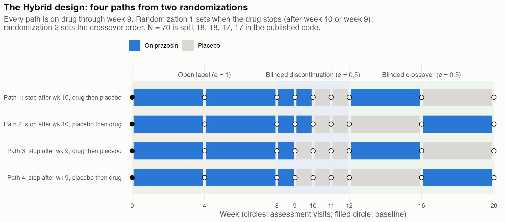
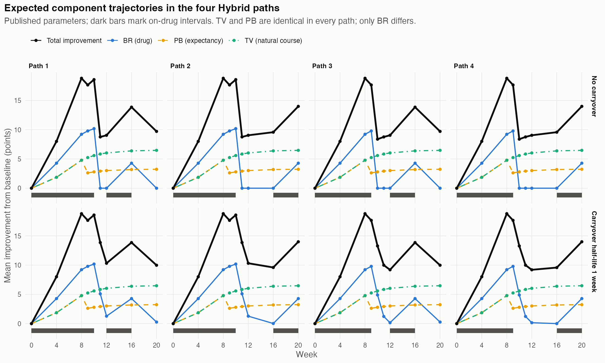
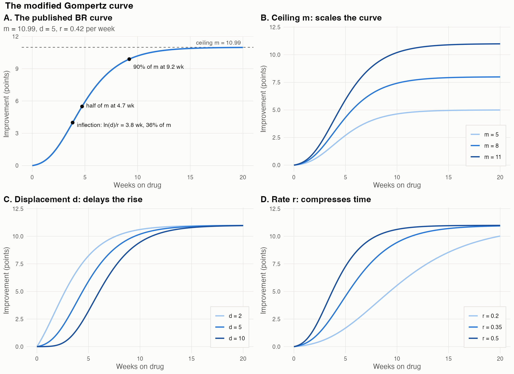
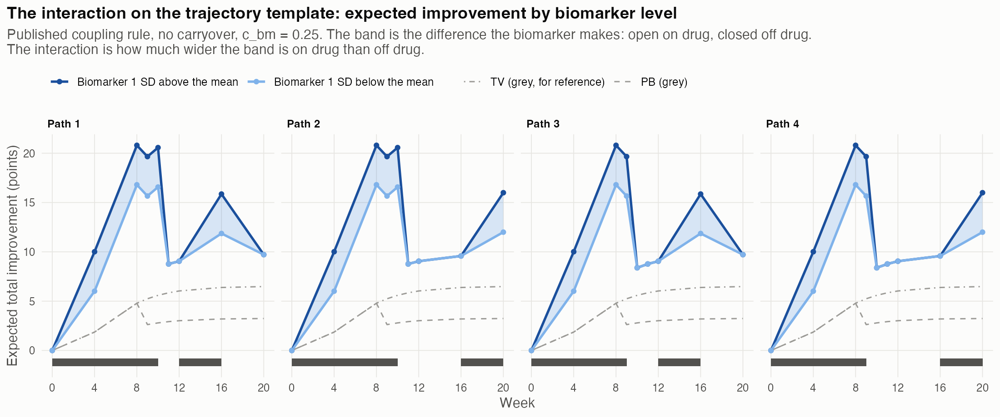
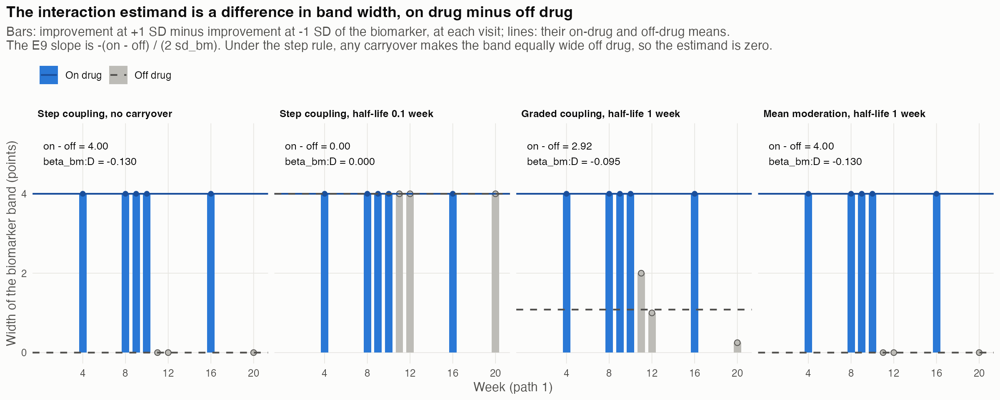
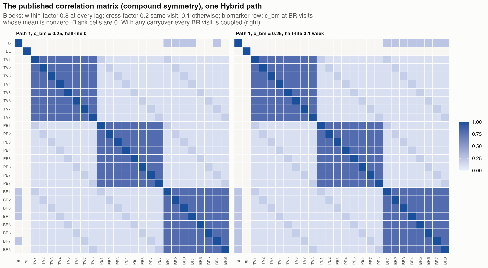
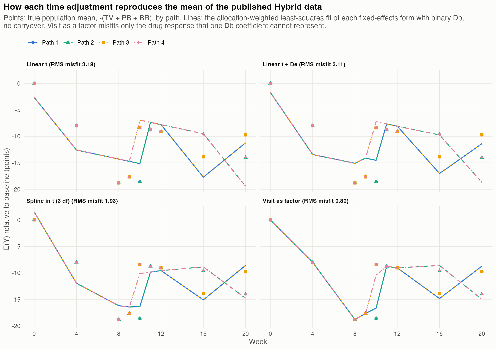
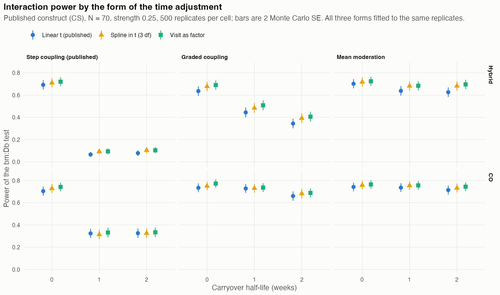

# The Hendrickson Hybrid Design: Response Components, the Gompertz Model, and the Analysis Model {.unlisted .unnumbered}
*2026-10-03 11:24 PDT*

**Author.** pmsimstats team

**Purpose.** This paper explains how the trial design of Hendrickson et
al. [1] works, what its simulation assumes, and how its analysis model
relates to that simulation. The design is the open-label, blinded
discontinuation and crossover design that the paper calls the 'N-of-1
design' and this project calls Hybrid. The paper brings together
material spread across `docs/24`, `docs/25`, `docs/31`, `docs/36`,
`docs/37`, `docs/38`, `docs/39` and manuscript 07 (the Gompertz
evaluation). It corrects several errors in those documents (Section 11)
and adds new Monte Carlo results on the form of the time adjustment
(Section 9). Eight figures develop the intuition.

```{=latex}
\clearpage
\tableofcontents
\listoftables
\listoffigures
\clearpage
```

## Notation index and glossary

Notation follows `analysis/report/NOTATION.md`. Symbols marked *local*
are defined here and are not part of the canonical set.

### Notation index

**Trial, indices and time.**

| Symbol | Meaning | Status |
|----------|----------------------------------------|------|
| $i$, $t$ | participant and visit indices | canonical |
| $N$ | total participants across paths; 70 throughout | canonical |
| $P$ | number of randomization paths; 4 for Hybrid | canonical |
| $p$ | path index | local |
| $w_t$ | calendar week of visit $t$ (4, 8, 9, 10, 11, 12, 16, 20) | local |
| $t_{od}$ | time on drug in the current run (code `tod`) | canonical |
| $t_{sd}$ | time since discontinuation (code `tsd`) | canonical |
| $t_{pb}$ | time under positive expectancy (code `tpb`) | canonical |
| $t_{1/2}$ | carryover half-life, weeks | canonical |
| $e_t$ | design expectancy at visit $t$: 1 open label, 0.5 blinded, 0 at baseline (code `e`, regressor `De`) | local |

Table: Notation index for trial, index and time symbols

**Outcome and components.**

| Symbol | Meaning | Status |
|----------|----------------------------------------|------|
| $Y_{it}$ | symptom score (CAPS-IV total; code column `Sx`) | canonical |
| $\mathrm{BL}_i$ | baseline symptom score | canonical |
| $BR_{it}$ | biological (drug) response; Hendrickson's BR | canonical |
| $PB_{it}$ | placebo-belief (expectancy) response; Hendrickson's ER | canonical |
| $TV_{it}$ | time-variant natural-course response; Hendrickson's TR | canonical |
| $u_i$, $\varepsilon_{it}$ | participant random intercept and residual | canonical |
| $G(t; m, d, r)$ | modified Gompertz curve, Section 4 | local |
| $m_c$, $d_c$, $r_c$ | ceiling, displacement and rate of component $c$ (code `max`, `disp`, `rate`) | local |

Table: Notation index for outcome and response component symbols

**Biomarker and moderation.**

| Symbol | Meaning | Status |
|----------|----------------------------------------|------|
| $B_i$, $b_i$ | biomarker (standing systolic blood pressure) and its standardized value | canonical |
| $\sigma_{BR}$, $\sigma_{bm}$ | standard deviations of $BR$ (8) and of the biomarker (15.36) | canonical |
| $c_{bm}$ | covariance-moderation strength: correlation of $B$ with $BR$ where coupled | canonical |
| $\beta_{bm}$ | mean-moderation multiplier | canonical |
| $g_t$ | coupling at visit $t$: fraction of $c_{bm}$ applied there | local |
| $\rho$ | within-factor correlation, 0.8 at every lag (compound symmetry, CS) | canonical |
| $c_1$, $c_\times$ | cross-factor correlation at the same visit (0.2) and at different visits (0.1) | local |

Table: Notation index for biomarker and moderation symbols

**Analysis model.**

| Symbol | Meaning | Status |
|----------|----------------------------------------|------|
| $D_{it}$ | binary drug state (code `Db`) | canonical |
| $D_{bc,it}$ | exposure-decayed drug indicator (code `Dbc`) | canonical |
| $\beta_0$, $\beta_B$ | intercept and biomarker main effect | local ($\beta_B$) |
| $\beta_t$, $\beta_e$ | coefficients of linear time and of expectancy | local |
| $\tau_t$ | visit effect when time enters as a factor | local |
| $\beta_D$ | drug main effect | canonical |
| $\beta_{bm:D}$ | biomarker-by-drug interaction, the estimand | canonical |
| $\alpha$, $\pi$ | test size (0.05) and power | canonical |

Table: Notation index for analysis model symbols

**Sign convention.** The three components are reductions in symptom
severity, so they enter $Y$ with a negative sign. Drug effects and
interaction coefficients are therefore negative, and the moderation
parameters $c_{bm}$ and $\beta_{bm}$ are positive.

### Glossary

- **Hybrid.** The Hendrickson 'N-of-1' design: 8 weeks open label, a
  4-week blinded discontinuation block, then a blinded two-period
  crossover (Section 2).
- **Path.** One sequence of drug states through the trial. Hybrid has
  $P = 4$, from two randomizations.
- **Blinded discontinuation (BD).** A block in which participants know
  they may be switched to placebo but not when. In Hybrid everyone
  stops during it; only the timing is randomized.
- **Coupling.** The rule that sets $g_t$, that is, at which visits the
  biomarker is correlated with $BR$ and how strongly. *Step* (published):
  $g_t = 1$ wherever the mean of $BR$ is nonzero. *Graded*: 1 on drug,
  $2^{-t_{sd}/t_{1/2}}$ off drug.
- **Covariance moderation.** The interaction is carried by the
  correlation between $B$ and $BR$ (the published architecture).
  **Mean moderation.** The interaction is a shift of $BR$ by
  $\beta_{bm} \sigma_{BR} b_i$ at on-drug visits.
- **E9.** The paired-difference statistic of `docs/37`: each
  participant's on-drug mean minus off-drug mean, regressed on the
  biomarker. Its slope has the same expectation as $\beta_{bm:D}$.
- **Tabula rasa (TaRa).** Hendrickson's assumption that $TV$ and $PB$
  share the same Gompertz parameters and variance.
- **Problem 1 and problem 2.** The two known defects of the published
  simulation (`docs/36`). Problem 1: correlation matrices that are not
  positive definite, which the code repairs without saying so.
  Problem 2: the collapse of power under negligible carryover.

## 1. Summary

1. **The design answers a question about individuals, not arms.** The
   estimand is whether baseline standing blood pressure predicts the
   size of a participant's response to prazosin. Every participant is
   on drug and off drug at some point, so each participant contributes
   a within-person contrast (Section 2).
2. **Three response components, each on its own clock.** Drug response
   runs on time on drug, expectancy response on time under expectancy
   scaled by the blinding level, and natural course on calendar time.
   In the Hybrid design $TV$ and $PB$ are identical in every path: all
   paths share the visit schedule and the blinding pattern. Only $BR$
   differs between paths (Section 3, Figure 3).
3. **The Gompertz curve is a slow-start, saturating rise.** At the
   published parameters the drug response reaches 3% of its ceiling
   after one week, 39% after four and 84% after eight. Re-exposure
   starts the curve from zero, so a crossover period of four weeks on
   drug recovers only 39% of the ceiling (Section 4, Figure 2).
4. **The interaction is how much wider the biomarker band is on drug
   than off drug.** Drawn on Hendrickson's trajectory template, the
   expected trajectories of high- and low-biomarker participants
   separate on drug and close off drug. The estimand is the difference
   in that separation, divided by $2\sigma_{bm}$. Under the published
   step rule, any carryover makes the band equally wide off drug, so
   the estimand is exactly zero. That is problem 2 (Section 5, Figures
   4 and 5).
5. **The analysis model is deliberately simpler than the simulation.**
   The published model is `Sx ~ bm + Db + t + bm*Db + (1|ptID)`. Its
   linear `t` stands in for $TV$ and $PB$. The expectancy term `De`
   exists in the code but was switched off, because it was collinear
   with `Db`: their correlation in the Hybrid long data is 0.59
   (Section 8).
6. **The time adjustment changes the drug effect, not the
   interaction.** Linear `t`, a spline and visit-as-factor give the
   same mean interaction estimate, within 0.0007. For the drug main
   effect they differ by about 2 points in Hybrid, because linear time
   cannot absorb the expectancy drop at blinding and attributes the
   extra open-label improvement to the drug. A population-mean
   calculation reproduces the simulated estimates (Section 9, Figure 7).
7. **Flexible time adjustment is not a free gain in power.** Spline
   and visit-as-factor raise interaction power by 0.02 to 0.07 in
   Hybrid, but they also raise the Type I error. Under one-week
   carryover it reaches 0.073 and 0.080, against 0.058 for linear `t`.
   In the crossover all three forms hold their size (Section 9,
   Figure 8).

## 2. The trial and its question

Hendrickson et al. designed the simulation to plan a trial of prazosin
for posttraumatic stress disorder (PTSD), registered as NCT03539614.
The hypothesis was that standing systolic blood pressure at baseline
predicts the reduction in PTSD symptoms that prazosin produces. That
relationship had been seen in a post hoc analysis of an earlier
parallel-group trial [1, 2]. The estimand is therefore not a treatment
effect but a treatment-by-biomarker interaction: whether participants
with higher blood pressure respond more to the drug.

A parallel-group trial answers this question poorly, because a
participant on placebo carries no information about their own drug
response. A design in which every participant is observed both on and
off drug supplies a within-person contrast for each participant, and
the interaction becomes a question about how those contrasts vary with
the biomarker. Hendrickson et al. compared four designs of equal length
(20 weeks) and equal number of assessments (8 after baseline): open
label (OL), open label followed by blinded discontinuation (OL+BDC), a
traditional crossover (CO), and the Hybrid design (Figure 1). The
Hybrid design was chosen for the trial.



**Why each phase is there.**

- **Open label, weeks 0 to 8.** Every participant starts on active
  drug, knowing it. Hendrickson et al. included this phase so that
  acutely symptomatic patients, who would decline possible placebo
  assignment, could enroll; they report that recruitment then
  outpaced the budget [1]. The phase also titrates the dose; the paper
  takes prazosin titration to need 2.5 weeks each time the drug is
  started. Statistically, the open-label phase contributes on-drug
  visits at full expectancy ($e_t = 1$). Drug and expectancy response
  are both present at full strength there and cannot be separated
  within the phase.
- **Blinded discontinuation, weeks 8 to 12.** Participants are told
  they may be switched to placebo during the block. Every path is on
  drug at week 9. Randomization 1 then decides whether the drug stops
  after week 9 or after week 10, so at week 10 half the participants
  are on drug and half off, with expectancy matched. In the paper's
  schedule only the participant is blinded during this block, except
  in its second week, when the switch is randomized and staff are
  blinded as well [1]. Expectancy is 0.5 throughout the block.
- **Crossover, weeks 12 to 20.** Two 4-week blinded periods, one on
  drug and one on placebo, in an order set by randomization 2. Each
  period has one assessment at its end (weeks 16 and 20). Expectancy
  is 0.5.

**The four paths** are the two discontinuation times crossed with the
two crossover orders. The published code does not randomize patients
to paths: it allocates them in fixed numbers (18, 18, 17, 17 at
$N = 70$) and generates each path's data separately. The path
definitions used in this project's scripts match the published
`buildtrialdesign()` output for every path and every field (verified,
re-fetched from commit `58b32a9`). Visit by visit:

| Path | Drug state | $t_{od}$ (weeks) | $t_{sd}$ (weeks) |
|------|------------------|------------------------|------------------------|
| 1 | 1 1 1 1 0 0 1 0 | 4 8 9 10 0 0 4 0 | 0 0 0 0 1 2 0 4 |
| 2 | 1 1 1 1 0 0 0 1 | 4 8 9 10 0 0 0 4 | 0 0 0 0 1 2 6 0 |
| 3 | 1 1 1 0 0 0 1 0 | 4 8 9 0 0 0 4 0 | 0 0 0 1 2 3 0 4 |
| 4 | 1 1 1 0 0 0 0 1 | 4 8 9 0 0 0 0 4 | 0 0 0 1 2 3 7 0 |

Table: Drug state, $t_{od}$ and $t_{sd}$ by visit for the four Hybrid paths

Two features of this table matter later. First, the paths differ in
drug state only at weeks 10, 16 and 20. At weeks 4, 8, 9, 11 and 12
every path is in the same state. Second, on re-exposure in the
crossover, time on drug restarts at 4 weeks rather than continuing
from the earlier run. The simulated drug response therefore rebuilds
from zero.

## 3. The three response components

Hendrickson et al. model each participant's symptom score as baseline
minus the sum of three responses [1]:

$$
Y_{it} = \mathrm{BL}_i - \bigl[\,TV_{it} + PB_{it} + BR_{it}\,\bigr].
$$

The paper calls the components BR, ER and TR; this project calls them
$BR$, $PB$ and $TV$. Each component has its own mean trajectory and
its own clock.

| Component | Clock | Mean at visit $t$ | SD |
|----------------|--------------------|----------------------------------------|--------|
| $BR$ | time on drug $t_{od}$ | $G(t_{od}; 10.99, 5, 0.42)$, plus carryover | 8 |
| $PB$ | time under expectancy $t_{pb}$ | $e_t \, G(t_{pb}; 6.51, 5, 0.35)$ | $10\,e_t$ |
| $TV$ | calendar time $w_t$ | $G(w_t; 6.51, 5, 0.35)$ | 10 |

Table: Clock, mean trajectory and SD of each response component

- **$BR$** is the pharmacological response to prazosin. It runs only
  while the participant is on drug and decays after discontinuation.
- **$PB$** is the response to believing one may be on active drug. It
  is scaled by the design expectancy.
- **$TV$** collects everything that changes with time in the trial
  regardless of treatment: regression to the mean, the effect of
  regular contact and assessment, and natural change in the illness.

The parameters are the published `extracted_rp` set, printed directly
from the `58b32a9` data. Baseline has mean 83.07 and SD 18.48 CAPS
points, and the biomarker mean 124.33 and SD 15.36 mmHg.

**How the parameters were obtained.** The $BR$ trajectory was fitted to
the difference between the prazosin and placebo arms of the
active-duty trial [2]. The placebo arm's trajectory was taken to be
$TV + PB$. Because no data separate those two, the tabula rasa
assumption gives them equal parameters [1]. The split between $TV$ and
$PB$ is therefore an assumption, not an estimate (`docs/25`, Section
4; `docs/31`, Section 14).

**Expectancy acts twice.** The design expectancy $e_t$ scales both the
mean and the standard deviation of $PB$. Blinding at week 9 halves the
expectancy response, and it also halves that response's variability.
This is the only route by which blinding enters the data.

**What differs between paths.** In the Hybrid design every path has
the same visit weeks, and expectancy stays positive throughout, so
$t_{pb} = w_t$ in every path. Hence $TV$ and $PB$ have identical means
in all four paths. Only $BR$ differs, through the drug-state pattern
(Figure 3; numbers in the table below, no carryover).

| Week | 4 | 8 | 9 | 10 | 11 | 12 | 16 | 20 |
|------------------|-----|-----|-----|-----|-----|-----|-----|-----|
| $TV$, all | 1.86 | 4.79 | 5.24 | 5.59 | 5.85 | 6.03 | 6.39 | 6.48 |
| $PB$, all | 1.86 | 4.79 | 2.62 | 2.79 | 2.92 | 3.02 | 3.19 | 3.24 |
| $BR$, path 1 | 4.28 | 9.22 | 9.79 | 10.19 | 0 | 0 | 4.28 | 0 |
| $BR$, path 2 | 4.28 | 9.22 | 9.79 | 10.19 | 0 | 0 | 0 | 4.28 |
| $BR$, path 3 | 4.28 | 9.22 | 9.79 | 0 | 0 | 0 | 4.28 | 0 |
| $BR$, path 4 | 4.28 | 9.22 | 9.79 | 0 | 0 | 0 | 0 | 4.28 |

Table: Expected component means by week and Hybrid path without carryover



Figure 3 reproduces panel D of Hendrickson's Figure 3 from the
published parameters. Three things stand out:

- **The total peaks at the end of open label** (18.8 points at week
  8). Drug and full expectancy are both at work there. It drops at
  week 9 although everyone is still on drug, because expectancy halves.
- **Discontinuation produces the largest single change.** The drug
  response falls from 10.2 to 0 for paths 1 and 2 after week 10, and
  for paths 3 and 4 after week 9.
- **The crossover's on-drug period recovers only 4.3 points** of drug
  response, against 9 to 10 at the end of open label. Time on drug
  restarts at zero (Section 4).

**Carryover.** With $t_{1/2} > 0$, the off-drug mean of $BR$ is computed
recursively: the previous visit's mean times $2^{-t_{sd}/t_{1/2}}$,
with $t_{sd}$ cumulative. At $t_{1/2} = 1$ week, path 1 has 5.09 at week
11, half of 10.19. At week 12 it has 1.27, where decay anchored at
discontinuation would give 2.55. The recursion therefore decays faster
than the stated half-life (`docs/38`, Section 3). Carryover affects
only $BR$; $TV$ and $PB$ are unchanged. Prazosin itself leaves plasma
with a half-life of about 2.3 hours [4], so the carryover that matters
on a weekly visit schedule is pharmacodynamic persistence of the
response, not drug remaining in the body (`docs/38`, Section 2).

## 4. The modified Gompertz curve

Each component's mean is a modified form of the Gompertz curve [3],

$$
G(t; m, d, r) \;=\; m\,\frac{\exp\!\bigl(-d\,e^{-r t}\bigr) - e^{-d}}{1 - e^{-d}},
$$

which is the code's `y = maxr * exp(-disp * exp(-rate * t))`, shifted to
pass through zero at $t = 0$ and rescaled to approach $m$. Each
parameter has a geometric meaning (Figure 2):

- **Ceiling $m$** (`max`) scales the whole curve. It is the improvement
  reached after a long time on drug (or in the trial, for $TV$).
- **Displacement $d$** (`disp`) sets how long the curve waits before it
  rises. Larger $d$ gives a longer lag and a steeper rise once it
  starts.
- **Rate $r$** (`rate`, per week) compresses or stretches time.
  Doubling $r$ halves every landmark time.



**Landmarks.** These are computed from the formula (verified,
`gompertz-landmarks.csv`). The inflection is at $t^* = \ln(d)/r$, where
the curve has reached $(e^{-1} - e^{-d})/(1 - e^{-d})$ of its ceiling,
36% when $d = 5$.

| Curve | Inflection | Half of $m$ | 90% of $m$ | Share of $m$, weeks 1 / 4 / 8 |
|------------|----------|----------|----------|--------------------|
| $BR$ | 3.8 wk | 4.7 wk | 9.2 wk | 0.03 / 0.39 / 0.84 |
| $TV$, $PB$ | 4.6 wk | 5.7 wk | 11.1 wk | 0.02 / 0.29 / 0.74 |

Table: Landmarks of the modified Gompertz curves for $BR$ and for $TV$ and $PB$

($BR$: $m = 10.99$, $d = 5$, $r = 0.42$; $TV$ and $PB$: $m = 6.51$,
$d = 5$, $r = 0.35$.)

**What the shape implies for the design.**

- **Slow start.** After one week on drug the response is 3% of its
  ceiling. A blinded block that returns a participant to drug after a
  week off therefore observes almost no drug response at the return
  visit. The published coupling and mean-moderation rules treat that
  visit as fully moderated anyway; under moderation proportional to
  the response, as `docs/38` proposes, it carries almost no interaction
  information.
- **Restart from zero.** Because time on drug resets at every
  re-exposure, the crossover's 4-week on-drug period reaches only 39%
  of the ceiling. This is a modeling choice in the published code, not
  pharmacology. `docs/38` argues that the response should rebuild from
  its residual level.
- **Monotone, with a population ceiling.** The curve cannot represent
  a response that fades while drug continues. Every participant has
  the same ceiling; individual differences enter only through the
  multivariate normal noise around the mean (`docs/25`, Section 6).

**How much the choice of curve matters.** Manuscript 07 replaced the
Gompertz with a logistic, a hyperbolic tangent and a piecewise-linear
curve, matched at the ceiling and at the week-5 response, in the
OL+BDC design at $N = 70$ (`analysis/report/07-gompertz-evaluation/`).
Under covariance moderation the curve family has no effect at all: the
interaction sits in the correlation matrix, not in the mean. With
matched random-number seeds the four families gave identical rejection
decisions. Under mean moderation with the shift scaled to the response
trajectory, power ranged from 0.743 (Gompertz, the lowest) to 0.782
(logistic), about two Monte Carlo standard errors. The Gompertz is a
defensible and mildly conservative default; it is not the main source
of uncertainty in the simulation.

## 5. The interaction on the trajectory template

Hendrickson's Figure 3 shows the population mean of each component.
The interaction is invisible there, because it concerns how responses
differ between participants. Conditioning the same template on the
biomarker makes it visible.

**Covariance moderation.** In the published construct, the biomarker is
correlated with $BR$ at visit $t$ with correlation $c_{bm} g_t$, and
with nothing else. Under the multivariate normal model the expected
drug response of a participant with standardized biomarker $b$ is

$$
E(BR_t \mid b) = E(BR_t) + c_{bm}\, g_t\, \sigma_{BR}\, b,
$$

and $TV$, $PB$ and baseline do not depend on $b$. **Mean moderation**
gives the same form directly, with $\beta_{bm}$ in place of $c_{bm}$
and the on-drug indicator in place of $g_t$. Participants one SD above
and one SD below the biomarker mean therefore have expected
trajectories that differ by $2 c_{bm} g_t \sigma_{BR}$ at visit $t$:
4 points at full coupling and $c_{bm} = 0.25$. Figure 4 draws the two
trajectories on the template.



The band opens wherever the drug response is coupled to the biomarker
and closes wherever it is not. Under the published rule without
carryover, that means open at every on-drug visit and closed at every
off-drug visit. The biomarker predicts improvement on drug and nothing
off drug, which is a biomarker-by-drug interaction.

**The estimand is a difference in band width.** For one path, the E9
statistic contrasts each participant's on-drug and off-drug means. Its
slope on the biomarker has expectation (`docs/37`, Section 3)

$$
\beta_{bm:D} \;=\; -\,\frac{\overline{\text{gap}}_{\text{on}} - \overline{\text{gap}}_{\text{off}}}{2\,\sigma_{bm}}
\;=\; -\,c_{bm}\,\frac{\sigma_{BR}}{\sigma_{bm}}\,\bigl(\bar g_{\text{on}} - \bar g_{\text{off}}\bigr),
$$

where $\overline{\text{gap}}$ is the band width averaged over the on-drug
or the off-drug visits. Figure 5 plots the band width visit by visit
for path 1 under four coupling rules.



Per-path slopes, computed from the band widths (verified,
`interaction-gap-by-path.csv`):

| Rule, $t_{1/2}$ (weeks) | Path 1 | Path 2 | Path 3 | Path 4 |
|------------------------------|----------|----------|----------|----------|
| Step, 0 | $-0.130$ | $-0.130$ | $-0.130$ | $-0.130$ |
| Step, 0.1 | 0 | 0 | 0 | 0 |
| Graded, 1 | $-0.095$ | $-0.097$ | $-0.100$ | $-0.101$ |
| Mean moderation, 1 | $-0.130$ | $-0.130$ | $-0.130$ | $-0.130$ |

Table: Per-path interaction slopes by coupling rule and carryover half-life

**This is problem 2 in one picture.** The published rule couples the
biomarker wherever the mean drug response is nonzero, and with any
carryover it is never exactly zero after first exposure. At a half-life
of 0.1 weeks the residual drug effect one week after stopping is 0.1%
of its on-drug value, yet the band is fully open at every off-drug
visit (second panel). The on-minus-off difference, and with it the
estimand, is then exactly zero. The power collapse that Hendrickson et
al. report, from 0.74 to 0.12 at $N = 70$ and $c_{bm} = 0.3$ (`docs/36`,
Section 5.1), is the analysis correctly finding nothing to detect.
Under graded coupling the off-drug band narrows as the drug effect
fades, and the estimand declines smoothly. Under the published mean
moderation the band closes the moment the drug stops, so the estimand
does not depend on the half-life.

The paths differ under graded coupling because path 4's off-drug
visits lie furthest from a discontinuation (up to 7 weeks), so its
off-drug band is narrowest. This is why the path whose drug stops
earlier and whose crossover is placebo first carries the most
interaction information under carryover.

## 6. The correlation structure

The published construct draws each participant's 26 variables jointly
from a multivariate normal distribution: biomarker, baseline, and
$TV$, $PB$ and $BR$ at 8 visits. The correlation matrix (Figure 6) has
four parts:

- **Within each component, $\rho = 0.8$ between any two visits**,
  whatever the time between them. This is compound symmetry.
- **Across components, $c_1 = 0.2$ at the same visit and
  $c_\times = 0.1$ at different visits.**
- **Biomarker and $BR$: $c_{bm}$ at the coupled visits, 0 elsewhere.**
  The biomarker is uncorrelated with baseline, $TV$ and $PB$. There is
  no parameter in the software for a biomarker correlated with natural
  course (`docs/31`, Section 18.1).
- **Baseline is uncorrelated with every response component.**



**Why this matters.**

- **Problem 1.** Under compound symmetry the biomarker row can carry
  at most $c_{bm} = 0.256$ when the coupling has an on/off contrast
  (`docs/36`, Section 4.2). The published effect sizes 0.3 and 0.6
  exceed that ceiling in every Hybrid path without carryover. The code
  then forces the matrix to be positive definite, which at
  $c_{bm} = 0.6$ lowers the simulated correlation to 0.54 to 0.57.
  With any carryover the coupling is constant (Figure 6, right), the
  matrix is valid, and the interaction is gone. The two problems are
  the two sides of the step rule (`docs/36`, Section 5.4).
- **The analysis has to match the covariance of the outcome.** Even
  under the published compound-symmetry construct, the outcome is not
  compound symmetric. The covariance of $Y$ computed from the construct
  (path 1, no interaction) has three blocks:

  | Visits | Variance | Covariance within | Covariance with baseline |
  |---|---|---|---|
  | Baseline | 342 | | |
  | Open label (weeks 4, 8) | 710 | 605 | 342 |
  | Blinded (weeks 9 to 20) | 599 | 527 | 342 |

  Table: Covariance blocks of the outcome $Y$ under the compound-symmetry construct, path 1

  The covariance between open-label and blinded visits is 556.
  Baseline carries no noise of its own (its value is $\mathrm{BL}_i$
  exactly), so its covariance with every later visit equals its
  variance. The published random intercept forces all of this into one
  between-participant variance and one residual variance. If the data
  are AR(1) instead, the published analysis rejects 14% to 23% of null
  crossover trials, and a `corCAR1` residual structure restores the
  size (`docs/36`, Section 6.8).

## 7. What the design identifies

The design's value lies in which comparisons it makes possible. Since
$TV$ and $PB$ are the same in every path at a given visit, any
comparison between paths at the same visit isolates $BR$: a randomized
comparison, untouched by natural course and expectancy. In the Hybrid
design such comparisons exist at weeks 10, 16 and 20 (and, under
carryover, at weeks 11 and 12, where the time since stopping differs).
Comparisons within a path, between on-drug and off-drug visits, are far
more numerous but rest on modeling time and expectancy.

- **Between paths at the same visit** (weeks 10, 16, 20): identifies
  $BR$, relying on the randomization only.
- **Within a path, open label against blinded, on drug** (weeks 8 and
  9): identifies the expectancy drop, $0.5\,PB$, relying on the
  expectancy model.
- **Within a path, on drug against off drug** (all visits): identifies
  $BR$ plus any difference in time and expectancy between the visits
  compared, relying on the time and expectancy terms.
- **Any of these by the biomarker**: identifies $\beta_{bm:D}$, relying
  on the biomarker being unrelated to $TV$ and $PB$.

**The interaction is protected by an assumption, the drug effect by
the randomization.** The interaction is estimated from how the
within-person on-minus-off contrast varies with the biomarker. Because
the biomarker is unrelated to $TV$ and $PB$ in the simulation, any
misfit of the time and expectancy terms adds noise to this contrast
but no bias. The drug main effect has no such protection. It is biased
by any time or expectancy trend that the model fails to capture,
unless it is estimated from the between-path comparisons alone
(Section 9).

**Two consequences.**

- **The mixture of paths does not affect interaction power in Hybrid.**
  Putting all 70 participants on one path changes `lmer` power by at
  most 0.04 from the published allocation (`docs/37`, Section 6;
  verified, 1000 replicates per cell). The
  randomization is not what powers the interaction test here. What it
  buys is protection against a biomarker associated with natural course
  or expectancy, which the simulation rules out by construction, and
  identification of the drug main effect.
- **The design's limit on expectancy.** With one open-label and one
  blinded level of expectancy, the data identify only the product of
  the expectancy weight and the $PB$ ceiling. The value 0.5 is an
  assumption (`docs/31`, Section 7.3).

## 8. Building the analysis model

The simulation's mean structure, for a participant in path $p$ with
standardized biomarker $b$, is

$$
E(Y_{it} \mid b) = \mu_{\mathrm{BL}} - TV(w_t) - e_t\,PB(t_{pb}) - BR_p(t) - [\text{moderation}]_t \, b .
$$

An analysis model replaces each part with something estimable. The
published model, under the publication settings (`useDE = FALSE`,
`t_random_slope = FALSE`; `58b32a9` vignette 1, line 350), is

$$
Y_{it} = \beta_0 + \beta_B B_i + \beta_D D_{it} + \beta_t w_t + \beta_{bm:D}\, B_i D_{it} + u_i + \varepsilon_{it},
$$

in code `Sx ~ bm + Db + t + bm*Db + (1|ptID)`, fitted with `lmer`. The
baseline enters as a row at $t = 0$ with $D = 0$. Term by term:

- **$\beta_0 + u_i$: baseline level and stable individual
  differences.** The random intercept matches compound symmetry. It
  ignores the change in variance at blinding.
- **$\beta_B B_i$: a prognostic biomarker effect,** zero in the
  simulation. The biomarker is uncentered (mean 124), so $\beta_D$ is
  the drug effect at a biomarker of zero. Centering fixes the
  interpretation and leaves $\beta_{bm:D}$ unchanged.
- **$\beta_D D_{it}$: the drug response $BR_p(t)$.** One number for a
  response that is 4.3 at week 4, 10.2 at week 10 and 4.3 again after
  re-exposure.
- **$\beta_t w_t$: the non-drug trends $TV(w_t) + e_t PB(t_{pb})$.** A
  straight line through two sigmoids and a step. It is significant in
  every fit (Section 10).
- **$\beta_{bm:D} B_i D_{it}$: the moderation,** the estimand.
- **$\beta_e e_t$ (`De`): the expectancy step.** Present in the code,
  switched off for the publication.

**The expectancy term.** Hendrickson et al. state that including
expectancy 'was found to increase the frequency of collinearity leading
to poor model fits while changing results minimally' [1]. In the
Hybrid long data (baseline rows included, weighted by allocation),
`De` has correlation 0.59 with `Db`, and $R^2 = 0.35$ on `Db` and `t`
together (variance inflation 1.5; verified). Every open-label visit is
on drug, and every visit with `De = 0` is baseline. The collinearity
is real but moderate. With $N = 70$ the term is estimable; its cost is
precision, and it changes the drug effect (Section 9).

**Time as a factor.** Replacing $\beta_t w_t$ by one free mean per visit,
$\tau_t$ (code `factor(t)`), absorbs everything common to all
participants at a visit. That includes $TV$, $PB$, the expectancy
step, and the part of $BR$ that every path shares. At weeks 4, 8 and
9 every path is on drug with the same time on drug, so the Gompertz
rise of $BR$ during open label goes into $\tau_t$, not into $\beta_D$.
The drug effect is then identified only by the between-path comparisons
of Section 7: a randomized estimate, but a less precise one. With a
single path, $D$ and $\tau_t$ are completely aliased. **A spline in
time** (`ns(t, 3)`) is the intermediate choice. It captures the
sigmoids but not the step at week 9, and it leaves the within-path
on/off variation available for $\beta_D$.

**Other choices, from earlier work.**

- **Exposure coding.** E1 is the binary $D_{it}$ (published). E2 is
  the exposure-decayed $D_{bc,it}$, which assumes a decay form and a
  half-life. E3 adds a lagged just-off-drug term (NOTATION.md, Part 3).
- **Residual correlation.** `corCAR1` is required when the data are
  serially correlated (`docs/36`, Section 6.8).
- **Path term.** A fixed path effect changes `lmer` interaction power
  by at most 0.001. The random intercept already covers it (`docs/37`,
  Section 6).
- **Open-label branch.** When no participant varies in drug state (the
  OL design), the code fits `Sx ~ bm + t + bm*t + (1|ptID)` and tests
  the biomarker-by-time slope. That slope is fully confounded with
  natural course and expectancy.
- **What 'unstructured' refers to.** The paper says models were 'run
  with maximal random effects structure justified by the design' and
  that 'an unstructured variance/covariance matrix was assumed' [1].
  The code fits every model with `lme4::lmer`, with random effects
  `(1|ptID)` or `(1+t|ptID)` and independent, constant-variance
  residuals. It has no correlation or variance-weights argument
  (inspected, `lme_analysis.R` at `58b32a9`, lines 106 to 137). Read
  with the reference to maximal random effects, 'unstructured' most
  plausibly describes the covariance of the random effects, which
  `lmer` estimates freely for `(1+t|ptID)` (inferred). The published
  runs used `(1|ptID)`, so the fitted model implies compound symmetry
  for the repeated measurements. It is not an unstructured outcome
  covariance in the MMRM sense.

**Summary measures and repeated-measures ANOVA.** The E9 statistic of
`docs/37` is the two-stage summary-measures counterpart of this model:
an on-minus-off contrast per participant, then a regression on the
biomarker. It equals the interaction test of a repeated-measures
ANCOVA with drug state as a two-level within-subject factor. It has no
time term, which is why it loses power in the crossover, where the
time trend enters the two sequences' contrasts with opposite sign
(`docs/37`, Section 5.7). `docs/26` derives the strict
repeated-measures ANOVA version with a dichotomized biomarker.

## 9. Does the form of the time adjustment matter?

Three forms of time adjustment were compared on the same simulated
trials: linear `t` (published), `ns(t, df = 3)`, and `factor(t)`. The
setting was the published construct (CS), $N = 70$, strength 0.25, the
published allocation, and three coupling rules at $t_{1/2} \in \{0, 1,
2\}$ weeks, in Hybrid and CO. There were 500 replicates per cell and
1000 per null cell, and all 39,000 fits converged (script
`07-time-adjustment.R`; verified).

**Population means first.** A weighted least-squares fit of each form
to the true population means shows what each form can represent
(Figure 7). Linear time leaves a root-mean-square misfit of 3.2
points, adding `De` leaves 3.1, the spline 1.9, and visit as a factor
0.8. What visit as a factor still misses is the drug response that one
`Db` coefficient cannot represent (10.2 at week 10 against 4.3 after
re-exposure).



**The drug effect depends on the time adjustment.** The same
population-mean calculation gives the drug coefficient each form
converges to. Simulation agrees with it (Hybrid, graded coupling;
Monte Carlo mean and SD over 500 replicates):

| Time adjustment | Limit, $t_{1/2} = 0$ | Simulated | Limit, $t_{1/2} = 1$ | Simulated |
|--------------------|------------|----------------|------------|----------------|
| Linear `t` | $-8.21$ | $-8.16$ (0.86) | $-6.78$ | $-6.70$ (0.84) |
| Linear `t` + `De` | $-7.28$ | not run | $-5.34$ | not run |
| Spline | $-6.22$ | $-6.02$ (0.99) | $-3.97$ | $-3.78$ (0.94) |
| Visit as factor | $-6.25$ | $-5.99$ (1.27) | $-4.52$ | $-4.28$ (1.19) |

Table: Limiting and simulated drug coefficient $\beta_D$ by time adjustment

'Limit' is the population-mean value of $\beta_D$; 'simulated' is the
Monte Carlo mean with its SD in parentheses.

The linear-`t` drug effect is about 2 points larger than the
visit-factor effect, with or without carryover (2.0 and 2.3 points in
the population-mean limit, 2.2 and 2.4 in simulation). The open-label
visits carry both drug and full expectancy, the expectancy then drops
by half at week 9, and a straight line cannot follow the drop. The
excess open-label improvement is therefore credited to the drug.
Adding `De` removes half to two thirds of the difference (0.93 of 1.96
points without carryover, 1.44 of 2.26 at a one-week half-life). In the crossover, where expectancy is constant, the three
forms agree within 0.5 points (CO, graded, $t_{1/2} = 0$: $-6.82$,
$-6.29$, $-6.74$).

None of these numbers is 'the' drug effect. Each form targets a
different weighted average of a drug response that varies from 4.3 to
10.2 across visits. Visit as a factor targets the between-path
contrasts at weeks 10, 16 and 20 alone, and pays for that in precision
(SD 1.27 against 0.86).

**The interaction does not depend on the time adjustment.** In every
cell the three mean estimates of $\beta_{bm:D}$ agree to within 0.0007.
In Hybrid their empirical SDs also agree (graded, $t_{1/2} = 0$: 0.0562,
0.0559, 0.0558). This is what Section 7 predicts: misfit of the time
terms is unrelated to the biomarker.

**Power and size.** Rejection rates of the interaction test:

| Design | Cell | Linear `t` | Spline | Visit as factor |
|---|---|---|---|---|
| Hybrid | null, $t_{1/2} = 0$ | 0.049 | 0.055 | 0.059 |
| Hybrid | null, $t_{1/2} = 1$ | 0.058 | 0.073 | 0.080 |
| Hybrid | graded, $t_{1/2} = 0$ | 0.636 | 0.678 | 0.690 |
| Hybrid | graded, $t_{1/2} = 1$ | 0.444 | 0.484 | 0.508 |
| Hybrid | mean moderation, $t_{1/2} = 2$ | 0.626 | 0.682 | 0.696 |
| CO | null, $t_{1/2} = 0$ | 0.052 | 0.040 | 0.044 |
| CO | null, $t_{1/2} = 1$ | 0.042 | 0.039 | 0.039 |
| CO | graded, $t_{1/2} = 0$ | 0.734 | 0.750 | 0.772 |

Table: Interaction test rejection rates by design, cell and time adjustment

Monte Carlo standard errors are about 0.007 for the null rates and
0.021 for power.



- **In Hybrid, the flexible forms gain power partly by losing size.**
  Their estimates are no less variable than linear time's, yet they
  reject more often, so their model-based standard errors must be
  smaller. Under the null with one-week carryover their Type I error
  is 0.073 and 0.080, about 3 and 3.5 Monte Carlo standard errors
  above the nominal 0.05, against 0.058 (about 1) for linear time.
  Without carryover all three lie within 1.2 standard errors of 0.05.
  The power gains (0.02 to 0.07) are therefore not clean improvements.
  A size-adjusted comparison was not made.
- **Why the flexible forms understate the standard error is not
  established.** A plausible mechanism (inferred, not tested): the
  data's variance changes at blinding, because the $PB$ standard
  deviation halves, and the drug response the single `Db` cannot
  represent varies by path and visit. The random-intercept model
  assumes neither, and the residual misfit left by linear time happens
  to inflate its error variance enough to offset the understatement.
- **In the crossover all three forms hold their size**, and the
  flexible forms gain 0.01 to 0.04, partly from a real reduction in
  the estimate's variability (SD 0.0487 against 0.0462).

## 10. Recommendations

**For the interaction test in a Hybrid trial:**

1. **Keep a time term.** It is highly significant in every fit (slope
   $-0.43$ to $-0.44$ points per week in Hybrid, median $p$ about
   $10^{-8}$; verified). Leaving it out confounds the drug state with
   natural course.
2. **Linear time is adequate for the interaction and holds its size**
   in this construct. Do not switch to a spline or visit-as-factor to
   gain power without also fitting a residual structure that reflects
   the variance change at blinding (for example
   `weights = varIdent(form = ~ 1 | De)` in `nlme`) and the serial
   correlation (`corCAR1`), and without checking the size. That
   combination has not been tested.
3. **Center the biomarker**, so that the drug coefficient is the effect
   at the average biomarker.

**For the drug main effect:**

4. **Model expectancy or use visit effects.** Linear time without `De`
   overstates the drug effect by about 2 points in Hybrid, because the
   open-label expectancy is credited to the drug. Visit-as-factor gives
   a randomized estimate from the between-path comparisons, at about
   1.5 times the standard deviation.

**For the simulation:**

5. **Use a coupling rule that fades with the drug effect** (graded, or
   moderation proportional to the response). The published step rule
   is the cause of both known problems (Sections 5 and 6).
6. **Treat the Gompertz parameters, the tabula rasa split of $TV$ and
   $PB$, the expectancy weight 0.5 and the restart from zero as
   assumptions to vary**, not as properties of prazosin.

## 11. Corrections to earlier documents

The synthesis turned up errors in earlier project documents. Each
statement below was checked against the published code, data or paper.

1. **`docs/25`, Section 4 table.** It gives $TV$ the parameters
   $m = 10.99$, $d = 5$, $r = 0.42$. Those are $BR$'s. $TV$ has the $PB$
   parameters, $m = 6.51$, $d = 5$, $r = 0.35$, SD 10 (`extracted_rp`
   at `58b32a9`).
2. **`docs/31`, Sections 5 and 7.1, and `docs/24`.** They describe the
   crossover as open label with expectancy 1. It is blinded, with
   expectancy 0.5 (Hendrickson Figure 2D; `e` in the vignette).
3. **`docs/31`, Sections 3 and 10.** They describe a sixteen-week trial
   with the switch to placebo at the start of week 9. The trial lasts
   20 weeks; everyone is on drug at week 9, and the drug stops after
   week 9 or after week 10.
4. **`docs/31`, Section 2.** It says $r = 0.42$ gives 'half-maximum at
   about eighteen days'. Half of the ceiling is reached at 4.7 weeks,
   33 days.
5. **`docs/31`, Section 6.** It gives the Hendrickson analysis as
   `Sx ~ bm + t + Dbc + bm:Dbc` with `corCAR1`. That is the later
   vendored implementation. The published `58b32a9` analysis is `lmer`
   with binary `Db`, a random intercept and no residual correlation.
6. **`docs/31`, references.** It cites Hendrickson et al. (2020) as
   'Optimizing aggregated N-of-1 trial designs for the detection of
   biomarker-treatment interactions'. The published title is
   'Optimizing Aggregated N-Of-1 Trial Designs for Predictive Biomarker
   Validation: Statistical Methods and Theoretical Findings' [1].

`docs/31` and `docs/24` should be corrected at the source. That has not
been done here.

## 12. Limitations

- **One construct.** Section 9 uses the published compound-symmetry
  construct. Under AR(1) data the conclusions about size would differ;
  the published analysis is then anticonservative in CO (`docs/36`).
- **No size-adjusted power.** The time-adjustment comparison reports
  raw rejection rates, and the null cells cover two half-lives only.
- **The drug-effect comparison has no single truth.** Each time
  adjustment targets a different weighted average of a time-varying
  drug response; Section 9 compares them with each other and with
  their population-mean limits, not with a true value.
- **The mechanism of the anticonservatism is a hypothesis.** It was
  not tested by refitting with a heteroscedastic residual structure.
- **Figures 4 and 5 show expectations.** They are exact for the
  simulation model; individual trajectories scatter widely around
  them (SDs of 8 to 10 points per component).

## 13. Reproducibility

```bash
Rscript analysis/scripts/quick-sim/carryover-closed-form/07-time-adjustment.R \
  --reps 500 --cores 8
Rscript analysis/scripts/quick-sim/carryover-closed-form/07-time-adjustment.R \
  --reps 1000 --cores 8 --null
Rscript analysis/scripts/quick-sim/hybrid-design-primer/01-figures.R
```

Run from the repository root. The first two write
`analysis/data/quick-sim/carryover-closed-form/time-adjustment/summary-reps500.csv`
and `summary-reps1000-null.csv` (about 15 and 12 minutes on 8 cores).
The third writes Figures 1 to 8 to `docs/figures/40-fig*.png` and the
supporting tables (Gompertz landmarks, component means, population-mean
drug coefficients, per-path interaction slopes) to
`analysis/data/quick-sim/hybrid-design-primer/`. All three read the
published construct from
`analysis/scripts/quick-sim/hendrickson-problems/04-power-simulation.R`,
whose design paths and parameters match the `58b32a9` code.

## 14. References

1. Hendrickson RC, Thomas RG, Schork NJ, Raskind MA. Optimizing
   aggregated N-of-1 trial designs for predictive biomarker
   validation: statistical methods and theoretical findings.
   *Frontiers in Digital Health* 2020; 2:13.
   doi:10.3389/fdgth.2020.00013. Code: `github.com/rchendrickson/pmsimstats`,
   commit `58b32a9`.
2. Raskind MA, Peterson K, Williams T, et al. A trial of prazosin for
   combat trauma PTSD with nightmares in active-duty soldiers returned
   from Iraq and Afghanistan. *American Journal of Psychiatry* 2013;
   170(9):1003-1010. doi:10.1176/appi.ajp.2013.12081133.
3. Gompertz B. On the nature of the function expressive of the law of
   human mortality. *Philosophical Transactions of the Royal Society
   of London* 1825; 115:513-583.
4. Hobbs DC, Twomey TM, Palmer RF. Pharmacokinetics of prazosin in man.
   *Journal of Clinical Pharmacology* 1978; 18(8-9):402-406.
   doi:10.1002/j.1552-4604.1978.tb02456.x.
